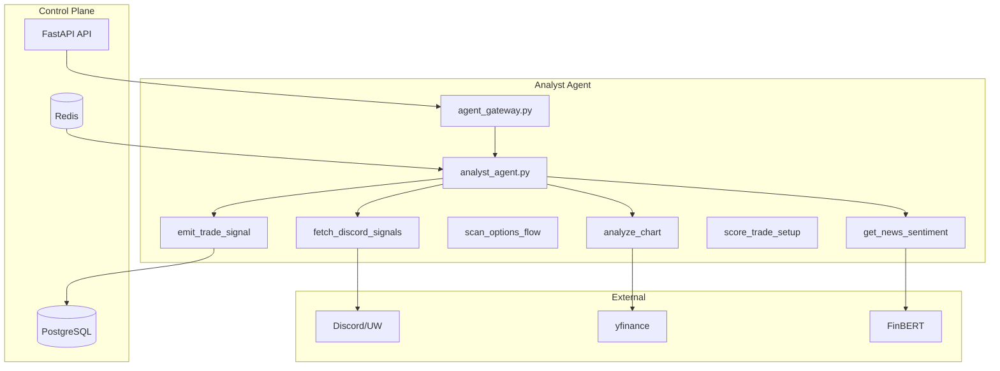
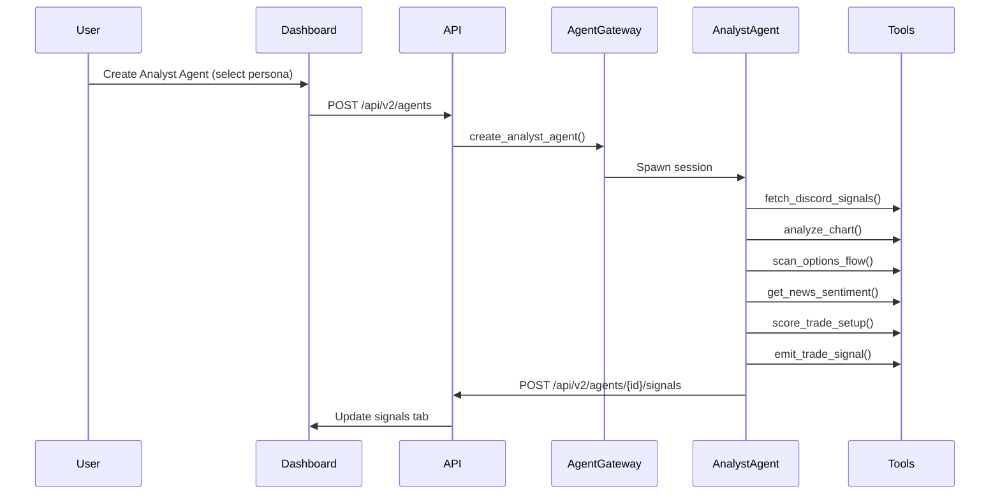
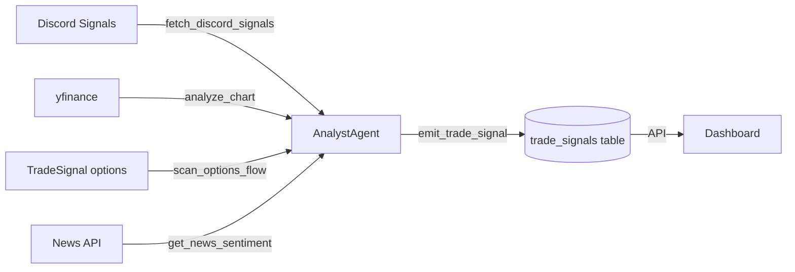
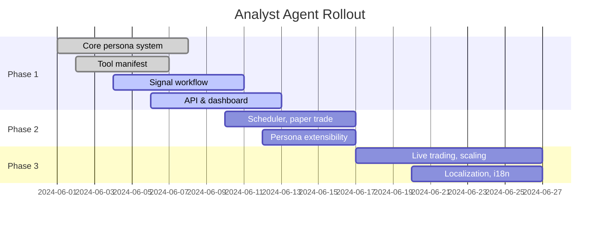

# Analyst Agent Architecture

## 1. Architecture Overview

The Analyst Agent is a new AI-powered persona-driven trading agent for Phoenix Trade Bot, designed to emulate professional traders by orchestrating a transparent, auditable workflow. It leverages existing infrastructure—Claude SDK session management, the Agent and TradeSignal models, repository-based DB access, and the agent_gateway pattern—while introducing a persona system, new tools, and extended data models. Analyst Agents process Discord signals, market data, and sentiment, then emit structured trade signals with full reasoning and tool traceability. The system is extensible, supporting new personas, tools, and workflows, and integrates tightly with the dashboard for visibility and monitoring. The phased rollout ensures robust delivery, starting with persona-driven signal generation and dashboard visibility, then adding scheduling, paper/live trading, and advanced features.

## 2. Complete File Tree

```
NEW FILES:
agents/analyst/
  __init__.py
  analyst_agent.py              # Claude session entry point
  tools/
    __init__.py
    fetch_discord_signals.py    # Tool 1
    analyze_chart.py            # Tool 2
    scan_options_flow.py        # Tool 3
    analyze_dark_pool.py        # Tool 4
    get_market_breadth.py       # Tool 5
    get_news_sentiment.py       # Tool 6
    score_trade_setup.py        # Tool 7
    emit_trade_signal.py        # Tool 8
    submit_paper_trade.py       # Tool 9 (Phase 2)
    submit_live_trade.py        # Tool 10 (Phase 3)
  personas/
    __init__.py
    base.py                     # PersonaConfig dataclass
    library.py                  # 6 persona definitions

apps/api/src/routes/
  analyst.py                    # New routes

apps/api/src/services/
  analyst_scheduler.py          # APScheduler-based scheduler (Phase 2)

apps/dashboard/src/components/agents/
  PersonaPicker.tsx
  SignalsTab.tsx
  SignalCard.tsx

MODIFIED FILES:
shared/db/models/trade_signal.py    # Add 6 new columns
apps/api/src/services/agent_gateway.py  # Add create_analyst_agent()
apps/api/src/routes/agents.py       # Accept 'analyst' type
apps/dashboard/src/pages/Agents.tsx  # Add step 4 wizard

NEW MIGRATION:
shared/db/migrations/versions/XXXX_add_analyst_agent.py
```

## 3. Data Model Changes

**`trade_signals` table — add columns:**
```python
analyst_persona: Mapped[str | None] = mapped_column(String(50), nullable=True)
tool_signals_used: Mapped[dict | None] = mapped_column(JSONB, nullable=True)
risk_reward_ratio: Mapped[float | None] = mapped_column(Float, nullable=True)
take_profit: Mapped[float | None] = mapped_column(Float, nullable=True)
entry_price: Mapped[float | None] = mapped_column(Float, nullable=True)
stop_loss: Mapped[float | None] = mapped_column(Float, nullable=True)
pattern_name: Mapped[str | None] = mapped_column(String(100), nullable=True)
```

**`agents` table — change:**
- `type` column CHECK constraint: add 'analyst' (currently 'trading|trend|sentiment')
- `config` JSONB: for analyst type, must include:
  - persona: str
  - skills: list[str]
  - tool_weights: dict[str, float]
  - workflow_config: dict

**Alembic migration code:**
```python
"""add analyst agent fields

Revision ID: xxxx
Depends on: previous_revision
"""
from alembic import op
import sqlalchemy as sa
from sqlalchemy.dialects.postgresql import JSONB

def upgrade():
    op.add_column('trade_signals', sa.Column('analyst_persona', sa.String(50), nullable=True))
    op.add_column('trade_signals', sa.Column('tool_signals_used', JSONB, nullable=True))
    op.add_column('trade_signals', sa.Column('risk_reward_ratio', sa.Float, nullable=True))
    op.add_column('trade_signals', sa.Column('take_profit', sa.Float, nullable=True))
    op.add_column('trade_signals', sa.Column('entry_price', sa.Float, nullable=True))
    op.add_column('trade_signals', sa.Column('stop_loss', sa.Float, nullable=True))
    op.add_column('trade_signals', sa.Column('pattern_name', sa.String(100), nullable=True))
    # Update agents.type constraint to include 'analyst'
    # ...

def downgrade():
    # reverse all
```

## 4. API Contract (Pydantic models)

```python
class AnalystRunRequest(BaseModel):
    manual_trigger: bool = False
    tickers: list[str] | None = None

class AnalystRunResponse(BaseModel):
    run_id: str
    signals_generated: int
    status: str
    started_at: str

class SignalResponse(BaseModel):
    id: str
    agent_id: str
    ticker: str
    direction: str | None         # buy | sell
    entry_price: float | None
    stop_loss: float | None
    take_profit: float | None
    risk_reward_ratio: float | None
    confidence: float | None      # 0-100
    decision: str                 # executed | rejected | watchlist | paper
    analyst_persona: str | None
    tool_signals_used: dict | None
    pattern_name: str | None
    reasoning: str | None         # rejection_reason or analysis reasoning
    created_at: str

class SignalsListResponse(BaseModel):
    signals: list[SignalResponse]
    total: int
```

## 5. Tool Interfaces (exact function signatures)

```python
# fetch_discord_signals.py
async def fetch_discord_signals(
    agent_id: str,
    since_minutes: int = 30,
    db_url: str = None
) -> list[dict]:
    """
    Fetch recent Discord signals from trade_signals table.
    Filters: signal_source in ('discord', 'unusual_whales'), created_at > now - since_minutes
    Returns: list of {ticker, direction, message, confidence, created_at}
    Data source: PostgreSQL trade_signals table
    """

# analyze_chart.py
async def analyze_chart(
    ticker: str,
    interval: str = "15m",
    lookback_days: int = 5
) -> dict:
    """
    Compute RSI, MACD, Bollinger Bands, VWAP, EMA/SMA, support/resistance.
    Detect chart patterns: bull flag, bear flag, wedge, head & shoulders, double top/bottom.
    Data source: yfinance.download(ticker, period=f"{lookback_days}d", interval=interval)
    Returns: {rsi, macd, bb_position, trend, support, resistance, patterns: list[str], signal: 'bullish'|'bearish'|'neutral'}
    """

# scan_options_flow.py
async def scan_options_flow(ticker: str, db_url: str = None) -> dict:
    """
    Parse options sweep alerts for ticker from trade_signals.
    Compute put/call ratio from recent signals.
    Returns: {sweep_count, put_call_ratio, unusual_activity: bool, iv_signal: str, dominant_side: str}
    Data source: trade_signals table where ticker=ticker and features JSONB contains options data
    """

# get_news_sentiment.py  
async def get_news_sentiment(ticker: str) -> dict:
    """
    Use existing FinBERT SentimentClassifier from shared/nlp/sentiment_classifier.py
    Fetch recent news from yfinance.Ticker.news
    Returns: {sentiment: str, score: float, confidence: float, headlines: list[str]}
    """

# score_trade_setup.py
def score_trade_setup(
    ticker: str,
    persona_config: dict,
    chart_signal: dict,
    options_signal: dict,
    sentiment_signal: dict,
    dark_pool_signal: dict | None = None
) -> dict:
    """
    Weighted aggregate of all tool signals into 0-100 confidence score.
    Uses persona's tool_weights to determine contribution of each signal.
    Returns: {confidence: int, breakdown: dict[str, float], recommendation: str}
    """

# emit_trade_signal.py
async def emit_trade_signal(
    agent_id: str,
    ticker: str,
    direction: str,
    entry_price: float,
    stop_loss: float,
    take_profit: float,
    confidence: int,
    reasoning: str,
    analyst_persona: str,
    tool_signals_used: dict,
    pattern_name: str | None = None,
    db_url: str = None
) -> str:
    """
    Write a TradeSignal record to the DB.
    Returns: signal_id (UUID str)
    """
```

## 6. Persona System (complete PersonaConfig)

```python
@dataclass
class PersonaConfig:
    id: str
    name: str
    emoji: str
    description: str
    system_prompt_snippet: str   # Injected into Claude's system prompt
    tool_weights: dict[str, float]   # chart, options_flow, dark_pool, sentiment
    min_confidence_threshold: int    # 0-100
    preferred_timeframes: list[str]  # ['15m', '1h', '4h']
    stop_loss_style: str             # 'tight' (1%), 'standard' (2%), 'wide' (3-5%)
    entry_style: str                 # 'aggressive', 'patient', 'breakout'
    signal_filters: dict             # per-persona filters

# Example persona definitions (all 6):
personas = [
    PersonaConfig(
        id="momentum",
        name="Aggressive Momentum Trader",
        emoji="🚀",
        description="Seeks high-momentum breakouts, quick entries/exits, favors technicals.",
        system_prompt_snippet="Focus on momentum, breakouts, and fast-moving setups. Prioritize technical signals.",
        tool_weights={"chart": 0.5, "options_flow": 0.3, "dark_pool": 0.1, "sentiment": 0.1},
        min_confidence_threshold=70,
        preferred_timeframes=["5m", "15m", "1h"],
        stop_loss_style="tight",
        entry_style="aggressive",
        signal_filters={"min_volume": 1_000_000}
    ),
    PersonaConfig(
        id="swing",
        name="Swing Trader",
        emoji="🌊",
        description="Targets multi-day swings, balances technicals and sentiment.",
        system_prompt_snippet="Look for swing setups with confirmation from sentiment and options flow.",
        tool_weights={"chart": 0.3, "options_flow": 0.2, "dark_pool": 0.2, "sentiment": 0.3},
        min_confidence_threshold=60,
        preferred_timeframes=["1h", "4h", "1d"],
        stop_loss_style="standard",
        entry_style="patient",
        signal_filters={"min_holding_days": 2}
    ),
    PersonaConfig(
        id="options_specialist",
        name="Options Flow Specialist",
        emoji="📈",
        description="Focuses on unusual options activity, sweep alerts, and IV spikes.",
        system_prompt_snippet="Prioritize options flow, sweep alerts, and IV signals over technicals.",
        tool_weights={"chart": 0.1, "options_flow": 0.7, "dark_pool": 0.1, "sentiment": 0.1},
        min_confidence_threshold=75,
        preferred_timeframes=["15m", "1h"],
        stop_loss_style="tight",
        entry_style="aggressive",
        signal_filters={"min_sweep_count": 3}
    ),
    PersonaConfig(
        id="dark_pool",
        name="Dark Pool Tracker",
        emoji="🕵️‍♂️",
        description="Monitors dark pool prints and block trades for hidden accumulation.",
        system_prompt_snippet="Emphasize dark pool activity and block trades as primary signals.",
        tool_weights={"chart": 0.2, "options_flow": 0.1, "dark_pool": 0.6, "sentiment": 0.1},
        min_confidence_threshold=65,
        preferred_timeframes=["1h", "4h"],
        stop_loss_style="wide",
        entry_style="patient",
        signal_filters={"min_dark_pool_value": 1_000_000}
    ),
    PersonaConfig(
        id="sentiment_guru",
        name="Sentiment Guru",
        emoji="🧘",
        description="Relies on news and social sentiment, filters for high-confidence consensus.",
        system_prompt_snippet="Base decisions on news, social, and sentiment signals. Use technicals for confirmation only.",
        tool_weights={"chart": 0.1, "options_flow": 0.1, "dark_pool": 0.1, "sentiment": 0.7},
        min_confidence_threshold=65,
        preferred_timeframes=["1h", "4h"],
        stop_loss_style="standard",
        entry_style="patient",
        signal_filters={"min_sentiment_score": 0.5}
    ),
    PersonaConfig(
        id="balanced",
        name="Balanced Analyst",
        emoji="⚖️",
        description="Blends all tools, seeks consensus, avoids extreme bets.",
        system_prompt_snippet="Blend all available signals, avoid over-weighting any single tool.",
        tool_weights={"chart": 0.3, "options_flow": 0.3, "dark_pool": 0.2, "sentiment": 0.2},
        min_confidence_threshold=60,
        preferred_timeframes=["15m", "1h", "4h"],
        stop_loss_style="standard",
        entry_style="breakout",
        signal_filters={}
    ),
]
```

## 7. Analyst Agent Entry Point Design

```python
"""
Analyst Agent Main Entry Point
Agent ID: {agent_id}
Persona: {persona_id}
Mode: {pre_market|signal_intake}
"""
import argparse
import asyncio
import json
import os
import sys

# ... imports from tools/ and personas/

async def run_premarket_scan(agent_id, persona, config):
    # Fetch tickers, run tools, emit signals
    ...

async def run_signal_intake(agent_id, persona, config):
    # Listen for new Discord signals, process workflow
    ...

async def analyze_ticker(ticker, persona, config):
    # Run all tools, aggregate, emit signal
    ...

async def main():
    parser = argparse.ArgumentParser()
    parser.add_argument('--agent_id', required=True)
    parser.add_argument('--persona_id', required=True)
    parser.add_argument('--mode', choices=['pre_market', 'signal_intake'], default='signal_intake')
    args = parser.parse_args()
    # Load persona, config
    # Run workflow
    ...

if __name__ == "__main__":
    asyncio.run(main())
```

**Claude system prompt template:**
```
You are a professional trading analyst agent. Your persona: {persona.name} {persona.emoji}
{persona.system_prompt_snippet}
Follow the workflow: process Discord signals, analyze chart, scan options flow, check sentiment, aggregate, and emit a trade signal with full reasoning and tool usage breakdown. Be transparent, auditable, and explain every decision.
```

## 8. Agent Gateway Extension

```python
async def create_analyst_agent(
    self,
    agent_id: UUID,
    config: dict,
    mode: str = "signal_intake"
) -> str:
    """
    Create/spawn an analyst agent session.
    Similar to create_live_agent() but uses agents/analyst/ template.
    Returns session_row_id.
    """
```

## 9. Mermaid Diagrams

**Diagram 1: System Component Diagram**


**Diagram 2: Analyst Workflow Sequence Diagram**


**Diagram 3: Data Flow Diagram**


**Diagram 4: Phased Rollout Plan**


## 10. Phased Implementation Plan (Phase 1 focus)

| # | File Path | Action | Key Classes/Functions | Dependencies |
|---|-----------|--------|----------------------|--------------|
| 1 | shared/db/migrations/versions/XXXX_add_analyst_agent.py | create | Alembic migration | None |
| 2 | shared/db/models/trade_signal.py | add columns | TradeSignal | 1 |
| 3 | agents/analyst/personas/base.py | create | PersonaConfig | None |
| 4 | agents/analyst/personas/library.py | create | persona definitions | 3 |
| 5 | agents/analyst/tools/fetch_discord_signals.py | create | fetch_discord_signals | 2 |
| 6 | agents/analyst/tools/analyze_chart.py | create | analyze_chart | 2 |
| 7 | agents/analyst/tools/scan_options_flow.py | create | scan_options_flow | 2 |
| 8 | agents/analyst/tools/get_news_sentiment.py | create | get_news_sentiment | 2 |
| 9 | agents/analyst/tools/score_trade_setup.py | create | score_trade_setup | 4,5,6,7,8 |
|10 | agents/analyst/tools/emit_trade_signal.py | create | emit_trade_signal | 2 |
|11 | agents/analyst/analyst_agent.py | create | main entry point | 3,4,5-10 |
|12 | apps/api/src/services/agent_gateway.py | add method | create_analyst_agent | 11 |
|13 | apps/api/src/routes/analyst.py | create | endpoints | 11,12 |
|14 | apps/api/src/routes/agents.py | add 'analyst' | type validation | 12 |
|15 | apps/dashboard/src/components/agents/PersonaPicker.tsx | create | PersonaPicker | 4 |
|16 | apps/dashboard/src/components/agents/SignalsTab.tsx | create | SignalsTab | 13 |
|17 | apps/dashboard/src/components/agents/SignalCard.tsx | create | SignalCard | 13 |
|18 | apps/dashboard/src/pages/Agents.tsx | add step 4 | wizard | 15 |

---

This document is the authoritative architecture for the Analyst Agent feature. All implementation must follow the structure, interfaces, and conventions defined herein.
