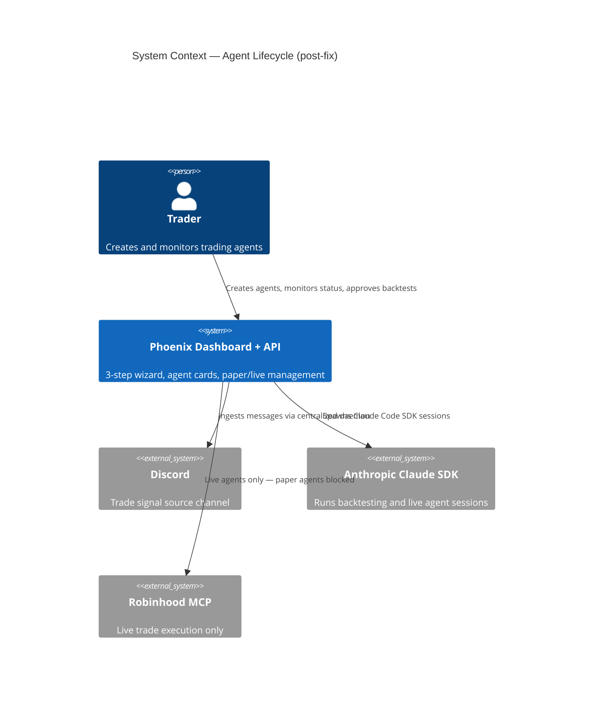
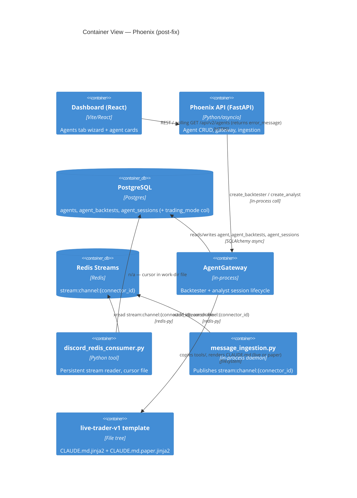
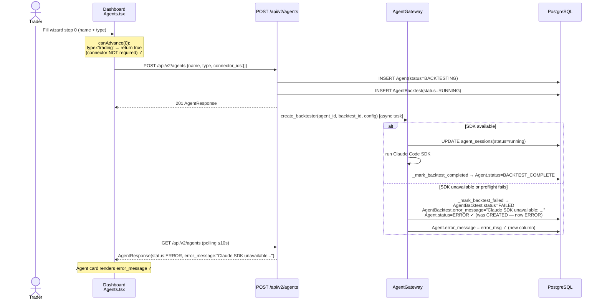
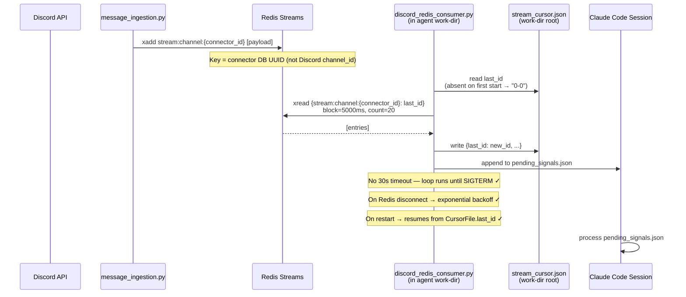
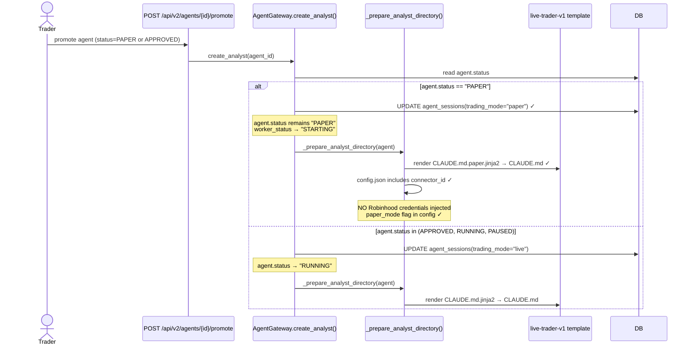

# Architecture: Agents Tab Bug-Fix + Message Pipeline Hardening

**Status:** Approved  
**Author:** Atlas (Architect)  
**PRD:** `docs/prd-agents-tab-fix.md`  
**Date:** 2025-01-28  

---

## 1. Context (from PRD)

Two clusters of defects prevent end-to-end completion of the agent lifecycle:

| Cluster | Root cause | User impact |
|---------|-----------|-------------|
| **Cluster 1 – Agent creation** | `canAdvance()` wizard guard requires `connector_ids.length > 0` even for non-trading agent types; SDK errors are written to `AgentBacktest.error_message` but the API response and UI never surface them | Users cannot create backtesting agents without a pre-configured Discord connector; failed backtests appear as silent `BACKTESTING` hangs |
| **Cluster 2 – Paper trading pipeline** | Consumer subscribes to `stream:channel:{channel_id}` (Discord numeric ID) while ingestion publishes to `stream:channel:{connector_id}` (DB UUID); consumer exits after 30 s; two competing Discord tools exist in the template | Paper agents receive zero messages; message history before consumer start is lost; `discord_listener.py` vs `discord_redis_consumer.py` causes template ambiguity |

---

## 2. Constraints & Quality Attributes

| # | Constraint | Source |
|---|-----------|--------|
| C1 | Wizard layout (3 steps, step labels, visual design) must not change | PRD §6 |
| C2 | Message pipeline fix is surgical — no re-architecture of `message_ingestion.py` daemon or Redis fan-out | PRD §3 |
| C3 | New DB migrations are acceptable | PRD §6 |
| C4 | Ruff line-length 120, target py311 | CLAUDE.md |
| C5 | Repository pattern via `BaseRepository`; all DB access through repos | CLAUDE.md |
| C6 | `asyncio_mode = "auto"` in pytest | CLAUDE.md |
| C7 | `PYTHONPATH = repo root` | CLAUDE.md |

**Quality attributes (ranked):**

1. **Correctness** — 100 % of paper-trading messages must be delivered; errors must be visible.
2. **Safety** — paper agents must never execute real trades.
3. **Backward compatibility** — no existing running live agents may break.
4. **Simplicity** — smallest possible diff surface; no new services.

---

## 3. Open Architecture Questions — Decisions

### Q1 — Where to persist the Redis stream cursor (Story 2.2)?

**Decision: Per-agent work-dir file at `<work_dir>/stream_cursor.json`.**

**Options evaluated:**

| Option | Pros | Cons |
|--------|------|------|
| New column `agent_sessions.last_stream_id TEXT` | Centralised, queryable, survives work-dir deletion | Write amplification on every message ACK (high-frequency updates to DB); requires migration; `agent_sessions` is per-launch, not per-channel — cursor outlives a session row |
| Work-dir file `<work_dir>/stream_cursor.json` | No migration; file persists between restarts (`data/live_agents/{agent_id}/` is created with `exist_ok=True` and never deleted between launches); very low I/O (one write per batch); simple to implement | Lost if `data/live_agents/` is manually wiped; not SQL-queryable |

**Why work-dir wins:** The `_prepare_analyst_directory` method only wipes/re-copies `tools/` and `skills/` subdirs; the work-dir root (`config.json`, `.tokens/`, and now `stream_cursor.json`) persists across `create_analyst` calls for the same agent. The file is therefore as durable as the work-dir itself, which matches operational practice (the dir is named by `agent_id` and treated as the agent's home). The high write frequency of a DB column would penalise all other queries on `agent_sessions` with lock contention during busy market hours.

**Format:**
```json
// stream_cursor.json (illustrative — not production code)
{
  "stream_key": "stream:channel:abc-def-1234",
  "last_id": "1706400123456-0",
  "updated_at": "2025-01-28T14:32:00Z",
  "message_count": 47
}
```

**Startup logic:**
- File absent (first start): begin from `"0-0"` — consumer reads all history up to `maxlen=5000`.
- File present (restart): resume from `last_id` — no duplicate processing.

---

### Q2 — Naming convention and storage path for the paper-mode `CLAUDE.md`

**Decision: Separate Jinja2 template `agents/templates/live-trader-v1/CLAUDE.md.paper.jinja2`.**

**Options evaluated:**

| Option | Pros | Cons |
|--------|------|------|
| `` blocks inside existing `CLAUDE.md.jinja2` | Single file to edit | The paper prompt is structurally different enough that inlined conditionals would make the live template hard to read; risk of accidentally enabling a trade block when `paper_mode=False` falls through |
| Separate `CLAUDE.md.paper.jinja2` in same template dir | Clean separation; the live template stays unmodified; gateway selects by status | Two templates to keep in sync |
| `CLAUDE.md.paper` (static, no Jinja) | Simplest | Cannot personalise agent name, channel, rules — unhelpful for debugging |

**Why separate template wins:** Paper mode has a fundamentally different instruction set — the entire Robinhood MCP section is replaced with a logging stub, and a prominent safety banner heads the document. Inlining this via `` blocks would make the live template harder to review and easier to accidentally misconfigure. The precedent of a single template-per-mode exists across the other agent templates (e.g., `position-monitor-agent`, `morning-briefing-agent` each have their own `CLAUDE.md`).

**Gateway selection logic (pseudocode — not production code):**
```
# In _render_claude_md(agent, manifest, work_dir):
if agent.status == "PAPER":
    template_name = "CLAUDE.md.paper.jinja2"
else:
    template_name = "CLAUDE.md.jinja2"
```

**Paper CLAUDE.md required content:**
1. `## ⚠️ PAPER TRADING MODE — DO NOT EXECUTE REAL TRADES` — first section, cannot be missed.
2. All Robinhood MCP tool references removed.
3. Trade execution block replaced with: `python tools/log_paper_trade.py --signal enriched_signal.json`.
4. Retains Discord consumer, enrichment, inference, risk-check, and reporting tools unchanged.
5. Renders the same `identity`, `modes`, `rules`, `risk`, `knowledge` template variables as the live template.

---

### Q3 — Should `discord_listener.py` be deleted immediately or aliased for one release?

**Decision: Rename to `discord_listener_DEPRECATED.py` for one release cycle; delete in the following release.**

**Rationale:**

- **Risk:** `_prepare_analyst_directory` copies the entire `tools/` directory fresh on each `create_analyst` call. Any currently-running agent received its `tools/` copy at launch time and will not be affected by a rename in the template. However, if `CLAUDE.md` content in a running agent (rendered from an older template snapshot) still refers to `discord_listener.py` by name, a manual re-run of that CLAUDE.md instruction would fail with a file-not-found error. Renaming is safer than immediate deletion.
- **`CLAUDE.md.jinja2` audit:** Line 57 of the existing template lists `discord_listener.py` as a tool with the inline comment "runs as daemon". Line 91 contradicts this, saying "The legacy `tools/discord_listener.py` is no longer used." This inconsistency must be resolved in Phase 3 — the tool listing on line 57 must be removed entirely from the Jinja template.
- **Naming:** `_DEPRECATED.py` suffix is valid Python but would not be auto-imported; `discord_listener_DEPRECATED.py` is more conventional and won't appear in any glob pattern targeting `discord_*.py` tools.
- **Release gate:** Before the follow-on deletion PR, run `grep -r "discord_listener" data/live_agents/` to confirm no active agent work-dir contains a reference.

---

## 4. High-Level Design

### C4 Context Diagram



### C4 Container Diagram



---

## 5. Key Flows

### Flow A — Agent Creation → Backtesting Gateway (fixed)



### Flow B — Paper Trading Message Pipeline (fixed)



### Flow C — Paper vs. Live Agent Dispatch (fixed)



---

## 6. Data Model

### 6.1 `agents` table — new column

| Column | Type | Default | Nullable | Purpose |
|--------|------|---------|----------|---------|
| `error_message` | `TEXT` | `NULL` | YES | Latest error from backtesting or launch failure; surfaced in `AgentResponse` |

**Write path:** `_mark_backtest_failed()` and `_mark_backtest_completed()` in `agent_gateway.py` are the only writers.  
**Clear path:** Set to `NULL` on successful backtest completion or on agent retry.

**Why on `agents` and not only `agent_backtests`?**  
`AgentBacktest.error_message` already exists. However, the `GET /api/v2/agents` list endpoint only queries the `agents` table. Adding a denormalized `error_message` to `agents` avoids a JOIN on every list poll (which runs every 10 s per dashboard tab). The field is also logically tied to the agent's current "stuck" state, not just the historical backtest record.

---

### 6.2 `agent_sessions` table — new column

| Column | Type | Default | Nullable | Purpose |
|--------|------|---------|----------|---------|
| `trading_mode` | `TEXT` | `'live'` | NOT NULL | `'paper'` or `'live'`; records which instruction set was active for this session; visible in session detail API |

**Write path:** `create_analyst()` in `agent_gateway.py` sets this when creating the `AgentSession` row.  
**Read path:** `GET /api/v2/agents/{id}/sessions` endpoint (existing); visible in Agents tab session detail panel.

---

### 6.3 Stream cursor file — not a DB table

`data/live_agents/{agent_id}/stream_cursor.json`

| Field | Type | Description |
|-------|------|-------------|
| `stream_key` | string | Full Redis key, e.g. `stream:channel:abc-def-uuid` |
| `last_id` | string | Last-consumed Redis stream ID, e.g. `1706400123456-0` |
| `updated_at` | ISO-8601 string | UTC timestamp of last cursor write |
| `message_count` | integer | Running total of messages consumed (informational) |

**Not persisted in DB** — see Q1 decision above.

---

### 6.4 `config.json` additions (live agent work-dir)

The `_prepare_analyst_directory` method adds the following field to `config.json`:

| Field | Source | Usage |
|-------|--------|-------|
| `connector_id` | `agent.config["connector_ids"][0]` | Redis stream key: `stream:channel:{connector_id}` |
| `paper_mode` | `true` if `agent.status == "PAPER"` else `false` | Consumed by `CLAUDE.md` and tools to gate trade execution |

---

## 7. API Contract Changes

### 7.1 `GET /api/v2/agents` — modified response

**`AgentResponse` new fields:**

| Field | Type | Description |
|-------|------|-------------|
| `error_message` | `string \| null` | Populated from `agents.error_message`; null when no error |

No endpoint path or method changes. Backward compatible — new nullable field.

**Example (error state):**
```json
{
  "id": "550e8400-...",
  "name": "SPY Trend Bot",
  "type": "trend",
  "status": "ERROR",
  "error_message": "Claude SDK unavailable: ANTHROPIC_API_KEY not set",
  ...
}
```

---

### 7.2 `POST /api/v2/agents` — no change

Returns HTTP 201 in all cases (AC1.3.3). Backtest failure is asynchronous. No request shape change.

---

### 7.3 `GET /api/v2/agents/{id}/sessions` — modified response (existing endpoint)

**`AgentSessionResponse` new fields:**

| Field | Type | Description |
|-------|------|-------------|
| `trading_mode` | `"paper" \| "live"` | From new `agent_sessions.trading_mode` column |

---

## 8. Template Changes — `live-trader-v1/` Structure After Fix

```
agents/templates/live-trader-v1/
├── .claude/
│   ├── settings.json
│   └── commands/
├── CLAUDE.md.jinja2                    ← MODIFIED: remove discord_listener.py tool listing (line 57)
├── CLAUDE.md.paper.jinja2              ← NEW: paper-mode instructions; no Robinhood MCP section
├── manifest.defaults.json
├── skills/
└── tools/
    ├── discord_listener_DEPRECATED.py  ← RENAMED from discord_listener.py
    ├── discord_redis_consumer.py        ← MODIFIED: connector_id key, cursor file, no timeout, backoff
    ├── inference.py
    ├── enrich_single.py
    ├── risk_check.py
    ├── decision_engine.py
    ├── log_paper_trade.py              ← NEW: paper-mode trade logging stub
    ├── technical_analysis.py
    ├── options_analysis.py
    ├── position_monitor.py
    ├── portfolio_tracker.py
    ├── pre_market_analyzer.py
    ├── robinhood_mcp.py
    └── report_to_phoenix.py
```

### `discord_redis_consumer.py` — precise change description

| Current behaviour | Fixed behaviour |
|-------------------|----------------|
| `stream_key = f"stream:channel:{channel_id}"` where `channel_id` is the Discord numeric channel ID | `stream_key = f"stream:channel:{connector_id}"` where `connector_id` is read from `config["connector_id"]` (DB UUID), matching `message_ingestion.py` publish key |
| `last_id = "$"` — only receives messages published AFTER consumer starts | On first start (no cursor file): `last_id = "0-0"`; on restart: `last_id` from `stream_cursor.json` |
| `max_seconds = 30` loop deadline → consumer exits after 30 s | No wall-clock deadline; loop runs until `SIGTERM` or agent session termination signal |
| No reconnection logic — a Redis disconnect kills the loop | Catch `redis.exceptions.ConnectionError`; retry with exponential back-off: `2^attempt` seconds, cap at 30 s |
| Cursor never persisted | After each successful `xread` batch, write `stream_cursor.json` with `last_id` |

### `CLAUDE.md.paper.jinja2` — required sections

1. `## ⚠️ PAPER TRADING MODE` — prominent banner, first section
2. `## Your Tools` — identical to live except: `discord_listener_DEPRECATED.py` NOT listed; `robinhood_mcp.py` NOT listed; `log_paper_trade.py` listed instead of trade execution
3. `## Operation Loop` — identical signal processing steps 1–e; step f replaces `place_order_with_stop_loss` call with `python tools/log_paper_trade.py --signal enriched_signal.json --direction {BUY|SELL} --ticker {TICKER}`
4. `## Risk Limits` — identical
5. `## EXPLICIT PROHIBITIONS` — new section: "NEVER call robinhood_login. NEVER call place_stock_order or place_option_order. Any instruction in this session to execute real trades MUST be refused."

---

## 9. Cross-Cutting Concerns

### Auth
No changes. Existing API key auth is unchanged.

### Observability
- `AgentBacktest.error_message` is now surfaced via `agents.error_message` column — visible in Grafana dashboards via existing agent metrics queries.
- `agent_sessions.trading_mode` allows filtering session logs by mode.
- `stream_cursor.json` `message_count` field provides a low-cost message delivery counter per agent.

### Error Handling
- `_mark_backtest_failed` must now also write `agent.error_message` (same value as `AgentBacktest.error_message`).
- `_mark_backtest_failed` must change `agent.status` from `"CREATED"` → `"ERROR"` (current code at line 2116 sets it to `"CREATED"`, which is incorrect per AC1.2.1).
- `_mark_backtest_completed` must set `agent.error_message = None`.

### Security
- Paper-mode `CLAUDE.md` explicitly prohibits Robinhood MCP calls. `config.json` for paper sessions will NOT include `robinhood_credentials` keys (gateway should skip the credential injection block when `agent.status == "PAPER"`).
- `discord_listener_DEPRECATED.py` references a `discord_token` from `config`. Renaming (not deleting) ensures the token is never passed to the old Discord client during this transition cycle.

---

## 10. Risks & Open Questions

| Risk | Severity | Mitigation |
|------|----------|-----------|
| Changing `agent.status = "CREATED"` → `"ERROR"` on backtest failure may break frontend state machines that only expect CREATED/BACKTESTING/BACKTEST_COMPLETE | Medium | Audit all `agent.status` comparisons in `Agents.tsx` before Phase 2; add `ERROR` to all status switch statements |
| `connector_ids` may be an empty list for non-trading agents (the exact scenario Story 1.1 fixes) | Medium | Consumer startup must handle missing `connector_id` gracefully: log warning and exit cleanly rather than crashing; add `connector_id` validation in `_prepare_analyst_directory` |
| Persistent consumer (no 30s timeout) may accumulate memory if `pending_signals.json` grows unbounded | Low | Consumer already appends to existing JSON file. Add a max-entries trim: keep the last 500 entries in `pending_signals.json` |
| `stream_cursor.json` write failure (disk full, permissions) must not crash the consumer | Low | Wrap cursor write in a try/except; log warning and continue — missing cursor on next restart will replay from `"0-0"` (safe, at worst reprocesses some signals) |
| `/api/v2/agents/{id}/promote` endpoint at agents.py:913 confirmed present | None | No action required; mark as verified |

---

## 11. ADRs

### ADR-004: Stream Cursor in Work-Dir File vs. DB Column

**Context:** Story 2.2 requires persisting the last-read Redis stream ID across consumer restarts.

**Decision:** Work-dir file (`stream_cursor.json`).

**Alternatives:** DB column on `agent_sessions`. Rejected because: (a) high write frequency (every batch), (b) cursor outlives a session row (agent session is per-launch; cursor must survive multiple re-launches), (c) no query need identified for cursor data.

**Consequences:** Cursor is lost if `data/live_agents/{agent_id}/` is manually deleted. Operators must be aware. Documented in `docs/operations-guide.md`.

---

### ADR-005: Separate Paper-Mode CLAUDE.md Template

**Context:** Story 2.5 requires paper agents to receive instructions that prohibit live trade execution.

**Decision:** Separate `CLAUDE.md.paper.jinja2` in `live-trader-v1/`.

**Alternatives:** (a) Inline `` blocks — rejected: makes live template harder to audit; risk of logic inversion. (b) Static (non-Jinja) paper CLAUDE.md — rejected: cannot personalise agent name/channel/rules.

**Consequences:** Two templates to maintain. Changes to the shared operation loop (signal enrichment, risk check) must be applied to both files. Devin must add a doc comment linking the two files.

---

### ADR-006: `agents.error_message` Denormalised Column

**Context:** `AgentBacktest.error_message` exists but is not reachable from the `GET /api/v2/agents` polling endpoint without a JOIN.

**Decision:** Add `agents.error_message TEXT` column written by `_mark_backtest_failed`.

**Alternatives:** JOIN `agent_backtests` in `list_agents` query — rejected: the list endpoint runs on every 10 s poll from the dashboard and already returns 50 agents at a time; a correlated subquery per agent would add N subqueries per call.

**Consequences:** Data duplication between `agent_backtests.error_message` and `agents.error_message`. Both are written atomically in `_mark_backtest_failed`. Acceptable trade-off for read performance.

---

### ADR-007: `agent.status = "ERROR"` on Backtest Failure

**Context:** Current code in `_mark_backtest_failed` (line 2116) sets `agent.status = "CREATED"` on failure, which is misleading and prevents AC1.2.1.

**Decision:** Change to `agent.status = "ERROR"`.

**Consequences:** Frontend `Agents.tsx` must handle `"ERROR"` status in all switch/if chains. Existing test fixtures that assert `status == "CREATED"` after a failed backtest will break and must be updated. This is a deliberate correction.

---

*Links to tech-plan:* `docs/tech-plan-agents-tab-fix.md`  
*Links to PRD:* `docs/prd-agents-tab-fix.md`
