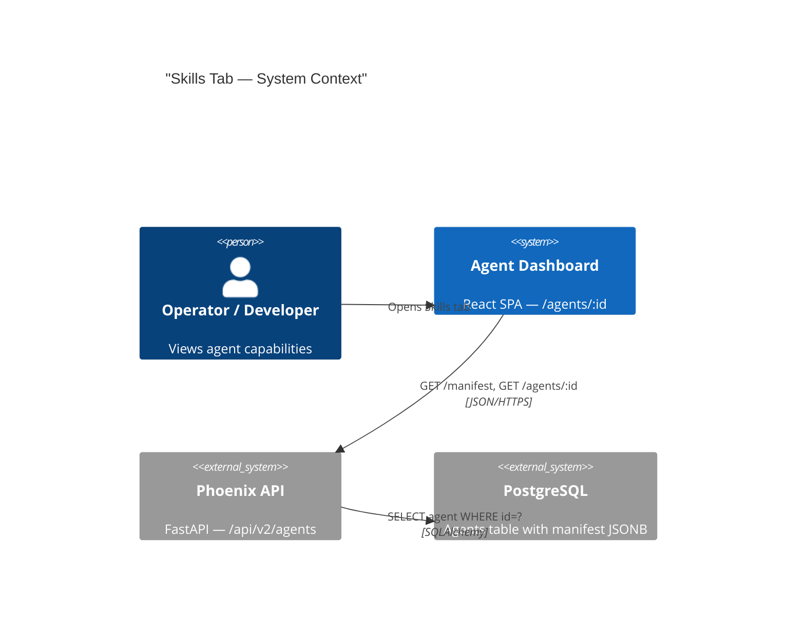
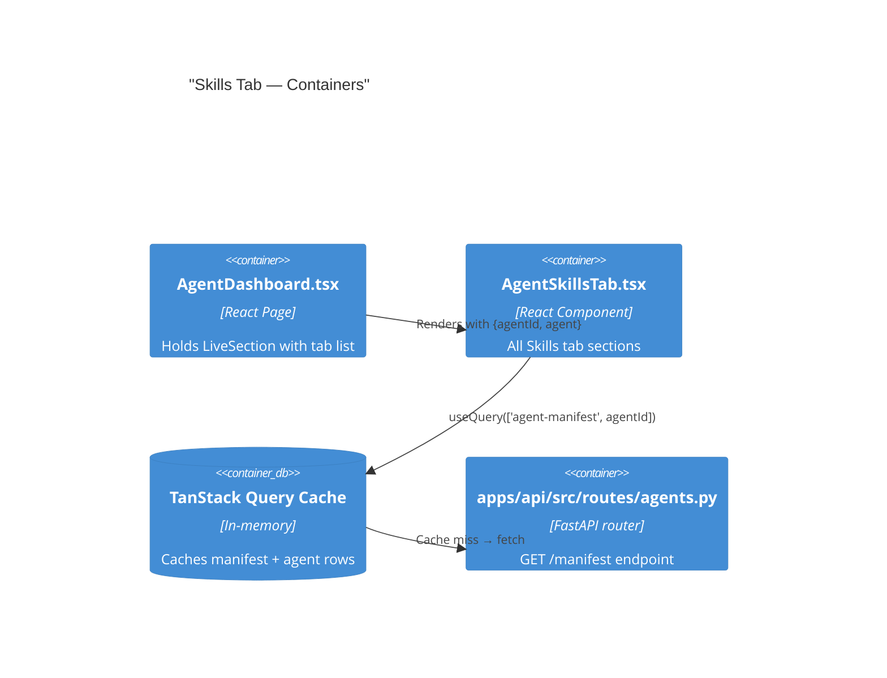
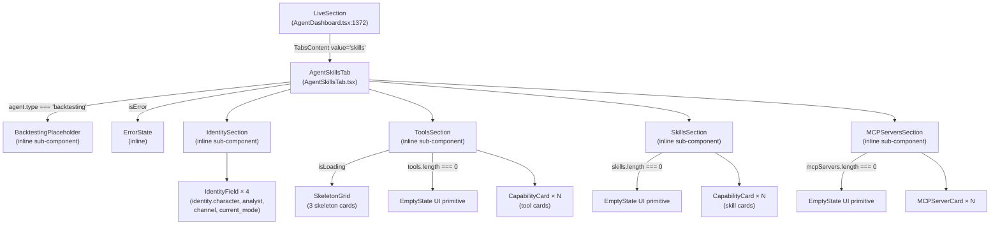
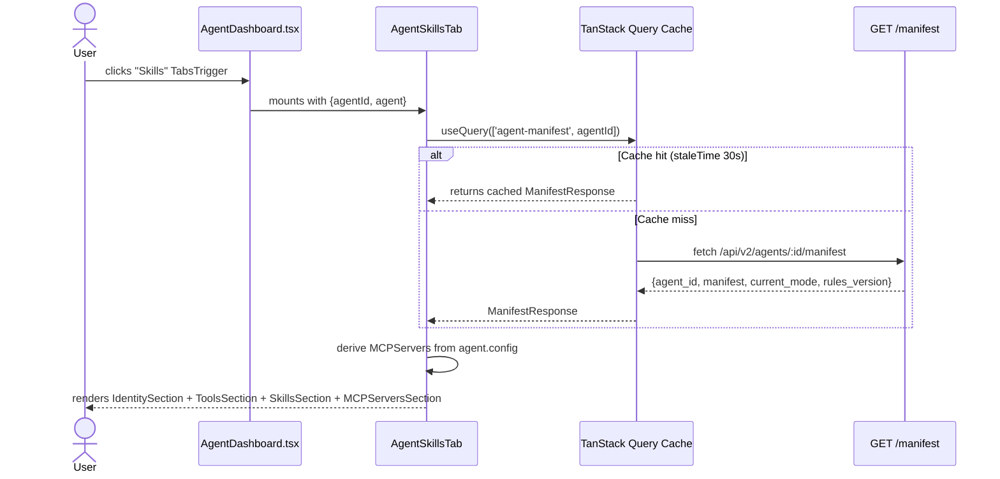
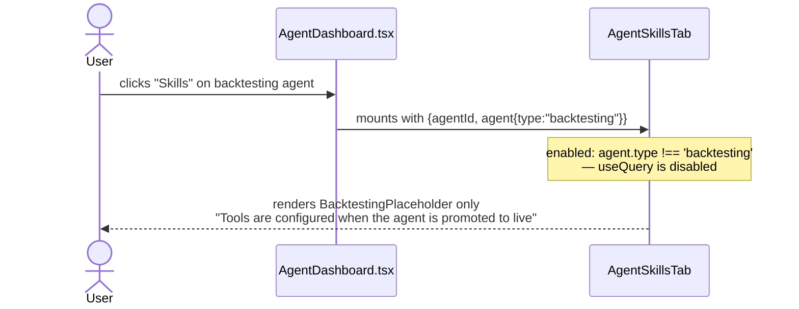
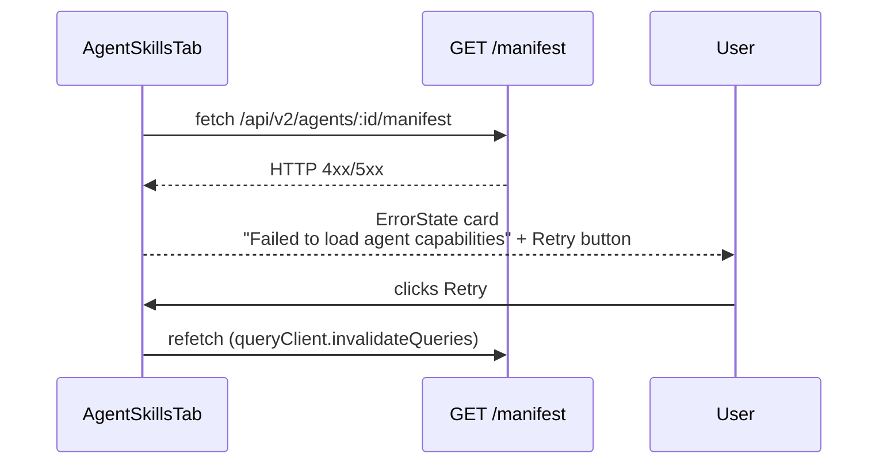

# Architecture: Skills / Tools Tab — Agent Detail Page

_Author: Atlas · Date: 2025-01-31 · Status: Approved for Implementation_
_PRD: `docs/prd-skills-tab.md`_

---

## 1. Context (from PRD)

Operators, developers, and reviewers cannot today answer **"What can this agent do?"** from the
agent detail page. The nine existing tabs expose historical activity and operational config, but
none surface the capability surface — registered tools, skills, MCP server connections, and the
character identity — in a readable UI.

All required data already exists: `GET /api/v2/agents/:id/manifest` returns `tools[]`, `skills[]`,
`identity{}`, `modes{}`, and `current_mode`. The agent row itself (`GET /api/v2/agents/:id`)
exposes the `config` JSONB that holds `robinhood_credentials` and `paper_trading` for MCP server
inference.

This feature adds a **read-only "Skills" tab** to the `LiveSection` tab bar in
`AgentDashboard.tsx`. No new backend endpoint is required for v1. The work is purely frontend
except for an optional Phase 2 convenience endpoint.

---

## 2. Constraints & Quality Attributes

| Attribute | Target |
|---|---|
| TypeScript strict mode | Zero `any` types in the new component |
| First-meaningful-paint | < 400 ms (manifest already cached via TanStack Query in normal flows) |
| Responsiveness | 2-col mobile (< 768 px) → 3-col desktop (≥ 1024 px) |
| Error / empty states | Every section has explicit loading, error, and empty state |
| Backtesting agents | Placeholder only — no manifest fetch, no tool/skill sections |
| Console hygiene | Zero new console errors or warnings |
| Query cache key convention | `['agent-manifest', agentId]` with `staleTime: 30_000` |

---

## 3. High-Level Design

### Backend Decision: Reuse `/manifest` — No New Endpoint (v1)

**Decision: The existing `GET /api/v2/agents/:id/manifest` endpoint is sufficient for Phase 1.**

Rationale:
1. The PRD explicitly classifies a new `/skills` endpoint as "out-of-scope for the initial
   release" and "optional" (PRD §3, §8, AC-QC-5).
2. The manifest response already guarantees `tools` and `skills` as arrays (even if empty) via
   the fallback synthesis at `agents.py:1441-1451`.
3. MCP server inference from `config` is already delivered by the agent row query
   (`['agent', agentId]`), which is always loaded before `LiveSection` renders. No additional
   fetch required.
4. Adding a `/skills` endpoint now would duplicate data already available, creating two sources
   of truth. If the manifest shape ever changes, only one endpoint would need updating.

A Phase 2 `/skills` endpoint is documented below purely as an optional convenience for
external consumers (e.g., CI pipelines that verify capability sets). It is not required for the
UI feature.

### C4 Context Diagram



### C4 Container Diagram



---

## 4. Components

### Component Tree



### Sub-Component Responsibilities

| Component | Responsibility | Data Source |
|---|---|---|
| `AgentSkillsTab` | Root: owns query, error/loading state, dispatches to sections | `useQuery(['agent-manifest', agentId])` |
| `BacktestingPlaceholder` | Renders placeholder text/icon; **no** query fired when active | `agent.type` prop |
| `IdentitySection` | Renders 4 identity fields in a 2×2 grid of `IdentityField` | `manifest.identity`, `current_mode` |
| `ToolsSection` | Renders tool cards in a responsive grid; handles loading/empty | `manifest.tools[]` |
| `SkillsSection` | Renders skill cards; section heading always shown | `manifest.skills[]` |
| `MCPServersSection` | Infers connected MCP servers from `agent.config`; renders server cards | `agent.config` prop |
| `CapabilityCard` | Shared card: name, description, category badge, active/inactive dot | `ManifestTool` or `ManifestSkill` |
| `MCPServerCard` | MCP server card: logo placeholder, Paper/Live mode badge | `MCPServer` derived type |
| `SkeletonGrid` | 3 animated `Skeleton` placeholder cards for loading state | — |

---

## 5. TypeScript Interfaces

> **These are design contracts, not production code.** Devin must implement them verbatim in
> `AgentSkillsTab.tsx`.

```typescript
// ── Manifest sub-shapes ──────────────────────────────────────────────

type ToolCategory =
  | 'trading'
  | 'analysis'
  | 'data'
  | 'risk'
  | 'reporting'
  | 'execution'
  | 'unknown'

interface ManifestTool {
  name: string
  description?: string
  category?: string       // raw string from manifest; normalise via CATEGORY_MAP
  enabled?: boolean       // undefined → treated as active (true)
  parameters?: Record<string, unknown>
}

interface ManifestSkill {
  name: string
  description?: string
  category?: string
}

interface ManifestIdentity {
  name?: string
  channel?: string        // Discord channel name (no leading #)
  analyst?: string
  character?: string
}

interface ManifestModes {
  [modeName: string]: unknown
}

// ── Full typed manifest payload (replaces Record<string,unknown> in ManifestData) ──

interface AgentManifestPayload {
  version?: string
  template?: string
  identity?: ManifestIdentity
  tools?: ManifestTool[]
  skills?: ManifestSkill[]
  modes?: ManifestModes
  risk?: Record<string, unknown>
  models?: Record<string, unknown>
  knowledge?: Record<string, unknown>
}

// ── API response shape ────────────────────────────────────────────────

interface ManifestResponse {
  agent_id: string
  manifest: AgentManifestPayload
  current_mode: string
  rules_version: number
}

// ── Derived MCP server shape (not from API; computed client-side) ─────

type MCPMode = 'paper' | 'live'

interface MCPServer {
  id: string              // e.g. 'robinhood'
  displayName: string     // e.g. 'Robinhood'
  mode: MCPMode
  status: 'connected'
}

// ── Component prop shapes ─────────────────────────────────────────────

interface AgentSkillsTabProps {
  agentId: string
  agent: {
    type: string
    config: Record<string, unknown>
  }
}

interface CapabilityCardProps {
  name: string
  description: string
  category: ToolCategory
  active: boolean
}

interface MCPServerCardProps {
  server: MCPServer
}
```

---

## 6. Key Flows

### Flow A — Happy Path (Live Agent, Manifest Cached)



### Flow B — Backtesting Agent (Placeholder, No Fetch)



### Flow C — Error State



---

## 7. Data Model

### Manifest JSON Structure (existing, no changes)

The `manifest` JSONB column on the `agents` table stores:

```
manifest {
  version: string              // "1.0"
  template: string             // "live-trader-v1"
  identity: {
    name: string
    channel: string            // Discord channel slug (no #)
    analyst: string
    character: string          // e.g. "balanced-intraday"
  }
  tools: [
    {
      name: string             // e.g. "place_market_order"
      description?: string
      category?: string        // "trading" | "analysis" | "data" | "risk" | "reporting"
      enabled?: boolean
      parameters?: object
    }
  ]
  skills: [
    {
      name: string
      description?: string
      category?: string
    }
  ]
  modes: {
    conservative: object
    aggressive: object
  }
  risk: object
  models: object
  knowledge: object
}
```

### MCP Server Inference (client-side, no schema change)

MCP servers are **not** stored as a top-level manifest key. They are inferred from `agent.config`
which is already available as a prop:

| Config key | Inference rule | Result |
|---|---|---|
| `config.robinhood_credentials` is truthy | Robinhood MCP server present | `MCPServer{id:'robinhood', displayName:'Robinhood', mode: config.paper_trading ? 'paper' : 'live'}` |
| (future) `config.alpaca_credentials` | Alpaca MCP server | Extensible pattern |

This client-side derivation requires **zero backend changes**.

---

## 8. Interfaces / APIs

### Existing endpoint consumed (unchanged)

```
GET /api/v2/agents/:id/manifest
Response 200:
{
  "agent_id": "<uuid>",
  "manifest": { ...AgentManifestPayload },
  "current_mode": "conservative" | "aggressive" | string,
  "rules_version": number
}
Response 404: { "detail": "Agent not found" }
```

### Tool Metadata Constant (frontend only)

The PRD requires category color-coding and category inference. This is stored as a module-level
constant inside `AgentSkillsTab.tsx` — no shared util needed at this scale, and no backend change:

```typescript
// ILLUSTRATIVE PSEUDOCODE — not production code
const CATEGORY_COLORS: Record<ToolCategory, string> = {
  trading:   'bg-blue-500/10   text-blue-400   border-blue-500/20',
  analysis:  'bg-purple-500/10 text-purple-400 border-purple-500/20',
  data:      'bg-green-500/10  text-green-400  border-green-500/20',
  risk:      'bg-red-500/10    text-red-400    border-red-500/20',
  reporting: 'bg-gray-500/10   text-gray-400   border-gray-500/20',
  execution: 'bg-orange-500/10 text-orange-400 border-orange-500/20',
  unknown:   'bg-muted         text-muted-foreground',
}

function normaliseCategory(raw?: string): ToolCategory {
  // maps raw manifest string → ToolCategory; falls back to 'unknown'
}
```

---

## 9. Cross-cutting Concerns

### Auth
No new auth surface. The `/manifest` endpoint is behind the same session/token auth as all
other `/api/v2/agents/:id/*` endpoints. The frontend uses the shared `api` Axios instance
(already authenticated).

### Observability
No new instrumentation needed. TanStack Query's built-in DevTools will surface the
`['agent-manifest', agentId]` query. Errors surface via `isError` state in the component.

### Error Handling Strategy
- **Network error / non-2xx**: `isError` → render `ErrorState` card with retry button
  (`queryClient.invalidateQueries`)
- **Empty arrays**: Each section handles `length === 0` independently; sections are never hidden
  entirely (AC-02.2)
- **Missing identity fields**: Graceful fallback to `"—"` string (AC-04.2)
- **Null / undefined manifest keys**: Safe optional-chain access throughout
  (`manifest?.tools ?? []`)

### Security
Read-only display. No user-supplied data is written back. No new attack surface.

### Performance
- `staleTime: 30_000` — avoids redundant fetches when the user switches tabs rapidly
- Manifest is typically already in cache when `Skills` tab is clicked (the `RulesTab` and
  `RuntimeTab` also fetch it indirectly)
- `enabled: agentType !== 'backtesting'` — prevents a network call for backtesting agents (AC-05.2)
- Skeleton cards prevent layout shift during the first fetch

---

## 10. File-by-File Change List

### Files to CREATE

#### `apps/dashboard/src/components/AgentSkillsTab.tsx` (new file, ~200 lines)

Complete self-contained tab component. Internal structure:

| Block | Description |
|---|---|
| Lines 1-5 | File docblock |
| Lines 6-18 | Imports: `useQuery`, `useQueryClient`, api, UI primitives (`Card`, `Badge`, `Skeleton`, `EmptyState`), Lucide icons (`Wrench`, `Cpu`, `Zap`, `Server`, `CheckCircle2`, `XCircle`, `AlertTriangle`) |
| Lines 20-80 | TypeScript interfaces: `ManifestTool`, `ManifestSkill`, `ManifestIdentity`, `AgentManifestPayload`, `ManifestResponse`, `MCPServer`, `MCPMode`, all prop types |
| Lines 82-100 | Constants: `CATEGORY_COLORS`, `normaliseCategory()`, `formatToolName()` (snake_case → Title Case) |
| Lines 102-120 | `SkeletonGrid` sub-component (3 skeleton cards) |
| Lines 122-145 | `CapabilityCard` sub-component |
| Lines 147-165 | `MCPServerCard` sub-component |
| Lines 167-185 | `IdentitySection` sub-component |
| Lines 187-210 | `BacktestingPlaceholder` sub-component |
| Lines 212-290 | `AgentSkillsTab` root export — `useQuery`, `deriveMCPServers()`, section rendering |

### Files to MODIFY

#### `apps/dashboard/src/pages/AgentDashboard.tsx`

| Change | Location | Detail |
|---|---|---|
| Add `Wrench` to Lucide import | **Line 30** — end of the icon import list | Append `, Wrench` before the closing `}` |
| Add `AgentSkillsTab` import | **After line 38** (after `ErrorBoundary` import) | `import { AgentSkillsTab } from '@/components/AgentSkillsTab'` |
| Update grid column count | **Line 1375** | `grid-cols-9` → `grid-cols-10` |
| Add `<TabsTrigger value="skills">` | **After line 1384** (after the `runtime` trigger) | `<TabsTrigger value="skills" className="text-xs"><Wrench className="h-3.5 w-3.5 mr-1 hidden sm:inline" />Skills</TabsTrigger>` |
| Add `<TabsContent value="skills">` | **After line 1410** (after the runtime `</TabsContent>`) | `<TabsContent value="skills" className="mt-4"><AgentSkillsTab agentId={id} agent={agent} /></TabsContent>` |

### Files to CREATE (Phase 2 — Optional)

| File | Purpose |
|---|---|
| `apps/api/src/routes/agents.py` — new route added | `GET /{agent_id}/skills` endpoint |
| `apps/api/tests/test_agent_skills.py` | Unit tests for new endpoint (required by AC-QC-5 if endpoint is added) |

---

## 11. Risks & Open Questions

| Risk | Likelihood | Mitigation |
|---|---|---|
| Manifest `tools[].category` values in production don't match the expected strings | Medium | `normaliseCategory()` function maps unknown values to `'unknown'`; no hard failure |
| `grid-cols-10` on narrow screens (< 480 px) wraps tab labels badly | Low | Labels use `hidden sm:inline` for icons; text-only at xs. PRD accepts responsive CSS. Consider `overflow-x-auto` on `TabsList` if needed. |
| Some agents have `null` manifest (never trained) | Medium-Low | Backend fallback at `agents.py:1442` always returns a synthetic manifest with `tools: []` and `skills: []` |
| MCP server inference from `config` breaks if JSONB shape changes | Low | Isolated to `deriveMCPServers()` helper; easy to update without touching other sections |

---

## 12. Phased Implementation Plan

### Phase 1 — Frontend Component + Tab Wiring

**Goal:** Ship the complete, read-only Skills tab visible in the UI. No backend changes.

**Scope:**
- Create `apps/dashboard/src/components/AgentSkillsTab.tsx` — all four sections
  (Identity, Tools, Skills, MCP Servers) plus BacktestingPlaceholder, ErrorState, SkeletonGrid
- Modify `apps/dashboard/src/pages/AgentDashboard.tsx` — 5 surgical edits (see §10)

**Files Touched:**
1. `apps/dashboard/src/components/AgentSkillsTab.tsx` — **CREATE**
2. `apps/dashboard/src/pages/AgentDashboard.tsx` — **MODIFY** (5 edits)

**Interfaces / Dependencies:**
- Depends on existing `GET /api/v2/agents/:id/manifest` (already deployed)
- Depends on `AgentData.config` and `AgentData.type` (already passed as prop from `LiveSection`)
- All UI primitives (`Card`, `Badge`, `Skeleton`, `EmptyState`) already exist in
  `apps/dashboard/src/components/ui/`
- `Wrench` icon must be added to the Lucide import in `AgentDashboard.tsx`

**Definition of Done (Phase 1):**
- [ ] `AgentSkillsTab.tsx` compiles with `tsc --strict` — zero errors, zero `any`
- [ ] "Skills" tab trigger appears in `LiveSection` tab bar at position 10
- [ ] `grid-cols-10` applied to `TabsList`
- [ ] For a live agent with tools: tool cards render with name, description, category badge,
      active/inactive indicator
- [ ] For a live agent with empty tools: "No tools configured" message shown
- [ ] Loading state: 3 skeleton cards shown while manifest fetches
- [ ] Error state: "Failed to load agent capabilities" with Retry button
- [ ] Backtesting agent: placeholder message shown, no manifest fetch fires
- [ ] MCP Servers section: Robinhood card appears when `config.robinhood_credentials` is set
- [ ] Paper/Live badge on Robinhood card is correct per `config.paper_trading`
- [ ] Identity section: character, analyst, channel, current_mode rendered with "—" fallbacks
- [ ] No console errors/warnings on mount or unmount
- [ ] TanStack Query key is `['agent-manifest', agentId]` with `staleTime: 30_000`

**Test Hooks for Quill (Phase 1):**
- QA can verify all ACs in §6 of the PRD
- Smoke: open Skills tab on any live agent → no JS errors
- Smoke: open Skills tab on a backtesting agent → placeholder only, no network call to `/manifest`
- Smoke: toggle between Skills and Portfolio tabs rapidly → no flicker, no duplicate fetches

---

### Phase 2 — Optional Backend `/skills` Convenience Endpoint

**Goal:** Add a dedicated `GET /api/v2/agents/:id/skills` endpoint that returns a cleaner,
pre-shaped skills payload (without the full manifest). Intended for external consumers (CI
verification, admin tooling).

> **This phase is explicitly out-of-scope for v1 per PRD §3 and §8.** It should only be
> implemented if an external consumer requests it, or if Phase 1 exposes a performance issue
> with the full manifest payload.

**Scope:**
- New route handler in `apps/api/src/routes/agents.py`
- Unit test in `apps/api/tests/test_agent_skills.py`
- No frontend changes required (the tab already works from Phase 1)

**Proposed Response Shape (if implemented):**

```
GET /api/v2/agents/:id/skills
Response 200:
{
  "agent_id": "<uuid>",
  "tools": [
    { "name": string, "description": string, "category": string, "enabled": boolean }
  ],
  "skills": [
    { "name": string, "description": string, "category": string }
  ],
  "identity": {
    "character": string, "analyst": string, "channel": string
  },
  "current_mode": string
}
Response 404: { "detail": "Agent not found" }
```

**Files Touched:**
1. `apps/api/src/routes/agents.py` — add new `@router.get("/{agent_id}/skills")` handler
2. `apps/api/tests/test_agent_skills.py` — **CREATE** with ≥ 3 test cases:
   - `test_skills_returns_200_with_tools`
   - `test_skills_returns_404_for_unknown_agent`
   - `test_skills_returns_empty_arrays_for_null_manifest`

**Definition of Done (Phase 2):**
- [ ] `GET /api/v2/agents/:id/skills` returns 200 with the payload shape above
- [ ] Returns 404 for unknown agent IDs
- [ ] Returns empty arrays (not null) for tools/skills when manifest is null
- [ ] All 3 unit tests pass in `pytest`
- [ ] OpenAPI docs auto-updated (FastAPI generates this automatically)

---

## 13. ADRs

### ADR-001: Reuse `/manifest` vs New `/skills` Endpoint

**Context:** The Skills tab needs `tools[]`, `skills[]`, `identity{}`, and `current_mode`. The
existing `/manifest` endpoint provides all of these, but also returns `rules[]`, `risk{}`,
`modes{}`, and `knowledge{}` which the Skills tab does not use.

**Options Considered:**

| Option | Pros | Cons |
|---|---|---|
| **A — Reuse `/manifest`** (chosen) | Zero backend work; manifest already cached; no new API surface | Slight over-fetching of unused fields (rules, risk, modes) |
| **B — New `/skills` endpoint** | Clean payload; purpose-built for this consumer | New endpoint to maintain; PRD marks as out-of-scope; creates duplicate data path |
| **C — Extend `AgentResponse`** | Single request | Bloats the agent list endpoint; manifest JSONB can be large |

**Decision:** Option A — Reuse `/manifest`.

**Consequences:**
- Positive: No backend deployment needed; faster shipping
- Positive: Manifest is already warmed in TanStack Query cache for most page loads
- Negative: ~5-20 KB over-fetch for unused manifest keys (acceptable at this scale)
- Future: If payload size becomes a concern, Phase 2 documents the `/skills` endpoint path

---

### ADR-002: Tool Metadata Storage — Hardcoded Constant vs Shared Util vs Backend

**Context:** The PRD requires category color-coding for tool/skill cards. The manifest stores
raw category strings. We need a map from category string → CSS class.

**Options Considered:**

| Option | Pros | Cons |
|---|---|---|
| **A — Module-level constant in `AgentSkillsTab.tsx`** (chosen) | Simple; no extra files; co-located with usage | Duplication if another component needs same map |
| **B — Shared util `src/lib/skill-utils.ts`** | Reusable | Premature abstraction; only one consumer today |
| **C — Backend-driven category colours** | Centralised | Over-engineered; colors belong in the design system |

**Decision:** Option A — constant inside the component file.

**Consequences:**
- If a second component needs the same map, extract to a shared util at that point (YAGNI)

---

### ADR-003: MCP Server Detection — Config Inference vs Manifest Key

**Context:** The PRD (US-03, AC-03.1/03.2) requires showing Robinhood MCP server connectivity.
This is not a manifest key — it lives in `agent.config.robinhood_credentials`.

**Options Considered:**

| Option | Pros | Cons |
|---|---|---|
| **A — Infer from `agent.config` prop** (chosen) | Zero backend change; `agent` already prop-drilled into `LiveSection` and thus available | Requires passing `agent.config` through to `AgentSkillsTab` |
| **B — Add `mcp_servers[]` to manifest** | Clean manifest; self-describing | Backend schema change; requires migration |
| **C — New `/mcp` endpoint** | Clean API | Disproportionate effort for read-only display |

**Decision:** Option A — client-side inference from `agent.config`.

**Consequences:**
- `AgentSkillsTab` receives both `agentId: string` and `agent: { type, config }` as props
- `deriveMCPServers(config: Record<string, unknown>): MCPServer[]` is a pure function, easily
  unit-testable without network
- Adding new MCP providers in future requires only updating `deriveMCPServers()`
