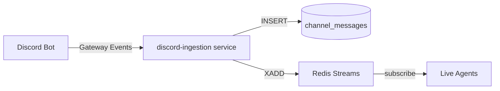

# Architecture: Backtesting Database Flow

**Status:** Active | **Updated:** 2026-04-18 | **Phase:** C.6

## Overview

Phoenix's backtesting pipeline operates **exclusively from the database** — no live Discord API calls during backtest execution. This design ensures reproducibility, eliminates rate-limit failures, and enables true offline backtesting with historical data.

## 1. Ingestion Pipeline

### Live Ingestion (Discord → DB)



**Service:** `services/discord-ingestion/src/main.py`

**Flow:**
1. Discord bot connects via official Gateway (discord.py library)
2. Receives message events in real-time
3. Persists to `channel_messages` table (dual-write: `channel` + `channel_id_snowflake`)
4. Publishes to Redis streams for live agent consumption
5. Optionally writes sentiment features to Feature Store

**Idempotency:** `platform_message_id` is checked before INSERT (migration 048 adds UNIQUE constraint).

**Fields written:**
- `channel_id_snowflake` — Discord snowflake ID (20-digit string)
- `backfill_run_id` — NULL for live ingestion, UUID for backfill runs
- `platform_message_id` — Discord message ID (unique)
- `posted_at` — Message timestamp from Discord
- `content`, `author`, `tickers_mentioned`, `raw_data`

## 2. Backfill Tool

### Historical Backfill (Discord API → DB)

**Tool:** `tools/backfill.py`

**Invocation:**
```bash
python -m tools.backfill \
  --connector-id <uuid> \
  --channel-id <snowflake> \
  --from 2024-01-01 \
  --to 2024-12-31 \
  [--batch-size 500] \
  [--checkpoint backfill-checkpoint.json] \
  [--resume]
```

**Features:**
- **Rate limiting:** Leaky bucket (20ms min interval) + 429 handling (exponential backoff)
- **Resumability:** Checkpoint saved after each batch (500 messages)
- **Idempotency:** Pre-INSERT check via `platform_message_id`
- **Signal-safe:** SIGINT/SIGTERM flush batch + write checkpoint + exit 130
- **Traceability:** Every backfilled message tagged with `backfill_run_id` (UUID)

**Checkpoint schema:**
```json
{
  "run_id": "uuid",
  "connector_id": "uuid",
  "channel_id": "snowflake",
  "start_date": "2024-01-01",
  "end_date": "2024-12-31",
  "last_message_id": "snowflake",
  "messages_imported": 8234,
  "batches_committed": 17,
  "last_checkpoint_at": "2024-04-18T10:30:00Z",
  "status": "in_progress | completed"
}
```

**Rate limit handling:**
- On HTTP 429: honor `Retry-After` header + 1s jitter
- After 3 consecutive 429s: switch to 5s fixed delay (conservative mode)
- All rate-limit events logged for observability

**Batch size:** 500 messages per `session.commit()` balances commit overhead vs. memory/recovery risk.

## 3. Backtest Pipeline

### Transform Step (DB → Parquet)

**Tool:** `agents/backtesting/tools/transform.py`

**Invocation (ONLY supported mode):**
```bash
python tools/transform.py \
  --source postgres \
  --db-url postgresql://... \
  --output output/transformed.parquet
```

**Phase C.4 enforcement:**
- `--source discord` is **deprecated** — raises `ValueError` with message to use backfill tool
- `fetch_discord_history()` function removed (L121-186 deleted)
- Static analysis CI check: `rg 'discord\.com/api|httpx.*discord' agents/backtesting/tools/ && exit 1`

**Query:**
```sql
SELECT cm.*, bt.*
FROM channel_messages cm
JOIN backtest_trades bt ON bt.signal_message_id = cm.id
WHERE cm.channel_id_snowflake = :channel_id
  AND cm.posted_at >= :start_date
  AND cm.posted_at <= :end_date
ORDER BY cm.posted_at;
```

**Index used:** `ix_channel_messages_channel_posted` (composite: `channel_id_snowflake`, `posted_at`)

**Output:** Parquet file with ~200 enriched features per trade.

### Enrichment → Training → Validation

**Subsequent steps** (all read from Parquet files, zero DB or API calls):
1. `enrich.py` — 200+ market features (price action, technicals, volume, market context, time, sentiment, options)
2. `preprocess.py` — Train/val/test splits across 4 modalities
3. `train_*.py` — XGBoost, LightGBM, CatBoost, RF, LSTM, Transformer, TFT, TCN, Hybrid, Meta-learner
4. `evaluate_models.py` — Select best model
5. `validate_model.py` — Test-set inference (PASS/FAIL gate)
6. `create_live_agent.py` — Generate live trading agent with manifest + tools

**Full pipeline documented in:** `agents/backtesting/CLAUDE.md`

## 4. Schema Reference

### `channel_messages` Table (Migration 048)

**DDL:**
```sql
CREATE TABLE channel_messages (
    id UUID PRIMARY KEY DEFAULT gen_random_uuid(),
    connector_id UUID NOT NULL REFERENCES connectors(id) ON DELETE CASCADE,
    channel VARCHAR(200) NOT NULL,  -- Legacy; will be dropped in migration 049
    channel_id_snowflake VARCHAR(20),  -- Canonical Discord snowflake (20 digits)
    backfill_run_id UUID,  -- NULL for live ingestion, UUID for backfill
    author VARCHAR(200) NOT NULL,
    content TEXT NOT NULL,
    message_type VARCHAR(30) NOT NULL DEFAULT 'unknown',
    tickers_mentioned JSONB NOT NULL DEFAULT '[]',
    raw_data JSONB NOT NULL DEFAULT '{}',
    platform_message_id VARCHAR(100) NOT NULL,  -- Discord message ID
    posted_at TIMESTAMPTZ NOT NULL,
    created_at TIMESTAMPTZ DEFAULT now()
);

CREATE INDEX ix_channel_messages_connector_id ON channel_messages(connector_id);
CREATE INDEX ix_channel_messages_posted_at ON channel_messages(posted_at);
CREATE INDEX ix_channel_messages_channel_posted ON channel_messages(channel_id_snowflake, posted_at);
CREATE INDEX ix_channel_messages_message_type ON channel_messages(message_type);
CREATE UNIQUE INDEX uq_channel_messages_platform_id ON channel_messages(platform_message_id);
```

**Migration 049 (pending):**
- Drops `channel` column after 1-week verification of `channel_id_snowflake` population
- Makes `channel_id_snowflake` NOT NULL
- Requires manual verification before applying (see migration file comments)

### `backtest_trades` Table (Migration 048)

**New column:**
```sql
ALTER TABLE backtest_trades ADD COLUMN channel_id VARCHAR(20);
CREATE INDEX ix_backtest_trades_channel_id ON backtest_trades(channel_id);
```

**Backfilled from:** `SELECT channel_id_snowflake FROM channel_messages WHERE id = backtest_trades.signal_message_id`

### Foreign Keys

- `channel_messages.connector_id` → `connectors.id` (ON DELETE CASCADE)
- `backtest_trades.signal_message_id` → `channel_messages.id` (ON DELETE SET NULL)
- `backtest_trades.close_message_id` → `channel_messages.id` (ON DELETE SET NULL)

## 5. Retention Policy

**Current policy:** **Infinite retention** (no auto-deletion)

**Rationale:**
- Backtest quality improves with longer history (24-month target minimum)
- Disk is cheap (JSONB compression, ~1KB per message)
- Reproducibility for compliance and audit
- Enables time-series analysis and regime detection

**Manual archive tool:** `tools/archive_old_messages.py`

**Usage:**
```bash
# Archive messages before 2024-01-01 to JSONL (no deletion)
python -m tools.archive_old_messages --before 2024-01-01 --output archive.jsonl

# Archive and delete from specific channel
python -m tools.archive_old_messages --before 2024-01-01 \
  --channel-id 1234567890123456789 \
  --output archive-channel.jsonl \
  --delete-after-archive
```

**Archive format:** JSONL (one message per line, JSON-serialized)

**Idempotency:** Running archive twice produces identical output (ordered by `posted_at`)

## 6. Query Patterns

### Coverage Audit

**Tool:** `tools/coverage_audit.py`

**Query:**
```sql
SELECT
    cm.connector_id,
    cm.channel_id_snowflake,
    COUNT(*) AS message_count,
    MIN(cm.posted_at) AS earliest_message,
    MAX(cm.posted_at) AS latest_message,
    EXTRACT(EPOCH FROM (MAX(cm.posted_at) - MIN(cm.posted_at))) / 86400 AS date_range_days
FROM channel_messages cm
JOIN connectors c ON c.id = cm.connector_id
WHERE c.is_active = true AND c.type = 'discord'
GROUP BY cm.connector_id, cm.channel_id_snowflake;
```

**Checks:**
- 24-month minimum history (730 days)
- 100-message minimum per channel
- Emits JSON report with recommended backfill commands

**Exit codes:**
- 0: All channels pass
- 1: Any channel fails threshold
- 2: Tool error

### Backtest Load

**Query (from `transform.py`):**
```sql
SELECT
    cm.id,
    cm.connector_id,
    cm.channel_id_snowflake,
    cm.author,
    cm.content,
    cm.tickers_mentioned,
    cm.posted_at,
    cm.raw_data
FROM channel_messages cm
WHERE cm.channel_id_snowflake = :channel_id
  AND cm.posted_at >= :start_date
  AND cm.posted_at <= :end_date
ORDER BY cm.posted_at;
```

**Index:** `ix_channel_messages_channel_posted` (composite)

**Performance:** ~1M messages scanned in <2s on PostgreSQL 14+ with proper indexing.

### Naming Audit

**Tool:** `tools/naming_audit.py`

**Scan targets:**
- DB schema (all `channel*` columns)
- Code (grep for `channel_id|channel_name|channel[^_]` across `apps/api`, `services`, `agents`)
- Config (`.env.example`, `docker-compose.yml`, agent CLAUDE.md files)
- Dashboard TS (`apps/dashboard/src/types/*.ts`)

**Output:** JSON report with inconsistencies (mixed formats, multiple keys, missing indexes)

## 7. Egress-Blocked Integration Test

**Test:** `tests/integration/test_backtest_db_only.py`

**Approach:**
1. Seed Postgres with 100 synthetic `channel_messages` + 10 `backtest_trades`
2. Run `transform.py --source postgres` via subprocess with monkey-patched `socket.socket`
3. Block all non-localhost connections (`OSError` on connect to external hosts)
4. Assert exit 0 and valid Parquet output (10 trades)

**Network blocking:** Python-level `socket.socket` replacement (portable, no Docker required)

**CI enforcement:** This test MUST pass before any backtest pipeline changes are merged.

## 8. Migration Timeline

| Date | Migration | Action | Verification |
|------|-----------|--------|--------------|
| 2026-04-18 | 048_channel_id_snowflake | Add columns, backfill, create indexes | `make db-upgrade` |
| 2026-04-18 | Code updates | Dual-write in discord-ingestion, backfill tool | Deploy services |
| 2026-04-25 | Verification | Check all `channel_id_snowflake` populated | SQL query |
| 2026-04-25 | 049_drop_channel_column | Drop legacy `channel` column | **Manual apply only** |

**Verification query (run on 2026-04-25):**
```sql
-- Should return 0
SELECT COUNT(*) FROM channel_messages WHERE channel_id_snowflake IS NULL;

-- Should return 0
SELECT COUNT(*) FROM channel_messages WHERE channel_id_snowflake !~ '^[0-9]{15,20}$';
```

**If any NULL or invalid snowflakes found:** Do NOT apply migration 049. Investigate and backfill first.

## 9. Operational Runbook

### Pre-Backtest Checklist

1. **Coverage audit:**
   ```bash
   python -m tools.coverage_audit --output coverage.json
   ```
   Exit 0? ✅ Proceed. Exit 1? Run recommended backfill commands.

2. **Backfill (if needed):**
   ```bash
   python -m tools.backfill --connector-id <uuid> --channel-id <snowflake> --from 2024-01-01
   ```
   Monitor checkpoint file for progress. Resume with `--resume` if interrupted.

3. **Verify ingestion:**
   ```sql
   SELECT COUNT(*), MIN(posted_at), MAX(posted_at)
   FROM channel_messages
   WHERE channel_id_snowflake = '<snowflake>';
   ```

4. **Run backtest:**
   ```bash
   cd agents/backtesting
   python tools/transform.py --source postgres --db-url $DATABASE_URL --output output/transformed.parquet
   ```

### Troubleshooting

**Issue:** Backtest fails with "no trades found"
- **Check:** `SELECT COUNT(*) FROM backtest_trades WHERE channel_id = '<snowflake>';`
- **Fix:** Ensure `signal_message_id` FK is populated in `backtest_trades`

**Issue:** Backfill rate-limited
- **Check:** Logs for `HTTP 429` messages
- **Fix:** Tool auto-retries with exponential backoff. If persistent, run backfill during off-peak hours.

**Issue:** Duplicate messages in DB
- **Check:** `SELECT platform_message_id, COUNT(*) FROM channel_messages GROUP BY platform_message_id HAVING COUNT(*) > 1;`
- **Fix:** Migration 048 adds UNIQUE constraint; duplicates rejected on INSERT.

## 10. Related Documentation

- **Architecture:** `docs/architecture/phase-c-backtesting-db-robustness.md` (full ADR)
- **Agent pipeline:** `agents/backtesting/CLAUDE.md` (12-step workflow)
- **Migrations:** `shared/db/migrations/versions/048_*.py`, `049_*.py`
- **Tools:** `tools/coverage_audit.py`, `tools/backfill.py`, `tools/archive_old_messages.py`
- **Tests:** `tests/integration/test_backtest_db_only.py`, `tests/unit/test_backtest_no_live_discord.py`

---

**Maintainer:** Phoenix Core Team | **Last verified:** 2026-04-18
