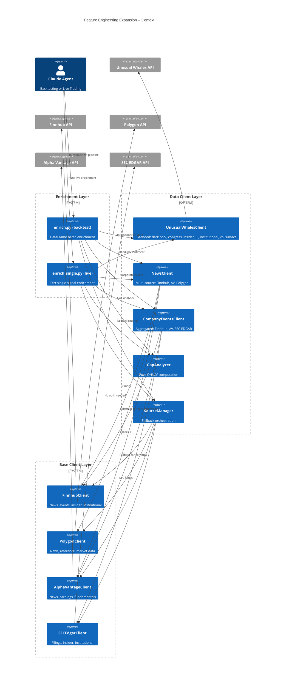
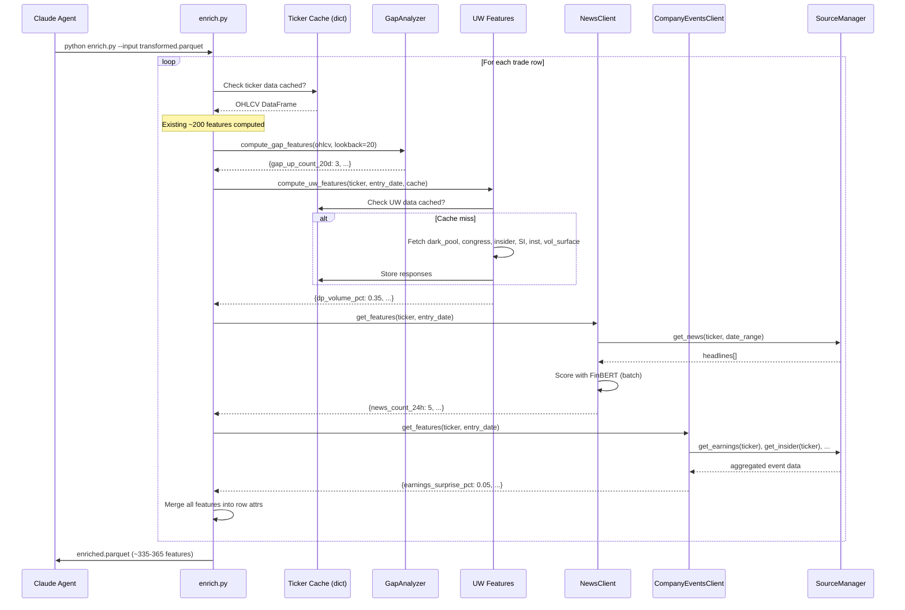
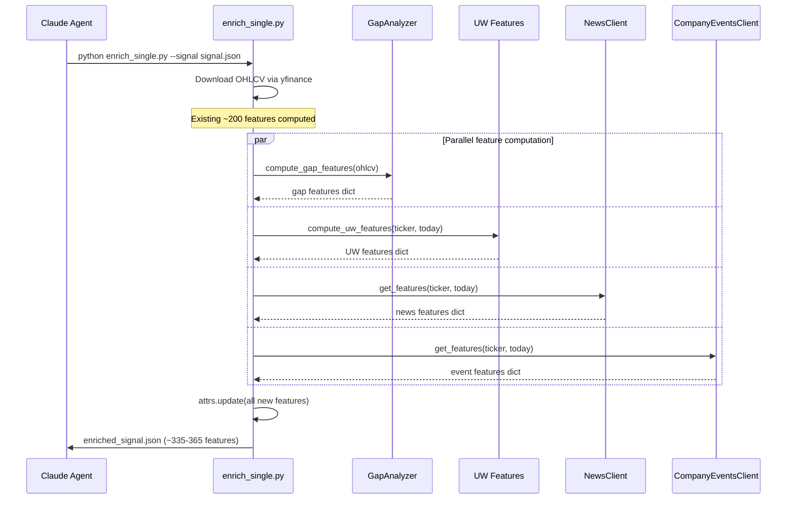
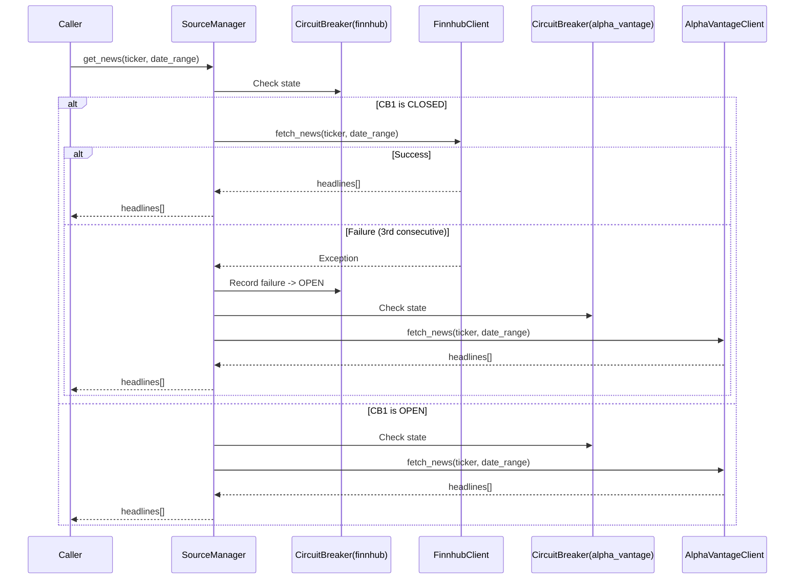

# Architecture: Feature Engineering Expansion (~135-165 New ML Features)

## 1. Context (from PRD)

The Phoenix ML pipeline currently computes ~200 features across 8 categories (price action, technicals, moving averages, volume, market context, time, sentiment/events, options). This expansion adds ~135-165 new features across 5 new categories:

- **D: Unusual Whales Full Integration** (~35-40 features) -- dark pool, congressional, insider, short interest, institutional, vol surface
- **A: Time Series Gap Filling** (~15-20 features) -- pure OHLCV computation, no external API
- **C: News & Headlines Sentiment** (~25-30 features) -- multi-source with FinBERT/TextBlob
- **B: Company Events** (~40-50 features) -- earnings, dividends, splits, insider, institutional, analyst, FDA, M&A
- **E: Data Source Expansion** (~20-25 features) -- Finnhub, Polygon, Alpha Vantage, SEC EDGAR clients with fallback orchestration

The expansion must integrate into both enrichment pipelines:
- **Backtest pipeline**: `agents/backtesting/tools/enrich.py` (DataFrame-based, batch, uses `enrich_trade(row, cache)`)
- **Live pipeline**: `agents/templates/live-trader-v1/tools/enrich_single.py` (dict-based, single signal, uses `enrich_signal(signal)`)

## 2. Constraints & Quality Attributes

| Attribute | Target |
|-----------|--------|
| Latency (live enrichment) | < 3s added per signal (new features only) |
| Latency (backtest enrichment) | < 500ms per trade (with warm cache) |
| Availability | Every feature must degrade to NaN, never crash the pipeline |
| Cache hit ratio | > 90% for repeated tickers within same backtest run |
| API cost | Respect free-tier rate limits; prefer disk cache over re-fetching |
| Memory | No per-feature memory leak; clients are singletons |
| Backward compat | Existing ~200 features unchanged; new features append only |

**Non-negotiable**: Every feature value is either a valid float or `np.nan`. No strings, no None, no exceptions propagating to the caller.

## 3. High-Level Design



## 4. Module Layout

```
shared/
  data/
    __init__.py
    fred_client.py                  # EXISTING -- reference pattern
    base_client.py                  # NEW -- BaseDataClient ABC
    gap_analysis.py                 # NEW (Category A) -- pure OHLCV
    news_client.py                  # NEW (Category C) -- multi-source news
    company_events.py               # NEW (Category B) -- aggregated events
    finnhub_client.py               # NEW (Category E) -- base Finnhub client
    polygon_client.py               # NEW (Category E) -- base Polygon client
    alpha_vantage_client.py         # NEW (Category E) -- base AV client
    sec_client.py                   # NEW (Category E) -- SEC EDGAR client
    source_manager.py               # NEW (Category E) -- fallback orchestrator
  unusual_whales/
    client.py                       # MODIFIED (Category D) -- add 6 new endpoints
    models.py                       # MODIFIED (Category D) -- add 6 new Pydantic models
    cache.py                        # EXISTING -- no changes
    features.py                     # NEW (Category D) -- feature computation from UW data
  config/
    base_config.py                  # MODIFIED -- add DataSourceConfig
agents/
  backtesting/tools/
    enrich.py                       # MODIFIED -- import + call new feature modules
  templates/live-trader-v1/tools/
    enrich_single.py                # MODIFIED -- import + call new feature modules
tests/
  unit/
    test_base_client.py             # NEW
    test_gap_analysis.py            # NEW
    test_news_client.py             # NEW
    test_company_events.py          # NEW
    test_uw_features.py             # NEW
    test_finnhub_client.py          # NEW
    test_polygon_client.py          # NEW
    test_alpha_vantage_client.py    # NEW
    test_sec_client.py              # NEW
    test_source_manager.py          # NEW
```

## 5. Components

### 5.1 BaseDataClient (Abstract Base)

All new data clients inherit from `BaseDataClient`. This codifies the patterns observed in `FredClient`:

```
# PSEUDOCODE -- illustrative only
class BaseDataClient(ABC):
    """Abstract base for all external data clients."""

    def __init__(self, name: str, api_key_env: str, cache_dir: str,
                 cache_ttl_hours: float, base_url: str):
        self._name = name
        self._api_key = os.getenv(api_key_env, "")
        self._cache_dir = Path(os.getenv(f"{name.upper()}_CACHE_DIR",
                              f"/tmp/phoenix_{name}_cache"))
        self._cache_dir.mkdir(parents=True, exist_ok=True)
        self._cache_ttl = cache_ttl_hours * 3600
        self._base_url = base_url
        self._circuit_breaker = CircuitBreaker(name, failure_threshold=3, cooldown_seconds=300)

    # Disk cache: JSON-based with TTL
    def _cache_path(self, key: str) -> Path
    def _is_cache_fresh(self, path: Path) -> bool
    def _read_cache(self, key: str) -> dict | None
    def _write_cache(self, key: str, data: dict) -> None

    # NaN-safe extraction
    @staticmethod
    def safe_float(value, default=np.nan) -> float
    @staticmethod
    def safe_int(value, default=0) -> int

    # HTTP with circuit breaker (sync for backtest compat)
    def _request(self, path: str, params: dict = None) -> dict
    async def _arequest(self, path: str, params: dict = None) -> dict

    # Subclass implements
    @abstractmethod
    def get_features(self, ticker: str, as_of_date: date) -> dict[str, float]
```

**Key design decisions**:
- **Sync-first with async option**: The backtest pipeline is sync (ThreadPoolExecutor). Live pipeline wraps async calls with `asyncio.run_until_complete`. Both patterns already exist in the codebase. BaseDataClient provides `_request` (sync via httpx) and `_arequest` (async).
- **Disk cache, not Redis**: Following the `FredClient` pattern. The UW Redis/in-memory cache is retained for its own endpoints since it already works. New clients use disk (JSON or Parquet) because the backtest agent runs in a sandboxed directory without guaranteed Redis access.
- **Circuit breaker per client**: Uses existing `shared/utils/circuit_breaker.py`. When a client trips, its features degrade to NaN for the cooldown period.

### 5.2 Category D: Unusual Whales Full Integration

Extends `shared/unusual_whales/client.py` with 6 new endpoints and adds a feature computation module.

**New endpoints on UnusualWhalesClient**:

| Method | API Path | Response Model |
|--------|----------|----------------|
| `get_dark_pool_flow(ticker)` | `/api/stock/{ticker}/dark-pool` | `DarkPoolFlow` |
| `get_congressional_trades(ticker)` | `/api/stock/{ticker}/congress` | `CongressionalTrade` |
| `get_insider_trades(ticker)` | `/api/stock/{ticker}/insider-trades` | `InsiderTrade` |
| `get_short_interest(ticker)` | `/api/stock/{ticker}/short-interest` | `ShortInterest` |
| `get_institutional_holdings(ticker)` | `/api/stock/{ticker}/institutional` | `InstitutionalHolding` |
| `get_vol_surface(ticker)` | `/api/stock/{ticker}/volatility-surface` | `VolSurface` |

**New Pydantic models** (in `models.py`):

```
# PSEUDOCODE -- illustrative only
class DarkPoolFlow(BaseModel):
    ticker: str
    total_volume: int = 0
    total_notional: float = 0.0
    dp_percentage: float | None = None      # dark pool as % of total volume
    block_trades: int = 0
    avg_trade_size: float | None = None
    sentiment: str | None = None            # bullish/bearish/neutral

class CongressionalTrade(BaseModel):
    ticker: str
    transaction_type: str = ""              # purchase/sale
    amount_range: str = ""
    representative: str = ""
    disclosure_date: str = ""
    transaction_date: str = ""

class InsiderTrade(BaseModel):
    ticker: str
    insider_name: str = ""
    title: str = ""
    transaction_type: str = ""
    shares: int = 0
    value: float = 0.0
    filing_date: str = ""

class ShortInterest(BaseModel):
    ticker: str
    short_interest: float | None = None
    shares_short: int = 0
    days_to_cover: float | None = None
    short_percent_of_float: float | None = None
    change_pct: float | None = None

class InstitutionalHolding(BaseModel):
    ticker: str
    total_institutional_shares: int = 0
    institutional_ownership_pct: float | None = None
    num_holders: int = 0
    change_in_shares: int = 0
    top_holders: list[dict] = Field(default_factory=list)

class VolSurface(BaseModel):
    ticker: str
    skew_25d: float | None = None           # 25-delta skew
    term_structure: dict[str, float] = Field(default_factory=dict)  # expiry -> IV
    atm_iv_30d: float | None = None
    atm_iv_60d: float | None = None
    atm_iv_90d: float | None = None
    butterfly_25d: float | None = None
```

**Feature computation** (`shared/unusual_whales/features.py`):

Computed features (~35-40):

| Feature Name | Source | Computation |
|-------------|--------|-------------|
| `dp_volume_pct` | DarkPoolFlow | `dp_percentage` directly |
| `dp_block_trade_count` | DarkPoolFlow | `block_trades` count |
| `dp_avg_trade_size` | DarkPoolFlow | `avg_trade_size` directly |
| `dp_notional_total` | DarkPoolFlow | `total_notional` |
| `dp_sentiment_bullish` | DarkPoolFlow | 1.0 if sentiment == "bullish" |
| `dp_sentiment_score` | DarkPoolFlow | mapped -1/0/1 |
| `congress_net_buys_30d` | CongressionalTrade[] | count purchases - sales in 30d window |
| `congress_trade_count_30d` | CongressionalTrade[] | total trades in 30d |
| `congress_has_recent_buy` | CongressionalTrade[] | 1.0 if any purchase within 14d |
| `congress_has_recent_sell` | CongressionalTrade[] | 1.0 if any sale within 14d |
| `insider_net_shares_90d` | InsiderTrade[] | sum of buy - sell shares in 90d |
| `insider_buy_count_90d` | InsiderTrade[] | count of buy transactions |
| `insider_sell_count_90d` | InsiderTrade[] | count of sell transactions |
| `insider_net_value_90d` | InsiderTrade[] | dollar value net |
| `insider_buy_sell_ratio` | InsiderTrade[] | buy_count / (buy + sell) |
| `insider_cluster_buy` | InsiderTrade[] | 1.0 if 3+ insiders bought in 14d |
| `si_short_pct_float` | ShortInterest | `short_percent_of_float` |
| `si_days_to_cover` | ShortInterest | `days_to_cover` |
| `si_change_pct` | ShortInterest | `change_pct` (period-over-period) |
| `si_squeeze_risk` | ShortInterest | 1.0 if si > 20% and dtc > 5 |
| `inst_ownership_pct` | InstitutionalHolding | `institutional_ownership_pct` |
| `inst_num_holders` | InstitutionalHolding | `num_holders` |
| `inst_share_change` | InstitutionalHolding | `change_in_shares` (positive = accumulation) |
| `inst_accumulation` | InstitutionalHolding | 1.0 if change_in_shares > 0 |
| `vol_skew_25d` | VolSurface | `skew_25d` |
| `vol_term_slope` | VolSurface | (iv_90d - iv_30d) / iv_30d |
| `vol_term_structure_flat` | VolSurface | 1.0 if abs(slope) < 0.05 |
| `vol_term_structure_inverted` | VolSurface | 1.0 if iv_30d > iv_90d |
| `vol_atm_30d` | VolSurface | `atm_iv_30d` |
| `vol_atm_60d` | VolSurface | `atm_iv_60d` |
| `vol_atm_90d` | VolSurface | `atm_iv_90d` |
| `vol_butterfly_25d` | VolSurface | `butterfly_25d` |
| `vol_smile_steepness` | VolSurface | abs(skew_25d) normalized |
| `options_sweep_count` | OptionsFlow (existing) | count where trade_type == "sweep" |
| `options_block_count` | OptionsFlow (existing) | count where trade_type == "block" |
| `options_unusual_ratio` | OptionsFlow (existing) | unusual volume / avg volume |

### 5.3 Category A: Time Series Gap Filling

`shared/data/gap_analysis.py` -- pure computation module, no API calls. Operates on OHLCV DataFrame that is already available in both enrichment pipelines.

Features (~15-20):

| Feature Name | Computation |
|-------------|-------------|
| `gap_up_count_20d` | Count of gap-up days (open > prev close * 1.005) in last 20 bars |
| `gap_down_count_20d` | Count of gap-down days in last 20 bars |
| `gap_fill_rate_20d` | Fraction of gaps filled same day (low reached prev close for up-gap) |
| `avg_gap_size_20d` | Mean absolute gap % over 20 bars |
| `max_gap_up_20d` | Largest gap-up % in 20 bars |
| `max_gap_down_20d` | Largest gap-down % in 20 bars |
| `gap_fill_speed_avg` | Mean number of bars to fill gaps (capped at 10) |
| `unfilled_gap_above` | 1.0 if there is an unfilled gap above current price within 20d |
| `unfilled_gap_below` | 1.0 if there is an unfilled gap below current price within 20d |
| `unfilled_gap_above_dist` | Distance to nearest unfilled gap above (% of price) |
| `unfilled_gap_below_dist` | Distance to nearest unfilled gap below (% of price) |
| `gap_tendency` | (gap_up_count - gap_down_count) / total_gaps, measures directional bias |
| `consecutive_gap_same_dir` | Longest streak of gaps in same direction |
| `fwd_fill_coverage_20d` | % of trading days with valid data (no missing bars) |
| `missing_bar_count_20d` | Count of expected but missing trading days |
| `data_quality_score` | Composite: 1.0 - (missing + stale) / expected |

**Interface**:
```
# PSEUDOCODE
def compute_gap_features(
    ohlcv: pd.DataFrame,   # must have Open, High, Low, Close columns
    lookback: int = 20
) -> dict[str, float]
```

No caching needed -- pure computation on already-downloaded data.

### 5.4 Category C: News & Headlines Sentiment

`shared/data/news_client.py` -- aggregates news headlines from multiple sources, scores them with FinBERT (primary) or TextBlob (fallback).

**Fallback chain**: Finnhub -> Alpha Vantage -> Polygon. Each source is tried in order; first to return non-empty results wins.

Features (~25-30):

| Feature Name | Computation |
|-------------|-------------|
| `news_count_24h` | Number of news articles in last 24 hours |
| `news_count_7d` | Number of news articles in last 7 days |
| `news_sentiment_avg_24h` | Mean FinBERT score of headlines in 24h |
| `news_sentiment_avg_7d` | Mean FinBERT score of headlines in 7d |
| `news_sentiment_std_24h` | Std dev of sentiment in 24h (disagreement) |
| `news_sentiment_std_7d` | Std dev of sentiment in 7d |
| `news_sentiment_max_24h` | Most bullish headline score in 24h |
| `news_sentiment_min_24h` | Most bearish headline score in 24h |
| `news_bullish_ratio_24h` | Fraction of bullish articles in 24h |
| `news_bearish_ratio_24h` | Fraction of bearish articles in 24h |
| `news_sentiment_momentum` | avg_24h - avg_7d (sentiment acceleration) |
| `news_volume_spike` | news_count_24h / (news_count_7d / 7) -- attention spike |
| `news_has_earnings_mention` | 1.0 if any headline mentions earnings/revenue |
| `news_has_fda_mention` | 1.0 if any headline mentions FDA/approval |
| `news_has_merger_mention` | 1.0 if any headline mentions merger/acquisition |
| `news_has_lawsuit_mention` | 1.0 if any headline mentions lawsuit/legal/SEC |
| `news_has_upgrade_mention` | 1.0 if any headline mentions upgrade/target/raise |
| `news_has_downgrade_mention` | 1.0 if any headline mentions downgrade/cut/lower |
| `news_source_count` | Number of distinct sources covering ticker |
| `news_headline_length_avg` | Average word count (proxy for story complexity) |
| `news_recency_hours` | Hours since most recent article |
| `news_weekend_flag` | 1.0 if most recent news was published on weekend |
| `news_confidence_avg_24h` | Mean FinBERT confidence score |
| `news_sentiment_skew_7d` | Skewness of sentiment distribution over 7d |
| `news_positive_streak` | Consecutive days with positive avg sentiment |

**Sentiment scoring**:
1. Primary: `shared.nlp.sentiment_classifier.SentimentClassifier` (FinBERT) -- already loaded in enrichment
2. Fallback: `TextBlob` polarity if FinBERT unavailable or fails

**Caching**: Disk cache per ticker per day. Key format: `news_{ticker}_{date}.json`. TTL: 4 hours for live, 24 hours for backtest.

### 5.5 Category B: Company Events

`shared/data/company_events.py` -- aggregates corporate events from Finnhub, Alpha Vantage, and SEC EDGAR.

Features (~40-50):

**Earnings** (~10):
| Feature | Source |
|---------|--------|
| `earnings_surprise_pct` | Finnhub/AV: (actual - estimate) / abs(estimate) |
| `earnings_surprise_direction` | 1.0 = beat, 0.0 = miss |
| `earnings_beat_streak` | Consecutive quarters beating estimates |
| `earnings_revenue_surprise_pct` | Revenue surprise % |
| `earnings_eps_growth_yoy` | EPS year-over-year growth |
| `earnings_reported_within_7d` | 1.0 if earnings reported in last 7 days |
| `earnings_upcoming_within_7d` | 1.0 if earnings expected in next 7 days |
| `post_earnings_drift_3d` | Return in 3 days after last earnings |
| `earnings_volatility_ratio` | IV before / IV after earnings |
| `earnings_count_last_4q` | Number of earnings reports in last 4 quarters (data quality) |

**Dividends** (~5):
| Feature | Source |
|---------|--------|
| `dividend_yield` | AV/Finnhub |
| `dividend_ex_date_within_7d` | 1.0 if ex-date in next 7 days |
| `dividend_growth_yoy` | Year-over-year dividend change |
| `dividend_payout_ratio` | Dividends / EPS |
| `dividend_consecutive_years` | Years of consecutive dividend payments |

**Splits** (~3):
| Feature | Source |
|---------|--------|
| `split_within_30d` | 1.0 if stock split in last/next 30 days |
| `split_ratio` | Split ratio (e.g., 4.0 for 4:1) |
| `days_since_split` | Days since most recent split |

**Insider & Institutional** (~10):
| Feature | Source |
|---------|--------|
| `sec_insider_buy_count_90d` | SEC EDGAR Form 4 buys in 90d |
| `sec_insider_sell_count_90d` | SEC EDGAR Form 4 sells in 90d |
| `sec_insider_net_value_90d` | Net dollar value from Form 4 |
| `sec_13f_holders_change` | Quarter-over-quarter change in 13F holders |
| `sec_13f_shares_change_pct` | Quarter-over-quarter change in 13F shares |
| `inst_top10_concentration` | Top 10 holders as % of institutional total |
| `inst_new_positions_count` | New positions initiated this quarter |
| `inst_closed_positions_count` | Positions fully sold this quarter |
| `sec_filing_count_30d` | Total SEC filings in last 30 days |
| `sec_8k_count_30d` | 8-K filings in last 30 days (material events) |

**Analyst** (~8):
| Feature | Source |
|---------|--------|
| `analyst_consensus_rating` | Finnhub: mean recommendation (1-5 scale) |
| `analyst_target_price` | Median target price |
| `analyst_target_upside` | (target - current) / current |
| `analyst_coverage_count` | Number of analysts covering |
| `analyst_upgrade_count_30d` | Upgrades in last 30 days |
| `analyst_downgrade_count_30d` | Downgrades in last 30 days |
| `analyst_rating_change_30d` | Net change in consensus over 30 days |
| `analyst_estimate_revision_pct` | EPS estimate revision % (30d) |

**Special Events** (~6):
| Feature | Source |
|---------|--------|
| `fda_event_within_30d` | 1.0 if FDA calendar event within 30d (biotech) |
| `ma_rumor_flag` | 1.0 if M&A keywords in recent 8-K filings |
| `shelf_registration_flag` | 1.0 if S-3 filing in last 90d |
| `buyback_announced` | 1.0 if buyback program announced (8-K) |
| `debt_offering_flag` | 1.0 if debt offering in recent filings |
| `management_change_flag` | 1.0 if CEO/CFO change in recent 8-K |

### 5.6 Category E: Data Source Expansion

Four new base clients + one orchestrator.

**FinnhubClient** (`shared/data/finnhub_client.py`):
- Extends BaseDataClient
- Endpoints: company news, earnings calendar, recommendation trends, insider transactions, institutional ownership, FDA calendar
- Rate limit: 60 calls/min (free tier)
- Cache TTL: 6 hours

**PolygonClient** (`shared/data/polygon_client.py`):
- Extends BaseDataClient
- Endpoints: ticker news, ticker details, stock splits, dividends
- Rate limit: 5 calls/min (free tier)
- Cache TTL: 12 hours

**AlphaVantageClient** (`shared/data/alpha_vantage_client.py`):
- Extends BaseDataClient
- Endpoints: news sentiment, earnings, company overview, income statement
- Rate limit: 5 calls/min (free tier), 500/day
- Cache TTL: 12 hours

**SECEdgarClient** (`shared/data/sec_client.py`):
- Extends BaseDataClient
- No API key required
- Endpoints: EDGAR full-text search, company filings (10-K, 10-Q, 8-K, Form 4, 13F-HR)
- Rate limit: 10 req/sec with User-Agent header
- Cache TTL: 24 hours

**SourceManager** (`shared/data/source_manager.py`):
- Orchestrator that routes data requests to the correct client with fallback
- Maintains a registry of `(data_type, priority_order)` mappings
- Tracks health of each source via circuit breaker state

## 6. Key Flows

### 6.1 Backtest Enrichment Flow



### 6.2 Live Signal Enrichment Flow



### 6.3 Fallback Chain Flow



## 7. Caching Strategy

### 7.1 Cache Layers

| Layer | Storage | TTL | Used By |
|-------|---------|-----|---------|
| Ticker OHLCV | Parquet on disk | Duration of backtest run | enrich.py (existing) |
| UW API responses | Redis + in-memory | 5 min (existing) | UnusualWhalesClient |
| New API responses | JSON on disk | Per-client (6-24h) | All new clients |
| Sentiment scores | JSON on disk | 4h (live), 24h (backtest) | NewsClient |
| SEC filings | JSON on disk | 24h | SECEdgarClient |

### 7.2 Cache Key Format

All disk caches follow the pattern: `{client_name}/{data_type}_{ticker}_{date_or_hash}.json`

Examples:
- `/tmp/phoenix_finnhub_cache/news_AAPL_2026-04-11.json`
- `/tmp/phoenix_sec_cache/filings_AAPL_form4_2026Q1.json`
- `/tmp/phoenix_av_cache/earnings_AAPL.json`

### 7.3 Eviction

- **Automatic TTL**: Files older than TTL are treated as stale (same as FredClient pattern)
- **Stale-while-revalidate**: If fetch fails, return stale cache data rather than NaN
- **Manual cleanup**: Not required for `/tmp`; OS handles it. For persistent cache dirs, a `cleanup_cache(max_age_days=7)` utility on BaseDataClient.

## 8. Fallback Chains

| Data Type | Priority 1 | Priority 2 | Priority 3 | Final Fallback |
|-----------|-----------|-----------|-----------|----------------|
| Company News | Finnhub | Alpha Vantage | Polygon | Empty list -> NaN features |
| Earnings Calendar | Finnhub | Alpha Vantage | yfinance (existing) | NaN |
| Insider Trades | SEC EDGAR (Form 4) | Finnhub | -- | NaN |
| Institutional Holdings | SEC EDGAR (13F) | Finnhub | -- | NaN |
| Analyst Recommendations | Finnhub | yfinance (existing) | -- | NaN |
| Stock Splits | Polygon | Alpha Vantage | yfinance | NaN |
| Dividends | Polygon | Alpha Vantage | yfinance | NaN |
| Dark Pool | Unusual Whales | -- | -- | NaN |
| Congressional Trades | Unusual Whales | -- | -- | NaN |
| Short Interest | Unusual Whales | Finnhub | -- | NaN |
| Vol Surface | Unusual Whales | -- | -- | NaN |

The SourceManager implements this table as a configuration dict, not hardcoded if-else chains:

```
# PSEUDOCODE
FALLBACK_CHAINS = {
    "news": ["finnhub", "alpha_vantage", "polygon"],
    "earnings": ["finnhub", "alpha_vantage"],
    "insider": ["sec_edgar", "finnhub"],
    "institutional": ["sec_edgar", "finnhub"],
    "analyst": ["finnhub"],
    "splits": ["polygon", "alpha_vantage"],
    "dividends": ["polygon", "alpha_vantage"],
    "dark_pool": ["unusual_whales"],
    "congressional": ["unusual_whales"],
    "short_interest": ["unusual_whales", "finnhub"],
    "vol_surface": ["unusual_whales"],
}
```

## 9. Configuration & Environment Variables

### 9.1 New Environment Variables

```bash
# API Keys (all optional -- features degrade to NaN if missing)
FINNHUB_API_KEY=""              # Free: https://finnhub.io/register
POLYGON_API_KEY=""              # Free: https://polygon.io/dashboard/signup
ALPHA_VANTAGE_API_KEY=""        # Free: https://www.alphavantage.co/support/
# SEC EDGAR requires no key, just a User-Agent
SEC_EDGAR_USER_AGENT="Phoenix Trading Bot (contact@example.com)"

# Unusual Whales (existing)
UNUSUAL_WHALES_API_TOKEN=""     # Already exists

# Feature flags (enable/disable entire categories)
FEATURE_UW_EXTENDED=true        # Category D
FEATURE_GAP_ANALYSIS=true       # Category A
FEATURE_NEWS_SENTIMENT=true     # Category C
FEATURE_COMPANY_EVENTS=true     # Category B
FEATURE_SOURCE_EXPANSION=true   # Category E

# Cache directories (all default to /tmp/phoenix_{name}_cache)
FINNHUB_CACHE_DIR=""
POLYGON_CACHE_DIR=""
ALPHA_VANTAGE_CACHE_DIR=""
SEC_CACHE_DIR=""
NEWS_CACHE_DIR=""
EVENTS_CACHE_DIR=""

# Rate limit overrides
FINNHUB_RATE_LIMIT=60          # calls per minute
POLYGON_RATE_LIMIT=5
ALPHA_VANTAGE_RATE_LIMIT=5
```

### 9.2 Config Dataclass Addition

Add to `shared/config/base_config.py`:

```
# PSEUDOCODE
@dataclass
class DataSourceConfig:
    finnhub_api_key: str = os.getenv("FINNHUB_API_KEY", "")
    polygon_api_key: str = os.getenv("POLYGON_API_KEY", "")
    alpha_vantage_api_key: str = os.getenv("ALPHA_VANTAGE_API_KEY", "")
    sec_user_agent: str = os.getenv("SEC_EDGAR_USER_AGENT", "Phoenix Trading Bot")
    feature_uw_extended: bool = os.getenv("FEATURE_UW_EXTENDED", "true").lower() == "true"
    feature_gap_analysis: bool = os.getenv("FEATURE_GAP_ANALYSIS", "true").lower() == "true"
    feature_news_sentiment: bool = os.getenv("FEATURE_NEWS_SENTIMENT", "true").lower() == "true"
    feature_company_events: bool = os.getenv("FEATURE_COMPANY_EVENTS", "true").lower() == "true"
    feature_source_expansion: bool = os.getenv("FEATURE_SOURCE_EXPANSION", "true").lower() == "true"
```

## 10. Error Handling

### 10.1 NaN-Safe Pattern

Every feature computation follows this structure (matching existing codebase convention):

```
# PSEUDOCODE -- matches pattern in enrich.py and fred_client.py
def compute_feature_X(data) -> dict[str, float]:
    features = {}
    try:
        result = some_computation(data)
        features["feature_x"] = BaseDataClient.safe_float(result)
    except Exception:
        features["feature_x"] = np.nan
    return features
```

The top-level integration in `enrich.py` / `enrich_single.py` wraps each category in try/except:

```
# PSEUDOCODE
# In enrich_trade() or enrich_signal():
if config.feature_gap_analysis:
    try:
        attrs.update(compute_gap_features(ohlcv))
    except Exception:
        pass  # All features default to NaN via the module's own handling
```

### 10.2 Circuit Breaker Integration

Each BaseDataClient instance holds a `CircuitBreaker` from `shared/utils/circuit_breaker.py`. The existing three-state implementation (CLOSED -> OPEN -> HALF_OPEN) is used as-is:
- **failure_threshold**: 3 consecutive failures -> OPEN
- **cooldown_seconds**: 300s (5 min) for live, 60s for backtest (faster retry in batch)
- When OPEN: `_request()` returns `{}` immediately, features degrade to NaN

### 10.3 Rate Limiting

Simple token-bucket per client, implemented in BaseDataClient:

```
# PSEUDOCODE
class BaseDataClient:
    def _wait_for_rate_limit(self):
        elapsed = time.monotonic() - self._last_request_time
        min_interval = 60.0 / self._rate_limit  # e.g., 1.0s for 60/min
        if elapsed < min_interval:
            time.sleep(min_interval - elapsed)
        self._last_request_time = time.monotonic()
```

## 11. Testing Strategy

### 11.1 Unit Test Pattern

Every client gets a test file with this structure:

```
# PSEUDOCODE -- test_finnhub_client.py
class TestFinnhubClient:
    def test_init_without_api_key(self):
        """Client initializes with empty key, features return NaN."""

    def test_cache_write_and_read(self, tmp_path):
        """Data is cached to disk and read back correctly."""

    def test_cache_ttl_expiry(self, tmp_path):
        """Stale cache is not returned when fresh fetch succeeds."""

    def test_stale_cache_on_failure(self, tmp_path):
        """Stale cache IS returned when API fetch fails."""

    @patch("httpx.Client.request")
    def test_successful_fetch(self, mock_request):
        """Valid API response is parsed into correct features."""

    @patch("httpx.Client.request")
    def test_api_error_returns_nan(self, mock_request):
        """HTTP error degrades all features to NaN, no exception."""

    def test_circuit_breaker_opens(self):
        """After 3 failures, circuit opens and requests fail-fast."""

    def test_get_features_returns_all_keys(self):
        """Feature dict always contains all expected keys (even if NaN)."""
```

### 11.2 Integration Points

- **GapAnalyzer**: Tested with synthetic OHLCV DataFrames (no external calls)
- **NewsClient**: Mocked HTTP responses, test FinBERT scoring on known headlines
- **CompanyEventsClient**: Mocked HTTP responses per source
- **SourceManager**: Test fallback by making primary source raise, verify secondary is called
- **Enrichment integration**: Add test in `tests/unit/test_enrich_expansion.py` that runs `enrich_trade()` with mocked clients and verifies all ~335 feature keys are present

### 11.3 Fixtures

```
# PSEUDOCODE -- conftest.py additions
@pytest.fixture
def sample_ohlcv():
    """Generate 252 days of synthetic OHLCV data."""

@pytest.fixture
def mock_finnhub_news_response():
    """Return a realistic Finnhub news API response."""

@pytest.fixture
def mock_uw_dark_pool_response():
    """Return a realistic UW dark pool API response."""
```

## 12. Phased Implementation Plan

### Phase 1: Foundation (BaseDataClient + GapAnalysis)
**Goal**: Establish the base client pattern and deliver the easiest category (A: no external APIs).

**Files created**:
- `shared/data/base_client.py`
- `shared/data/gap_analysis.py`
- `tests/unit/test_base_client.py`
- `tests/unit/test_gap_analysis.py`

**Files modified**:
- `shared/config/base_config.py` (add `DataSourceConfig`)
- `agents/backtesting/tools/enrich.py` (add gap feature call at end of `enrich_trade`)
- `agents/templates/live-trader-v1/tools/enrich_single.py` (add gap feature call at end of `enrich_signal`)

**Interfaces**: `BaseDataClient` ABC, `compute_gap_features(ohlcv, lookback) -> dict[str, float]`

**Dependencies**: None (first phase).

**DoD**:
- `BaseDataClient` with disk caching, NaN-safe helpers, circuit breaker, rate limiter
- `compute_gap_features` returns all 16 features given valid OHLCV
- All features are `float` or `np.nan`
- Both enrichment pipelines call gap analysis behind `FEATURE_GAP_ANALYSIS` flag
- `make test` passes with new tests
- Backtest enrichment still produces same existing ~200 features (no regression)

**Test hooks**: `test_gap_analysis.py` with synthetic data; `test_base_client.py` with mocked HTTP

---

### Phase 2: Unusual Whales Extension (Category D)
**Goal**: Expand existing UW client with 6 new endpoints and add feature computation module.

**Files created**:
- `shared/unusual_whales/features.py`
- `tests/unit/test_uw_features.py`

**Files modified**:
- `shared/unusual_whales/client.py` (add 6 new async methods)
- `shared/unusual_whales/models.py` (add 6 new Pydantic models)
- `agents/backtesting/tools/enrich.py` (replace inline UW feature extraction with `compute_uw_features`)
- `agents/templates/live-trader-v1/tools/enrich_single.py` (same)

**Interfaces**: 6 new methods on `UnusualWhalesClient`, `compute_uw_features(ticker, date, uw_client) -> dict[str, float]`

**Dependencies**: Phase 1 (uses `BaseDataClient.safe_float`, feature flags).

**DoD**:
- 6 new endpoints with caching (existing UWCache pattern)
- 6 new Pydantic models validate correctly
- `compute_uw_features` returns all ~35 features
- Features gracefully degrade if UW API token is missing
- Existing options features (options_total_premium_50, gex_value, etc.) still work
- `make test` passes

**Test hooks**: `test_uw_features.py` with mocked UW client responses

---

### Phase 3: Data Source Clients (Category E)
**Goal**: Build the 4 base clients and the SourceManager orchestrator.

**Files created**:
- `shared/data/finnhub_client.py`
- `shared/data/polygon_client.py`
- `shared/data/alpha_vantage_client.py`
- `shared/data/sec_client.py`
- `shared/data/source_manager.py`
- `tests/unit/test_finnhub_client.py`
- `tests/unit/test_polygon_client.py`
- `tests/unit/test_alpha_vantage_client.py`
- `tests/unit/test_sec_client.py`
- `tests/unit/test_source_manager.py`

**Files modified**: None yet (clients are standalone; consumers come in Phase 4 and 5).

**Interfaces**: Each client extends `BaseDataClient`. `SourceManager.get(data_type, ticker, params) -> dict`

**Dependencies**: Phase 1 (BaseDataClient).

**DoD**:
- Each client correctly parses its API's response format
- Each client has disk caching with correct TTL
- SourceManager implements fallback chains from the table in Section 8
- Circuit breaker integration tested (failure threshold -> fallback)
- Rate limiting tested per client
- All clients degrade to empty/NaN if API key is missing
- `make test` passes

**Test hooks**: Each client has a test file with mocked HTTP responses. SourceManager tests mock client-level failures.

---

### Phase 4: News Sentiment (Category C)
**Goal**: Multi-source news fetching with FinBERT scoring.

**Files created**:
- `shared/data/news_client.py`
- `tests/unit/test_news_client.py`

**Files modified**:
- `agents/backtesting/tools/enrich.py` (add news feature call)
- `agents/templates/live-trader-v1/tools/enrich_single.py` (add news feature call)

**Interfaces**: `NewsClient.get_features(ticker, as_of_date) -> dict[str, float]`

**Dependencies**: Phase 1 (BaseDataClient), Phase 3 (FinnhubClient, AlphaVantageClient, PolygonClient, SourceManager).

**DoD**:
- NewsClient fetches headlines via SourceManager with fallback chain
- FinBERT scoring with TextBlob fallback
- All 25 features returned with correct types
- Keyword detection (earnings, FDA, merger, lawsuit, upgrade, downgrade) works
- Caching: headlines cached per ticker per day
- Backtest performance: FinBERT batch scoring for efficiency (score all headlines at once)
- Both enrichment pipelines integrate behind `FEATURE_NEWS_SENTIMENT` flag
- `make test` passes

**Test hooks**: `test_news_client.py` with mocked headlines and mocked sentiment classifier

---

### Phase 5: Company Events (Category B)
**Goal**: Aggregate corporate events from multiple sources.

**Files created**:
- `shared/data/company_events.py`
- `tests/unit/test_company_events.py`

**Files modified**:
- `agents/backtesting/tools/enrich.py` (add events feature call)
- `agents/templates/live-trader-v1/tools/enrich_single.py` (add events feature call)

**Interfaces**: `CompanyEventsClient.get_features(ticker, as_of_date) -> dict[str, float]`

**Dependencies**: Phase 1 (BaseDataClient), Phase 3 (all base clients + SourceManager).

**DoD**:
- Earnings features computed from Finnhub/AV data with fallback to yfinance
- Dividend features computed
- Split features computed
- SEC-sourced insider/institutional features computed
- Analyst features computed from Finnhub with yfinance fallback
- Special event flags (FDA, M&A, buyback, shelf, debt, management) from 8-K keyword analysis
- All ~45 features returned
- Existing earnings/analyst features in enrichment pipelines are replaced by richer versions (backward compatible -- same feature names preserved, new ones added)
- Both enrichment pipelines integrate behind `FEATURE_COMPANY_EVENTS` flag
- `make test` passes

**Test hooks**: `test_company_events.py` with mocked API responses per source

---

### Phase 6: Integration Testing & Documentation
**Goal**: End-to-end validation, performance benchmarking, documentation.

**Files created**:
- `tests/integration/test_enrichment_expansion.py`

**Files modified**:
- `agents/backtesting/CLAUDE.md` (update feature count from ~200 to ~335-365)
- `.env.example` (add new env vars)
- `pyproject.toml` (add new optional deps: `finnhub-python`, `polygon-api-client`, `textblob`)

**Dependencies**: All prior phases.

**DoD**:
- Integration test runs both `enrich_trade` and `enrich_signal` with all features enabled
- Verifies all ~335-365 feature keys are present in output
- Verifies no feature key contains None (only float or NaN)
- Performance benchmark: backtest enrichment < 500ms/trade (warm cache), live < 3s/signal
- All `make test` passes
- All `make lint` passes
- All `make typecheck` passes
- `.env.example` updated with all new variables
- Agent CLAUDE.md updated with new feature categories

## 13. ADRs

### ADR-001: Sync-first client design with async escape hatch

**Context**: The backtest pipeline uses `ThreadPoolExecutor` for parallelism and is fundamentally synchronous. The live pipeline is also sync but wraps async UW calls with `asyncio.new_event_loop().run_until_complete()`. New clients need to work in both contexts.

**Options considered**:
1. **Async-only** (like current UW client) -- requires event loop juggling in backtest, which is error-prone and already shows as a pattern smell (`asyncio.new_event_loop()` created per ticker).
2. **Sync-only** (like FredClient) -- simpler, works everywhere, but cannot leverage httpx async for concurrent calls within a single enrichment.
3. **Sync primary, async optional** -- BaseDataClient provides both `_request` (sync httpx.Client) and `_arequest` (async httpx.AsyncClient). Default usage is sync. Live pipeline can opt into async if needed.

**Decision**: Option 3. Sync primary, async optional.

**Consequences**: 
- Simpler integration in both pipelines
- BaseDataClient carries two HTTP client attributes (lazy-init)
- Slight code duplication in request methods (acceptable for clarity)
- Existing UW async client is NOT refactored -- it keeps working as-is; the new `features.py` module bridges sync/async

---

### ADR-002: Disk cache (not Redis) for new clients

**Context**: UW client uses Redis with in-memory fallback. FredClient uses Parquet on disk. New clients need a caching strategy.

**Options considered**:
1. **Redis** -- consistent with UW cache, but backtest agents run in sandboxed directories and may not have Redis access.
2. **Disk (JSON)** -- consistent with FredClient, works in any environment, survives process restarts.
3. **Disk (Parquet)** -- more compact for DataFrames, but new clients mostly deal with JSON API responses.
4. **Hybrid (Redis + disk)** -- two layers, more complex.

**Decision**: Option 2. Disk cache with JSON serialization, following the FredClient reference pattern.

**Consequences**:
- Works in all environments (Docker, local, sandboxed agent)
- Slightly slower than Redis for hot data, but TTLs of 6-24h mean most data is cold
- No new infrastructure dependency
- Cache directory configurable per client via env var

---

### ADR-003: Feature flags per category

**Context**: Some users may not have API keys for all sources. Some features may cause regressions in existing models.

**Options considered**:
1. **All-or-nothing** -- new features always computed.
2. **Per-category feature flags** -- `FEATURE_UW_EXTENDED=true`, etc.
3. **Per-feature flags** -- too granular, 165 flags is unmanageable.

**Decision**: Option 2. Per-category feature flags, all defaulting to `true`.

**Consequences**:
- Easy to disable a category that is causing issues
- Retraining is needed when toggling flags (feature count changes)
- Config dataclass in `base_config.py` grows by 5 boolean fields

---

### ADR-004: SourceManager with declarative fallback chains

**Context**: Multiple data types need fallback across 4+ sources. The fallback logic could be in each consumer or centralized.

**Options considered**:
1. **Per-consumer fallback** -- each feature module tries sources inline.
2. **Centralized SourceManager** -- single module owns the fallback table.

**Decision**: Option 2. Centralized SourceManager with a declarative `FALLBACK_CHAINS` dict.

**Consequences**:
- One place to change fallback order
- SourceManager adds one level of indirection
- Circuit breaker state is per-client, SourceManager queries it before routing
- New sources can be added by extending the dict

---

### ADR-005: FinBERT primary, TextBlob fallback for news sentiment

**Context**: News headline sentiment scoring needs a model. The codebase already has FinBERT in `shared/nlp/sentiment_classifier.py`.

**Options considered**:
1. **FinBERT only** -- best accuracy, but heavy (transformer model) and may fail to load in constrained environments.
2. **TextBlob only** -- lightweight, but mediocre on financial text.
3. **FinBERT primary, TextBlob fallback** -- best of both.

**Decision**: Option 3. FinBERT primary with TextBlob fallback.

**Consequences**:
- `textblob` added as optional dependency
- Fallback is transparent: if SentimentClassifier import or `.classify()` fails, TextBlob is used
- Sentiment scores between FinBERT (-1 to 1) and TextBlob (-1 to 1) are on the same scale
- Model retraining should account for potential sentiment score distribution shift if fallback activates mid-run (rare edge case)

## 14. Risks & Open Questions

| Risk | Mitigation |
|------|-----------|
| Free-tier API rate limits cause backtest timeouts | Aggressive disk caching (6-24h TTL), rate limiter in BaseDataClient, parallel fetch only across tickers (not across APIs) |
| FinBERT model loading adds 2-3s to first enrichment | Lazy-load singleton pattern (already used), warm on first call |
| SEC EDGAR response format changes | Defensive parsing with try/except per field, cache validated responses |
| New features cause model performance regression | Feature flags allow disabling categories; retraining is a separate pipeline step |
| Unusual Whales API plan limits may block new endpoints | Feature flag `FEATURE_UW_EXTENDED` disables entire category; per-endpoint try/except |

**Open questions** (to be resolved during implementation):
1. Should SEC EDGAR User-Agent include a real contact email, or a generic one?
2. What is the Unusual Whales subscription tier? Some endpoints may require premium.
3. Should backtest pipeline prefetch all tickers' events in batch, or fetch per-trade?
