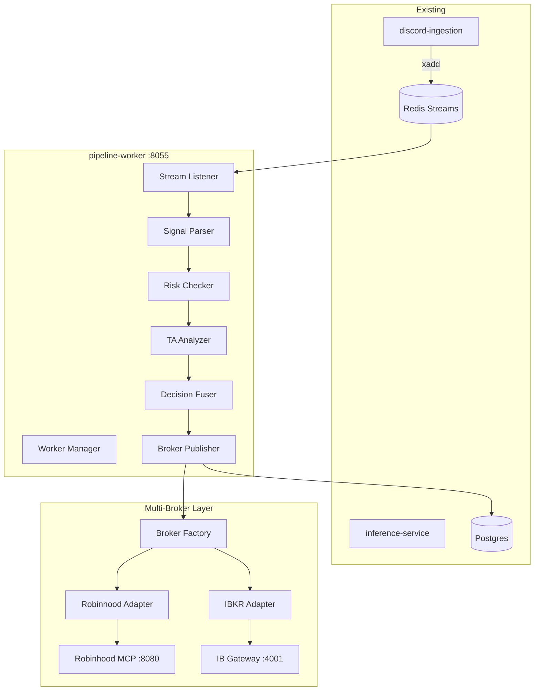
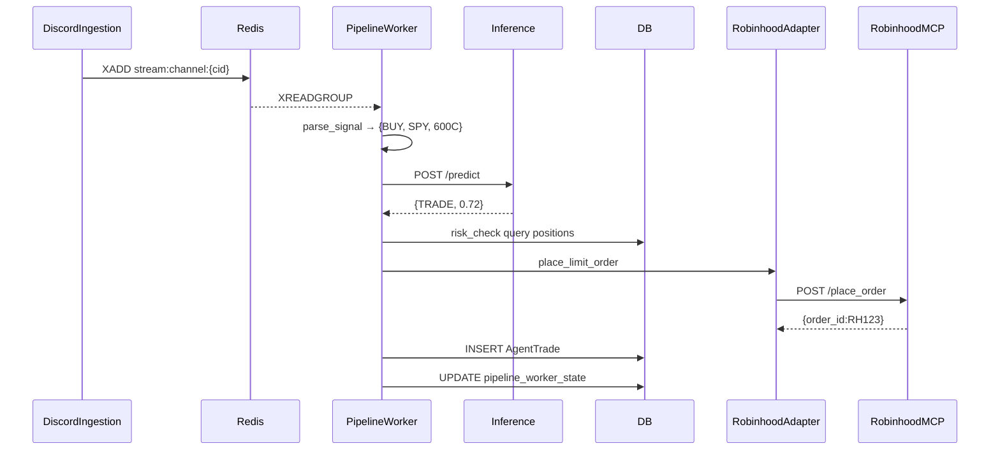
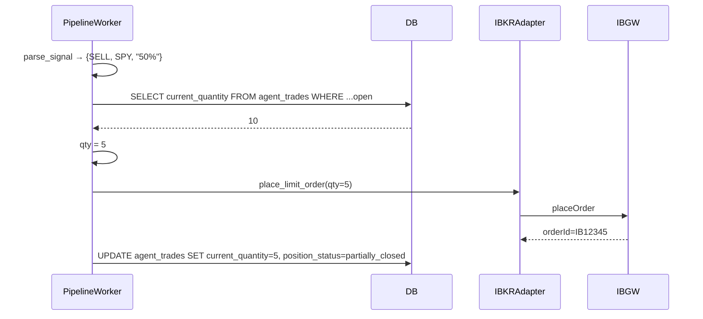

# Architecture: Phase A — Pipeline Engine Consolidation + Multi-Broker Support

ADR-007 | Date: 2026-04-18 | Status: Proposed

## Summary

Phase A consolidates Phoenix Trade Bot's pipeline trading logic from OldProject into the existing `services/pipeline-worker/` scaffold, adds multi-broker support (Robinhood + Interactive Brokers), and completes the pipeline dashboard UI. The pipeline worker becomes the deterministic, non-AI trading engine alternative to Claude SDK agents, with broker-agnostic adapters wrapping Robinhood MCP and IBKR TWS API. All six PRD open questions are resolved below with opinionated, production-ready decisions.

## Decisions on PRD Open Questions

### 1. IBKR API Path: TWS API (ib_insync) vs Client Portal Gateway

**Decision:** TWS API via `ib_insync` (or its successor `ib_async`).

**Justification:**
- TWS API is mature, fast, options-complete (OCC symbols, chains, Greeks, IV). Client Portal is newer REST, limited options coverage.
- Target latency < 500ms signal-to-decision; TWS TCP socket << Client Portal HTTP overhead.
- Target persona (technical traders) already run TWS/IB Gateway.

**Deployment:**
- Local dev: TWS or IB Gateway on 127.0.0.1:7497 (paper) / 7496 (live).
- Production: Docker container (`ghcr.io/gnzsnz/ib-gateway`), pipeline-worker connects via internal network `ib-gateway:4001`.
- Credentials in `TradingAccount.credentials_encrypted`; paper uses `edemo`/`demouser`.
- Daily re-auth: IB Gateway container restarts nightly; adapter subscribes to disconnectedEvent with exponential backoff.

### 2. Broker Config Scope
Per-pipeline (`agent.config.broker_type` + `agent.config.broker_account_id`). Routes different signal sources to different brokers; falls back to user default if `broker_account_id` missing.

### 3. Symbol Normalization
OCC-normalized internally; broker-native at adapter boundary. `shared/broker/symbol_converter.py` extends per-broker formatting. Trade log stores both.

### 4. Position Tracking
Extend `AgentTrade` with `current_quantity` + `position_status`. Migration 046 backfills `current_quantity = quantity` and `position_status` from `exit_time`. Indexed on `(agent_id, ticker, strike, expiry, position_status)`.

### 5. IBKR Paper Credentials
Nested JSON in `TradingAccount.credentials_encrypted`: `{username, password, paper_username, paper_password, account_id}`. Adapter toggles by `config.trading_mode`.

### 6. Robinhood MCP Concurrency
Shared singleton MCP server + async adapter. Each agent has own `httpx.AsyncClient`; all share server. Deployed as `robinhood-mcp-server` compose service on port 8080.

## Component Diagram



## Sequence Diagrams

### A) Agent Creation with Broker Selection

```mermaid
sequenceDiagram
    Dashboard->>API: POST /agents {engine_type:pipeline, broker_type:ibkr}
    API->>DB: INSERT Agent, AgentBacktest
    API->>Gateway: create_backtester
    Gateway->>BacktestRunner: run_backtest
    BacktestRunner-->>Gateway: metrics
    Dashboard->>API: POST /agents/{id}/approve
    API->>Gateway: start_pipeline_agent
    Gateway->>PipelineWorker: POST /workers/start {broker_config}
    PipelineWorker-->>Gateway: {worker_id, status:running}
```



### B) End-to-End Signal → Robinhood Trade



### C) Percentage-Sell Flow (IBKR)



## Data Model Deltas

### Migration 046: Position Tracking

```sql
ALTER TABLE agent_trades
ADD COLUMN current_quantity INTEGER,
ADD COLUMN position_status VARCHAR(20) DEFAULT 'open';

UPDATE agent_trades
SET current_quantity = CASE WHEN exit_time IS NOT NULL THEN 0 ELSE quantity END,
    position_status = CASE WHEN exit_time IS NOT NULL THEN 'closed' ELSE 'open' END;

ALTER TABLE agent_trades ALTER COLUMN current_quantity SET NOT NULL;
ALTER TABLE agent_trades ALTER COLUMN current_quantity SET DEFAULT 0;

CREATE INDEX ix_agent_trades_position_lookup
ON agent_trades(agent_id, ticker, strike, expiry, position_status)
WHERE position_status IN ('open', 'partially_closed');
```

Broker config stored in `agent.config` JSONB (no schema change).

## API Contracts

### POST /api/v2/agents

```json
{
  "name": "IBKR Pipeline Bot",
  "engine_type": "pipeline",
  "broker_type": "ibkr",
  "broker_account_id": "uuid",
  "connector_ids": ["uuid"],
  "config": { "risk_params": { "max_concurrent_positions": 5 } }
}
```

Validation: if `engine_type=pipeline`, `broker_type` required. Returns 400 if no matching `TradingAccount`.

### GET /api/v2/agents/{id}

```json
{
  "id": "uuid",
  "engine_type": "pipeline",
  "broker_type": "ibkr",
  "runtime_info": {
    "pipeline_stats": {
      "signals_processed": 42,
      "trades_executed": 7,
      "signals_skipped": 35,
      "last_heartbeat": "...",
      "uptime_seconds": 28800,
      "circuit_state": "closed"
    }
  }
}
```

`pipeline_stats` only when `engine_type=pipeline`.

### POST /api/v2/agents/{id}/approve
- SDK agent: spawns Claude session.
- Pipeline agent: calls `pipeline-worker:8055/workers/start`.

## Broker Adapter Protocol

```python
from typing import Protocol, runtime_checkable

@runtime_checkable
class BrokerAdapter(Protocol):
    async def place_limit_order(self, symbol: str, qty: int, side: str, price: float) -> str: ...
    async def place_bracket_order(self, symbol: str, qty: int, side: str, price: float, take_profit: float, stop_loss: float) -> str: ...
    async def cancel_order(self, order_id: str) -> bool: ...
    async def get_order_status(self, order_id: str) -> dict: ...
    async def get_positions(self) -> list[dict]: ...
    async def get_orders(self, status: str = "open") -> list[dict]: ...
    async def close_position(self, symbol: str) -> bool: ...
    async def get_quote(self, symbol: str) -> dict: ...
    async def get_account(self) -> dict: ...
    def format_option_symbol(self, ticker: str, expiration: str, option_type: str, strike: float) -> str: ...
```

All methods async; `BrokerAPIError` wraps broker-specific exceptions. OCC in, broker-native out of adapter.

## IBKR Adapter Design

File: `shared/broker/ibkr_adapter.py`.
- `ib_insync.IB()` client; lazy connect on first call.
- Circuit breaker: 3 failures → OPEN for 30s → HALF_OPEN probe.
- OCC parsing → `Option(ticker, YYYYMMDD, strike, right, "SMART")`.
- `format_option_symbol`: `SPY   260616C00600000` (6-char padded ticker).
- `get_positions` filtered by `account_id`.
- Disconnect handling: subscribe to `disconnectedEvent`, exponential backoff reconnect.

## Robinhood Adapter Design

File: `shared/broker/robinhood_adapter.py`.
- Wraps shared MCP server via `httpx.AsyncClient`.
- `format_option_symbol`: human-readable `"SPY 6/16/26 600C"`.
- Converts OCC ↔ Robinhood on both boundaries.
- MCP server as docker-compose service `robinhood-mcp-server:8080`.

## Port Plan

| OldProject | Target | Port | Drop |
|---|---|---|---|
| `parsing/trade_parser.py` | `pipeline/signal_parser.py` | regex patterns, pct-sell parsing | Kafka wrappers |
| `trading/trade_validator.py` | `pipeline/risk_checker.py` | blacklist, position limits, buying power, pct-sell lookup | Alpaca calls, in-memory cache |
| `services/execution_service.py` | `agent_worker.py` (execution step) | pct-sell qty calc, dry-run, order sequencing | Kafka consumer, Alpaca SDK |
| `trading/position_manager.py` | DB queries in `risk_checker.py` | qty calc for pct sells | separate Position table |

Drop entirely: Kafka transport; Alpaca client; OldProject DB models; OldProject auth/dashboard.

## Dashboard Architecture

- Wizard step 0: engine type radio (SDK default, Pipeline).
- Wizard step: broker dropdown conditional on Pipeline.
- Agent cards: engine badge + conditional broker badge.
- Detail page: Pipeline Stats panel (5 metrics + circuit state + last heartbeat).
- TanStack Query `refetchInterval: 5000` for pipeline agents; `30000` for SDK.

## Phased Implementation Plan

| Phase | Scope | Depends | Parallel? | Effort |
|---|---|---|---|---|
| A.1 | Foundation: commit scaffold, migration 045 apply, port parser + risk checker + tests | — | No | 2d |
| A.2 | Robinhood adapter + factory + tests | A.1 | Parallel with A.3 | 2d |
| A.3 | IBKR adapter + docker-compose ib-gateway + tests | A.1 | Parallel with A.2 | 3d |
| A.4 | Position tracking migration 046 + risk queries update | A.1 | No | 1d |
| A.5 | Pipeline worker completion: broker selection, pct-sell, kill-switch, dry-run | A.2, A.3, A.4 | No | 2d |
| A.6 | Dashboard UI: wizard, badges, stats panel | A.5 | Parallel with A.7 | 2d |
| A.7 | API integration: agents routes, approve routing | A.5 | Parallel with A.6 | 1d |
| A.8 | E2E + QA: Robinhood paper, IBKR paper, SDK regression | A.5, A.6, A.7 | No | 3d |
| A.9 | Cleanup: delete OldProject/, CHANGELOG | A.8 | No | 0.5d |

Wall-clock with 2 devs: ~12 days.

## Risks & Mitigations

| Risk | Severity | Mitigation |
|---|---|---|
| IBKR daily re-auth | HIGH | IB Gateway docker + cron restart 11pm ET; adapter retry |
| Robinhood MCP rate limits | MED | Rate limiter in MCP server (10 req/s/agent); adapter retry on 429 |
| OCC parsing edge cases (SPX, SPXW, odd strikes) | MED | 100+ unit tests; paper-account integration tests |
| Percentage-sell race | LOW | Sequential per agent; DB transaction |
| Paper/live confusion | HIGH | UI "Paper" badge; API rejects `trading_mode=live` in Phase A |
| Phoenix channel regex fragility | MED | Port OldProject tests + Phoenix-specific cases |
| Broker failure cascades | MED | Per-adapter circuit breaker; route to WATCHLIST on OPEN |
| Migration 046 breaks AgentTrade | LOW | Backfill guarantees non-NULL; index prevents slow queries |

## Test Strategy

- Unit (`tests/unit/pipeline_worker/`): parser 20+ cases, risk_checker 15+ scenarios, mocked broker tests, decision fuser.
- Integration (`tests/integration/`): Redis-backed pipeline flow; real paper Robinhood + IBKR; pct-sell flow.
- E2E YAML: pipeline-agent-creation-robinhood, -ibkr; pipeline-execution-robinhood, -ibkr; sdk-agent-unchanged.

AC mapping: AC-1 → unit; AC-2 → integration; AC-3/4 → E2E; AC-5 → Playwright; AC-6 → SDK regression YAML; AC-7 → post-merge grep.

## Deliverables Handoff to devin-dev

1. `shared/db/migrations/versions/046_position_tracking.py`
2. `shared/broker/robinhood_adapter.py` + `shared/broker/ibkr_adapter.py` + `shared/broker/factory.py` update
3. `services/pipeline-worker/src/pipeline/signal_parser.py` + `risk_checker.py`
4. `services/pipeline-worker/src/agent_worker.py` (broker selection, pct-sell) + `config.py`
5. `apps/api/src/routes/agents.py` + `apps/api/src/services/agent_gateway.py` (approve routing)
6. `apps/dashboard/src/pages/{Agents,AgentDashboard,Connectors}.tsx` + `types/agent.ts`
7. `docker-compose.yml` additions: `robinhood-mcp-server`, `ib-gateway`
8. Tests: `tests/unit/pipeline_worker/test_signal_parser.py`, `test_risk_checker.py`; `tests/unit/test_broker_adapters.py`; `tests/integration/test_pipeline_flow.py`; YAML journeys
9. Cleanup: delete `OldProject/`, update `CHANGELOG.md`

## References

- IBKR Web API v1.0 documentation
- ib_insync (GitHub erdewit/ib_insync)
- Installing TWS for the API (Interactive Brokers campus)
