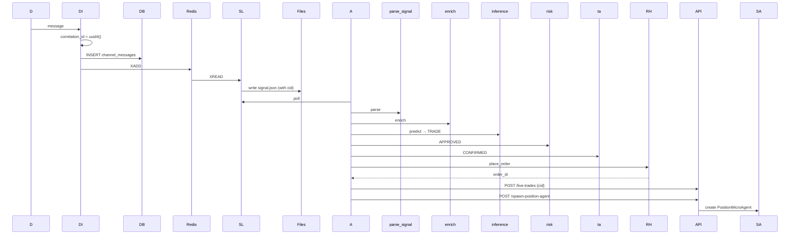
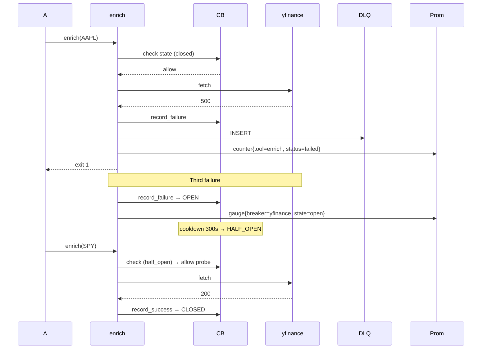
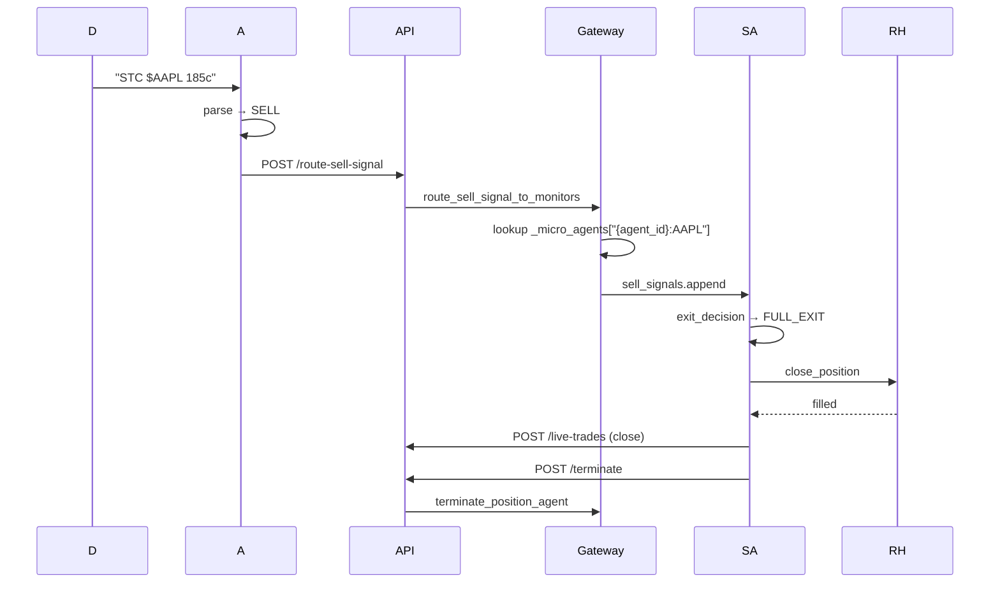

# Architecture: Phase B — Agent Wake-on-Discord AI Flow Verification + Observability Hardening

ADR-B001 | Date: 2026-04-18 | Status: Proposed

## Summary

Phoenix's AI trading flow spans 15 hops from Discord message arrival to broker order and sub-agent spawn. This architecture catalogs each hop to its exact source, identifies 12 gaps (3 Sev-1, 8 Sev-2, 1 Sev-3), and designs correlation-ID propagation, DLQ, per-dependency circuit breakers, and an 8-panel Grafana dashboard reusing the existing Prometheus/Loki stack.

## Current System Overview

- `services/discord-ingestion/src/main.py` — persists to `channel_messages`, XADD to `stream:channel:{cid}` and `stream:messages:{cid}`.
- `apps/api/src/services/agent_gateway.py` — AgentGateway singleton; manages Claude Code sessions; tracks in `agent_sessions` (model exists, migration missing — see B-GAP-01).
- `apps/api/src/routes/agents.py` — `POST /spawn-position-agent` (L606), `POST /route-sell-signal` (L658).
- `agents/templates/live-trader-v1/tools/` — parse_signal, enrich_single, inference, risk_check, technical_analysis, execute_trade, signal_listener, Robinhood MCP client.
- `apps/api/src/services/position_micro_agent.py` — Tier-1+2 Python monitor per trade; tracked in `_micro_agents` dict.
- `shared/utils/circuit_breaker.py` — present but not instantiated in tools.
- `dead_letter_messages` table — present (migration 039) but not written to by tools.
- Observability: Prometheus, Grafana, Loki already in `docker-compose.yml`, prometheus scrapes 12 services.

## 15-Hop End-to-End Trace

| Hop | From → To | File:Function | Line | Status |
|---|---|---|---|---|
| 1 | Discord → channel_messages | `services/discord-ingestion/src/main.py:_persist_message` | 171-218 | WIRED |
| 2 | channel_messages → Redis | `services/discord-ingestion/src/main.py:_persist_message` | 222-247 | WIRED |
| 3 | Redis → signal_listener | `agents/templates/live-trader-v1/tools/signal_listener.py:listen` | 28-99 | WIRED |
| 4 | signal_listener → agent wake | (file polling) | — | SEMI-WIRED — see B-GAP-02 |
| 5 | Agent → parse_signal | `parse_signal.py:parse` | 22-30 | WIRED |
| 6 | Agent → enrich_single | `enrich_single.py` | 0+ | WIRED |
| 7 | Agent → inference | `inference.py:predict` | 16-48 | WIRED |
| 8 | Agent → risk_check | `risk_check.py:check_risk` | 7-28 | WIRED |
| 9 | Agent → technical_analysis | `technical_analysis.py` | 0+ | WIRED |
| 10 | Agent → execute_trade | `execute_trade.py:execute` | 94-99 | WIRED |
| 11 | execute_trade → Robinhood MCP | MCP client | 19 | WIRED |
| 12 | execute_trade → Phoenix trade record | `execute_trade.py:_report_trade_to_phoenix` | 31-46 | WIRED |
| 13 | execute_trade → sub-agent spawn | `execute_trade.py:_spawn_position_agent` | 49-70 | WIRED |
| 14 | Sub-agent lifecycle | `position_micro_agent.py:PositionMicroAgent.run` | 67-99 | WIRED |
| 15 | Sell routing primary → sub-agent | `apps/api/src/routes/agents.py:route_sell_signal` | 658-670 | WIRED |

## Gap Inventory

| ID | Hop | Severity | Category | Location | Fix |
|---|---|---|---|---|---|
| B-GAP-01 | 4 | Sev-2 | Observability | `shared/db/models/agent_session.py` has model; no migration | Create `040_agent_sessions.py` |
| B-GAP-02 | 4 | Sev-3 | ErrorHandling | File polling no backpressure | Add max-file cap in signal_listener |
| B-GAP-03 | 1-15 | **Sev-1** | CorrelationID | no UUID propagation | Generate at discord-ingestion L184; carry in Redis payload, JSON file, tool logs |
| B-GAP-04 | 5-7 | **Sev-1** | DLQ | parse/enrich/inference fail silently | try/except → INSERT dead_letter_messages |
| B-GAP-05 | 11 | **Sev-1** | CircuitBreaker | Robinhood MCP calls unguarded | Instantiate `CircuitBreaker("robinhood", ...)` |
| B-GAP-06 | 3 | Sev-2 | Metrics | No Redis stream lag metric | `XINFO STREAM` vs cursor → prometheus_client Gauge |
| B-GAP-07 | 5-10 | Sev-2 | Metrics | No tool-call latency | `time.monotonic()` + histogram |
| B-GAP-08 | 12 | Sev-2 | Metrics | No trade success rate | Counter per trade status |
| B-GAP-09 | 13 | Sev-2 | Metrics | No sub-agent spawn counter | Counter on 2xx |
| B-GAP-10 | — | Sev-2 | Metrics | No DLQ size metric | Gauge from `COUNT(*) WHERE resolved=false` |
| B-GAP-11 | — | Sev-2 | Metrics | No breaker state metric | Gauge per breaker name |
| B-GAP-12 | 14 | Sev-2 | Observability | No heartbeat-based alive check | `/admin/agent-health` endpoint |

Critical path: B-GAP-03, B-GAP-04, B-GAP-05 must ship before go-live.

## Decisions on PRD Open Questions

1. **Observability stack** — Reuse existing Prometheus + Grafana + Loki.
2. **DLQ mechanism** — Postgres `dead_letter_messages` (migration 039).
3. **Trace-ID propagation** — Structured log field `correlation_id = UUID4`; generated at discord-ingestion; carried via Redis payload, file handoff, and `extra={"correlation_id": ...}` in every log.
4. **Sub-agent linking** — AgentSession FK `parent_agent_id` (already in model L36-37).
5. **Heartbeat** — DB column `agent_sessions.last_heartbeat` (already L32); batched every 60s.
6. **Circuit breaker placement** — In-process per external dependency (Robinhood MCP, Phoenix API, yfinance).
7. **Redis stream lag** — Client-computed (`XINFO STREAM last_entry_id` vs local cursor); export every 30s.
8. **Smoke-test environment** — Shared staging channel; signals tagged `test_run_id` for parallel isolation; `config.test_mode=true` skips Robinhood MCP.

## Component Diagram

```mermaid
graph TD
    D[Discord Bot] --> DI[discord-ingestion]
    DI --> CM[(channel_messages)]
    DI --> RS[Redis stream:channel:{cid}]
    RS --> SL[signal_listener.py]
    SL --> FL[incoming_signals/*.json]
    FL --> A[Claude Code Session]
    A --> PS[parse_signal]
    A --> EN[enrich_single]
    A --> INF[inference]
    A --> RCH[risk_check]
    A --> TA[technical_analysis]
    A --> EX[execute_trade]
    EX --> RH[Robinhood MCP]
    EX --> API[Phoenix API /live-trades]
    EX --> SPN[Phoenix API /spawn-position-agent]
    SPN --> SA[PositionMicroAgent]
    SA --> ED[exit_decision]
    ED --> RH
    A --> RSS[Phoenix API /route-sell-signal]
    RSS --> SA
    DI --> DLQ[(dead_letter_messages)]
    PS --> DLQ
    EN --> DLQ
    INF --> DLQ
    EX --> DLQ
    A --> PM[Prometheus]
    SA --> PM
    PM --> GF[Grafana]
```

## Sequence Diagrams

### A) Happy Path



### B) Failure Path → DLQ + Circuit Breaker



### C) Sell Signal Routing



## Correlation ID Design

- **Format:** UUID4 string (36 chars).
- **Generation:** `services/discord-ingestion/src/main.py:_persist_message` ~L184: `correlation_id = str(uuid.uuid4())`.
- **Propagation:**
  1. `channel_messages.raw_data['correlation_id']` + Redis payload.
  2. `signal_listener` writes to `{msg_id}.json`.
  3. Agent exports `CORRELATION_ID` env var per tool invocation.
  4. Each tool imports `shared.observability.logging`; attaches via `extra={"correlation_id": ...}`.
  5. Phoenix API writes to `trades.metadata['correlation_id']`.
  6. Sub-agent inherits from parent spawn request.
- **Query:** Grafana Loki `{job="phoenix-*"} | json | correlation_id="..."` returns all log lines for one signal.

## DLQ Design

Schema (migration 039 existing):
```sql
CREATE TABLE dead_letter_messages (
  id UUID PRIMARY KEY DEFAULT gen_random_uuid(),
  connector_id VARCHAR(100) NOT NULL,
  payload JSONB NOT NULL,
  error TEXT NOT NULL,
  attempts INTEGER DEFAULT 0,
  resolved BOOLEAN DEFAULT false,
  created_at TIMESTAMPTZ DEFAULT now(),
  resolved_at TIMESTAMPTZ
);
CREATE INDEX idx_dlq_connector ON dead_letter_messages(connector_id);
CREATE INDEX idx_dlq_resolved ON dead_letter_messages(resolved);
```

Tools wrap `main()`:
```python
try: result = enrich(...)
except Exception as e:
    async with db_session() as session:
        await session.execute(text("INSERT INTO dead_letter_messages (connector_id, payload, error) VALUES (:cid, :payload, :error)"), {"cid": cfg["connector_id"], "payload": json.dumps(signal), "error": str(e)[:500]})
    sys.exit(1)
```

Operator endpoints:
- `GET /api/v2/admin/dlq`
- `POST /api/v2/admin/dlq/{id}/replay`
- `POST /api/v2/admin/dlq/{id}/discard`
- CLI `scripts/replay_dlq.py --connector-id XYZ`

Metric: `phoenix_dlq_size{connector_id}`.

## Circuit Breaker Design

| Dependency | Failures | Cooldown | Half-Open |
|---|---|---|---|
| Robinhood MCP | 3 | 300s | 1 |
| yfinance | 5 | 60s | 1 |
| Phoenix API | 3 | 120s | 1 |

States: CLOSED → (N failures) → OPEN → (cooldown) → HALF_OPEN → (success) → CLOSED (or failure → OPEN reset).

Per-dependency config in `config.json`; metric `phoenix_circuit_breaker_state{name, state}` where state ∈ {0=closed, 1=half_open, 2=open}.

## Observability Dashboard

`infra/observability/grafana/agent-wake-flow.json`:

| Panel | Metric | Source |
|---|---|---|
| Messages ingested/s | `rate(phoenix_discord_messages_total[1m])` | discord-ingestion |
| Redis stream lag | `phoenix_redis_stream_lag_seconds{stream_key}` | signal_listener |
| Agents launched/min | `rate(phoenix_agent_sessions_created_total[1m])` | AgentGateway |
| Tool-call latency p95 | `histogram_quantile(0.95, phoenix_tool_duration_seconds_bucket{tool})` | All tools |
| Trade success rate | `rate(trades{status=success}[5m])/rate(trades[5m])` | execute_trade |
| Sub-agent spawn rate | `rate(phoenix_subagent_spawned_total[1m])` | AgentGateway |
| Circuit breaker state | `phoenix_circuit_breaker_state{name}` | CircuitBreaker |
| DLQ size | `phoenix_dlq_unresolved_total{connector_id}` | Phoenix API |

Alerts (`infra/observability/alerting-rules.yml`):
- `CircuitBreakerOpen` if state=2 for 5min.
- `DLQBacklog` if > 50.
- `StreamLagHigh` if > 300s for 2min.

## Sub-Agent Verification

Integration test `tests/integration/test_sub_agent_spawn.py`:
1. POST `/spawn-position-agent` → assert `session_id` returned.
2. Query `agent_sessions` WHERE `session_role='position_monitor'` → row exists with correct `parent_agent_id`, `position_ticker`.
3. POST `/route-sell-signal` → confirm `sell_signals` appended within 5s.
4. Terminate → `_micro_agents` dict no longer contains key.

E2E smoke `tests/e2e/test_agent_wake_flow.py`:
1. Inject test signal.
2. Tail logs for `correlation_id`.
3. Assert trade row with `correlation_id`; assert sub-agent session row; assert no ERROR logs.

## Phased Plan

| Phase | Scope | Deliverable |
|---|---|---|
| B.1 | This ADR | Trace + gap table |
| B.2 | JIRA tickets | 12 tickets |
| B.3 | Correlation ID propagation | discord-ingestion + signal_listener + tools |
| B.4 | DLQ writes on tool failures | try/except in parse/enrich/inference |
| B.5 | Circuit breakers | Instantiate in execute_trade + enrich_single |
| B.6 | Metrics + Grafana dashboard | 8 metrics + JSON dashboard |
| B.7 | Integration + smoke tests | 5 fault-injection + 1 smoke |
| B.8 | agent_sessions migration | `040_agent_sessions.py` |
| B.9 | Operator DLQ tools | admin endpoints + CLI |
| B.10 | Docs | CLAUDE.md update |

Critical path: B.3 → B.4 → B.5 → B.6 → B.7.

## Risks

| # | Risk | Mitigation |
|---|---|---|
| B-R1 | Race in `_micro_agents` dict | `asyncio.Lock` around mutations |
| B-R2 | Correlation ID lost at file handoff | Integration test B.3 asserts propagation |
| B-R3 | DLQ unbounded growth | Cron job to delete resolved > 30 days |
| B-R4 | Breaker state diverges per process | Acceptable in Phase B; global Redis-backed breaker deferred |
| B-R5 | Prometheus scrape misses short-lived tool metrics | Push to pushgateway in teardown |
| B-R6 | Sub-agent spawn silently fails if API down | 3 retries, exponential backoff in execute_trade L49-70 |
| B-R7 | Missing dashboard | Commit JSON to git; CI validates schema |
| B-R8 | Loki retention insufficient | Configure 30-day retention |

## Deliverables Handoff

1. `shared/db/migrations/versions/040_agent_sessions.py`
2. `services/discord-ingestion/src/main.py:184` — generate `correlation_id`
3. `agents/templates/live-trader-v1/tools/signal_listener.py:96` — include `correlation_id` in JSON
4. `parse_signal.py:33`, `enrich_single.py:10`, `inference.py:16` — DLQ try/except
5. `enrich_single.py:10` — `yfinance_breaker = CircuitBreaker(...)`
6. `execute_trade.py:94` — `robinhood_breaker` + retry spawn_position_agent
7. `shared/observability/metrics.py` — shared prometheus registry
8. `signal_listener.py:28` — export `phoenix_redis_stream_lag_seconds`
9. `apps/api/src/routes/admin.py` — `/dlq` CRUD + `/agent-health`
10. `infra/observability/grafana/agent-wake-flow.json`
11. `infra/observability/alerting-rules.yml` — 3 new alerts
12. `tests/integration/test_phase_b_fault_injection.py`
13. `tests/e2e/test_smoke_phase_b.py`
14. `scripts/replay_dlq.py`
15. `agent_gateway.py:1929` — `asyncio.Lock` on `_micro_agents`
16. `docker-compose.yml:418` — Loki retention 30d

Constraints: no breaking changes to tool output schemas; breaker instances module-global; DLQ writes async + best-effort; UUID4 `correlation_id` only; `phoenix_` prefix for all metrics.
