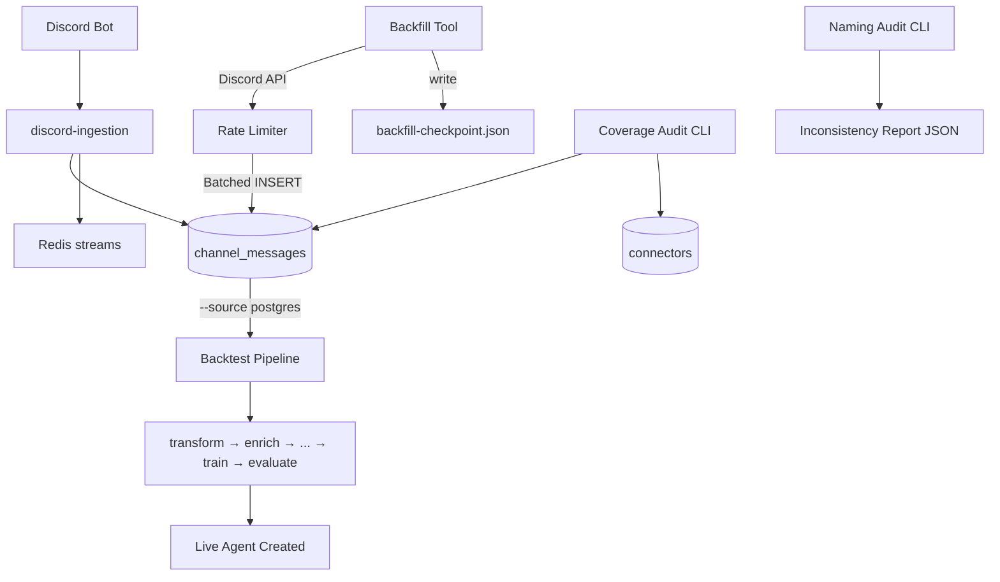

# Architecture: Phase C — DB-Backed Backtesting Robustness + Channel Coverage Audit

ADR-C001 | Date: 2026-04-18 | Status: Proposed

## Summary

Phoenix's backtest pipeline must read exclusively from `channel_messages` — never live Discord. This architecture:
1. Deprecates `fetch_discord_history()` (`transform.py` L121-186) and enforces `--source postgres`.
2. Adds a **coverage audit CLI** (24-month target per channel).
3. Adds a **naming audit CLI** (scan DB + code + config) and standardizes on Discord snowflake strings.
4. Adds a **backfill tool** (rate-limited, resumable, idempotent).
5. Introduces migration 046 (snowflake column + `backfill_run_id` + indexes) and migration 047 (drop legacy `channel` column after 1-week verification).
6. Documents the full DB-backed flow in `docs/architecture/backtesting-db-flow.md` at build time.

## Decisions on PRD Open Questions

### 2.1 Backtestable channel source of truth — `connectors.config.channel_ids`
Authoritative config location. Tool queries `connectors WHERE type='discord' AND is_active=true`, extracts `config.channel_ids`, scans `channel_messages`.

### 2.2 Backfill versioning — YES, via `backfill_run_id UUID NULL`
Enables traceability, rollback, and audit. Live ingestion writes NULL.

### 2.3 Retention — **Infinite** with manual archive tool
Backtest quality improves with history; disk is cheap; reproducibility and compliance matter. Optional `archive_old_messages.py` CLI for manual purge.

### 2.4 Auto-trigger backfill — **Manual only**
Discord rate limits + operator judgment. Audit emits JSON with recommended backfill commands.

### 2.5 Naming migration — **Single cutover**, canonical form = Discord snowflake string (20 digits)
Small affected surface (6 files); Phoenix is early-stage; snowflakes are globally unique and match `platform_message_id`.

## Canonical Channel Identifier

- Form: snowflake string (`"1234567890123456789"`).
- Columns: `channel_messages.channel_id_snowflake` (NEW, indexed), `connectors.config.channel_ids` (list), `backtest_trade.channel_id` (NEW, indexed).
- Migration: 046 adds; 047 drops legacy `channel` after 1-week verification.

## Component Diagram



## Coverage Audit CLI

**Interface**
```
python -m tools.coverage_audit [--connector-id <uuid>] [--output coverage.json] [--min-months 24] [--min-messages 100]
```

**Exit codes:** 0 pass; 1 any channel fails; 2 tool error.

**Output (JSON):**
```json
{
  "audit_timestamp": "...",
  "threshold_months": 24,
  "channels_total": 12,
  "channels_pass": 10,
  "failures": [{
    "connector_id": "...", "channel_id": "...", "message_count": 45,
    "date_range_days": 180, "earliest_message": "...", "latest_message": "...",
    "reason": "Insufficient history (180 < 730 days)",
    "recommended_backfill": "python -m tools.backfill --connector-id ... --from 2024-04-01"
  }],
  "passes": [...]
}
```

**Human summary (stderr):** `✅ PASS` / `❌ FAIL` lines per channel with recommended commands.

**Query:** `SELECT connector_id, channel_id_snowflake, COUNT(*), MIN(posted_at), MAX(posted_at) FROM channel_messages GROUP BY connector_id, channel_id_snowflake`. Join `connectors` for names.

## Naming Audit CLI

**Interface**
```
python -m tools.naming_audit [--output naming-audit.json] [--verbose]
```

**Scan targets:**
- DB schema: `channel_messages.channel`, `connector_agents.channel`, `backtest_trade.signal_message_id`.
- Code: grep `channel_id|channel_name|channel[^_]` in `apps/api/src/routes/*.py`, `services/discord-ingestion/src/*.py`, `shared/discord_utils/*.py`, `agents/backtesting/tools/*.py`, `services/connector-manager/src/connectors/*.py`.
- Config: `.env.example`, `docker-compose.yml`, `agents/backtesting/CLAUDE.md`.
- Dashboard TS: `apps/dashboard/src/types/*.ts`, `pages/Connectors.tsx`.

**Inconsistency rules:**
- Mixed snowflake + text slug in one column → flag.
- Multiple keys (`channel_ids`, `channel_id`, `selected_channels`) → flag.
- FK without index → flag.

**Output:** full JSON with location, field, type, format_detected, issue, recommendation; includes proposed 4-step migration plan.

## Backfill Tool

**Interface**
```
python -m tools.backfill \
  --connector-id <uuid> \
  --channel-id <snowflake> \
  [--from YYYY-MM-DD] [--to YYYY-MM-DD] \
  [--batch-size 500] [--checkpoint backfill-checkpoint.json] [--resume]
```

**Rate-limit handling:** leaky bucket (20ms min interval per channel); on 429 honor `Retry-After` + 1s jitter; after 3 consecutive 429s switch to 5s fixed delay (conservative mode); log rate-limit events.

**Checkpoint JSON:**
```json
{
  "run_id": "uuid",
  "connector_id": "uuid",
  "channel_id": "snowflake",
  "start_date": "...", "end_date": "...",
  "last_message_id": "snowflake",
  "messages_imported": 8234,
  "batches_committed": 17,
  "last_checkpoint_at": "...",
  "status": "in_progress | completed"
}
```

Updated after each batch commit.

**Resumability:** if `--resume` and checkpoint exists, continue from `last_message_id` (Discord API `?before=<id>`); skip already-imported via `UNIQUE(platform_message_id)`. On SIGINT/SIGTERM flush batch + write checkpoint; exit 130.

**Idempotency key:** `UNIQUE(platform_message_id)` constraint; pre-INSERT check preferred (`SELECT 1`) for logging. `INSERT ... ON CONFLICT DO NOTHING` rejected as it hides duplicates.

**Batching:** 500 messages per `session.commit()` (5 Discord API calls of 100). Too small = commit overhead; too large = memory + recovery risk.

## DB-Only Enforcement

**8.1 Remove `fetch_discord_history()`**
Delete `agents/backtesting/tools/transform.py` L121-186. Convert `--source discord` to explicit `raise ValueError("deprecated; use backfill tool")`.

**8.2 Enforce `--source postgres` default** (L369 change from `discord` to `postgres`).

**8.3 Static analysis proof:**
```
rg 'discord\.com/api|httpx.*discord' agents/backtesting/tools/ && exit 1 || exit 0
```
CI-enforced.

**8.4 Integration test (egress-blocked):**
```dockerfile
FROM python:3.11-slim
RUN pip install sqlalchemy pandas pyarrow
COPY agents/backtesting/tools /app/tools
COPY shared /app/shared
WORKDIR /app
CMD ["python", "tools/transform.py", "--source", "postgres", "--db-url", "$DB_URL", "--output", "output.parquet"]
```
Run: `docker run --network none --env DB_URL=... backtest-test`. Assert exit 0.

## Data Model Deltas

### Migration 046
```python
def upgrade():
    op.add_column("channel_messages", sa.Column("channel_id_snowflake", sa.String(20), nullable=True))
    op.execute("UPDATE channel_messages SET channel_id_snowflake = channel WHERE channel ~ '^[0-9]+$'")
    op.add_column("channel_messages", sa.Column("backfill_run_id", UUID(as_uuid=True), nullable=True))
    op.create_index("ix_channel_messages_channel_posted", "channel_messages", ["channel_id_snowflake", "posted_at"])
    op.create_unique_constraint("uq_channel_messages_platform_id", "channel_messages", ["platform_message_id"])
    op.add_column("backtest_trades", sa.Column("channel_id", sa.String(20), nullable=True))
    op.execute("UPDATE backtest_trades bt SET channel_id = (SELECT cm.channel_id_snowflake FROM channel_messages cm WHERE cm.id = bt.signal_message_id) WHERE bt.signal_message_id IS NOT NULL")
    op.create_index("ix_backtest_trades_channel_id", "backtest_trades", ["channel_id"])
```

### Migration 047 (1 week later)
```python
def upgrade():
    op.execute("UPDATE channel_messages SET channel_id_snowflake = 'UNKNOWN' WHERE channel_id_snowflake IS NULL")
    op.alter_column("channel_messages", "channel_id_snowflake", nullable=False)
    op.drop_column("channel_messages", "channel")
```

## API Contracts

**Decision:** CLI-only for Phase C. No API endpoints. Coverage audit is an operational task; backfill is long-running (not suited to HTTP).

If future dashboard integration needed: `GET /api/v2/channels/coverage-audit?...` + background-job-based `POST /channels/{id}/backfill`.

## Phased Plan

| Phase | Scope | Depends |
|---|---|---|
| C.1 | Coverage audit CLI + tests + runbook | — |
| C.2 | Naming audit CLI + tests | — |
| C.3 | Backfill tool (rate limiter + checkpoint) + tests | C.1 |
| C.4 | Remove live-Discord paths in `transform.py`; update CLAUDE.md | C.3 verified |
| C.5 | Egress-blocked integration test | C.4 |
| C.6 | Migrations 046/047 + `docs/architecture/backtesting-db-flow.md` + optional `archive_old_messages.py` + `discord-ingestion` snowflake write + dashboard TS type | C.1-C.5 |

Critical path: C.3 → C.4 → C.5. C.1 and C.2 run in parallel.

## Risks

| # | Risk | Mitigation |
|---|---|---|
| C-R1 | Discord rate limits during backfill | Honor 429; leaky bucket; checkpoint per batch; off-hours |
| C-R2 | Duplicate imports | `UNIQUE(platform_message_id)` + pre-INSERT check |
| C-R3 | Naming cutover breaks agents | Single-cutover with 1-week verification; live agents read new column immediately |
| C-R4 | Discord's 1-year history cap | Document in coverage audit output |
| C-R5 | `channel_messages` disk growth | Manual archive tool; JSONB compression |
| C-R6 | Post-cutover backtest failures | Pre-cutover staging run; diff result |

## Test Strategy

- Unit: audit logic; rate limit sleep; checkpoint write.
- Integration: real Postgres, mocked Discord returning 10k messages; kill mid-run, resume, assert no duplicates.
- E2E: egress-blocked container backtest of 100-message seed.

## Deliverables Handoff

1. `tools/coverage_audit.py` + `tests/unit/test_coverage_audit.py` + `docs/operations/coverage-audit-runbook.md`
2. `tools/naming_audit.py` + `tests/unit/test_naming_audit.py`
3. `tools/backfill.py` + `shared/discord_utils/rate_limiter.py` + `tests/unit/test_backfill.py` + `tests/integration/test_backfill_real_db.py`
4. `agents/backtesting/tools/transform.py` — delete L121-186, enforce postgres default
5. `agents/backtesting/CLAUDE.md` — update Step 1
6. `tests/integration/test_backtest_db_only.py` + fixture `tests/integration/fixtures/seed_channel_messages.sql`
7. `shared/db/migrations/versions/046_channel_id_snowflake.py`
8. `shared/db/migrations/versions/047_drop_channel_column.py`
9. `docs/architecture/backtesting-db-flow.md`
10. `tools/archive_old_messages.py` (optional)
11. `services/discord-ingestion/src/main.py` — write `channel_id_snowflake`
12. `apps/dashboard/src/types/connector.ts` — update TS type

Total: 17 artifacts. Effort: ~3-5 days.
