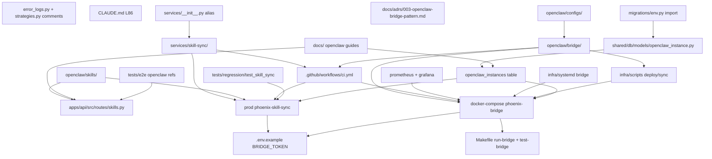

# Architecture: Phase F — OpenClaw Safe Removal

ADR-046 | Date: 2026-04-18 | Status: Proposed

## Summary

Phase F is a pure deletion refactor removing the legacy OpenClaw distributed agent runtime. This architecture provides a **completed inventory** (245 files), a **Mermaid dependency graph**, a **5-phase removal plan** (4a-4e), an **Alembic migration skeleton** to drop `openclaw_instances`, **post-removal grep verification**, and a **user confirmation checklist**. No functionality is replaced.

## Completed Inventory

### Services & Directories

| Path | Files | Purpose | Action |
|---|---|---|---|
| `openclaw/bridge/` | 18 Python + Dockerfile + README | Bridge sidecar REST :18800 | Delete (4e) |
| `services/skill-sync/` | 6 Python + Dockerfile + reqs | Skill distribution | Delete (4e) |
| `openclaw/skills/` | 226 markdown (11,838 lines) | Skill catalog (6 categories) | Archive to `docs/archive/openclaw-skills-legacy/` (4e) |
| `openclaw/configs/` | 53 files (12 template dirs) | Agent config templates | Delete (4e) |

### Database

| Table/Column | Created | FKs | Action |
|---|---|---|---|
| `openclaw_instances` | `001_initial_v2_tables.py` L40-57 | None (FK dropped in 007 L25-30) | DROP in new migration `046_drop_openclaw_instances.py` |
| `automations.instance_id` | `003_remaining_tables.py` L200 | FK dropped in migration 007 | Update comment in `task.py:59` |

**FK-drop verification:** `007_v3_remove_vps_add_workers.py` L25-30 already dropped FKs from `agents.instance_id`, `agents.backtest_instance_id`, `agents.trading_instance_id`. No other tables reference `openclaw_instances`.

### API Routes (`apps/api/src/routes/skills.py`)
- `GET /api/v2/skills` (L26-46)
- `GET /api/v2/skills/categories` (L49-60)
- `GET /api/v2/skills/{category}/{skill_name}` (L63-76)
- `POST /api/v2/skills/sync` (L79-84)

**Action:** Delete entire route file (4a) + remove router import/include in `apps/api/src/main.py`.

**Related refs:**
- `apps/api/src/routes/error_logs.py` L103, L132, L148: update docstrings; keep `"openclaw_agent"` string literal (historical data).
- `apps/api/src/routes/strategies.py` L142, L159, L200-203: delete TODO comments.

### Tests

| Path | Action |
|---|---|
| `openclaw/bridge/tests/` (9 files) | Delete with parent (4e) |
| `openclaw/configs/tests/test_agent_configs.py` | Delete with parent (4e) |
| `tests/regression/test_skill_sync_regression.py` | Delete (4d) |
| `tests/e2e/test_agent_wizard.py:22` | Change expectation to "Agent Instance" (4d) |
| `tests/e2e/test_agents_page.py:32` | Remove `.or_(...OpenClaw...)` fallback (4d) |
| `tests/manual/MANUAL_TEST_RUN.md`, `MASTER_MANUAL_RUN.md`, `TEST_SUITES.md` | Manual review + remove sections (4d) |

### Documentation

| Doc | Action |
|---|---|
| `docs/operations/OPENCLAW_SETUP_GUIDE.md` | Delete (4d) |
| `docs/operations/OPENCLAW_AGENT_LOGS.md` | Delete (4d) |
| `docs/adrs/003-openclaw-bridge-pattern.md` | Status → SUPERSEDED (4d) |
| `docs/development/skill-development-guide.md` | Delete (4d) |
| `docs/operations/configuration-guide.md` | Remove L61-68, L93, L97-138 (4d) |
| `docs/prd/PRD.md` | Update L14, 621-633, 858-863, 909-913, 1637, 2564, 2583-2585, 3029-3037 (4d) |
| `README.md` | Remove L76, L87 (4d) |
| `CLAUDE.md` | Remove L86 `openclaw/bridge/` (4a) |
| `docs/specs/05-data-models/schema-changes.md` | Add note about drop (4d) |
| `docs/orchestration/phoenix-pipeline-unification-tracker.md` | Remove refs (4d) |

### Configuration

| Location | Lines | Action |
|---|---|---|
| `.env.example` | 26-27 (BRIDGE_TOKEN) | Delete (4a) |
| `Makefile` | 7, 34, 45-46, 127-128, 278-279, 367 (run-bridge, test-bridge, LOCAL_BRIDGE, BRIDGE_TOKEN, BRIDGE_URL, help) | Delete (4a) |
| `docker-compose.yml` | 46-59 (phoenix-bridge) | Delete (4b) |
| `infra/docker-compose.production.yml` | 46-59, 153-170 (bridge + skill-sync) | Delete (4b) |
| `infra/observability/prometheus.yml` | 11-14 (phoenix-bridge job) | Delete (4d) |
| `.github/workflows/ci.yml` | 21 (lint target), 75-77, 99-101 (build matrix) | Edit/Delete (4d) |

### Agent Tooling
Zero OpenClaw references in `agents/`. No changes needed.

### Infra & Scripts

| File | Action |
|---|---|
| `infra/scripts/deploy-openclaw.sh` | Delete (4d) |
| `infra/scripts/sync-skills.sh` | Delete (4d) |
| `infra/systemd/bridge.service` | Delete (4d) |
| `infra/systemd/openclaw.service` | Delete (4d) |
| `infra/observability/grafana/openclaw-instances.json` | Delete (4d) |
| `infra/wireguard/client.conf.template` | Update comment (4d) |
| `scripts/register_openclaw_instance.py` | Delete (4d) |

### Shared Models

| File | Action |
|---|---|
| `shared/db/models/openclaw_instance.py` | Delete (4e) |
| `shared/db/migrations/env.py:15` | Remove OpenClaw import (4c) |
| Migrations 001/003/007 | Leave (historical) |
| `shared/db/models/task.py:59` | Update comment (4a) |
| `services/__init__.py:31` | Remove `skill_sync` alias (4e) |

### Summary Stats

- 245 files to delete
- ~13,000+ lines removed (11,838 in skills alone)
- 2 Docker services removed
- 4 API routes removed
- 1 DB table dropped
- 2 env vars removed
- 2 Makefile targets removed

## Dependency Graph



Topological removal order: 4a (API/config) → 4b (Compose) → 4c (DB) → 4d (tests/docs/infra/CI) → 4e (directories + model + alias).

## Decisions on PRD Open Questions

1. **Q1 porting:** No porting required. Skills are docs; Bridge only provided lifecycle for VPS agents (AgentGateway replaces). No feature loss.
2. **Q2 DB drop order:** Single-migration drop safe. FKs dropped in migration 007. Verified via grep.
3. **Q3 deprecation window:** Immediate delete in 4a. No dashboard references to skills route; no production traffic. Rollback via git revert trivial.
4. **Q4 production deployments:** **BLOCKER for user.** Must confirm via `docker ps | grep phoenix-bridge`, `systemctl status bridge.service openclaw.service`, `wg show`. See §9.
5. **Q5 skills archival:** Archive to `docs/archive/openclaw-skills-legacy/` with README. Preserves 226 skills (institutional knowledge).
6. **Q6 agent dependencies:** Zero. Grep of `agents/` finds no references.

## Alembic Migration Skeleton: 046_drop_openclaw_instances.py

```python
"""Drop openclaw_instances table (Phase F).

Revision ID: 046_drop_openclaw_instances
Revises: 045_pipeline_engine
Create Date: 2026-04-18
"""
from typing import Sequence, Union
import sqlalchemy as sa
from alembic import op
from sqlalchemy.dialects import postgresql

revision: str = "046_drop_openclaw_instances"
down_revision: Union[str, None] = "045_pipeline_engine"
branch_labels: Union[str, Sequence[str], None] = None
depends_on: Union[str, Sequence[str], None] = None


def upgrade() -> None:
    op.drop_index("ix_openclaw_instances_name", table_name="openclaw_instances")
    op.drop_table("openclaw_instances")


def downgrade() -> None:
    op.create_table(
        "openclaw_instances",
        sa.Column("id", postgresql.UUID(as_uuid=True), nullable=False),
        sa.Column("name", sa.String(100), nullable=False),
        sa.Column("host", sa.String(255), nullable=False),
        sa.Column("port", sa.Integer(), nullable=False, server_default="18800"),
        sa.Column("role", sa.String(50), nullable=False, server_default="general"),
        sa.Column("status", sa.String(20), nullable=False, server_default="ONLINE"),
        sa.Column("node_type", sa.String(10), nullable=False, server_default="vps"),
        sa.Column("auto_registered", sa.Boolean(), nullable=False, server_default="false"),
        sa.Column("capabilities", postgresql.JSONB(), nullable=False, server_default="{}"),
        sa.Column("last_heartbeat_at", sa.DateTime(timezone=True), nullable=True),
        sa.Column("last_offline_at", sa.DateTime(timezone=True), nullable=True),
        sa.Column("created_at", sa.DateTime(timezone=True), server_default=sa.text("now()"), nullable=False),
        sa.Column("updated_at", sa.DateTime(timezone=True), server_default=sa.text("now()"), nullable=False),
        sa.PrimaryKeyConstraint("id"),
    )
    op.create_index("ix_openclaw_instances_name", "openclaw_instances", ["name"], unique=True)
```

Verification: `make db-upgrade`; `psql -c "\dt openclaw_instances"` returns nothing; `make db-downgrade` recreates; `make db-upgrade` drops again; `make test-integration` green.

## Phased Implementation

### Phase 4a: Deprecate Routes & Config
Files: `apps/api/src/routes/skills.py` (DELETE), `apps/api/src/main.py` (remove import+include), `routes/error_logs.py` (docstrings), `routes/strategies.py` (delete TODOs), `.env.example` (delete BRIDGE_TOKEN), `Makefile` (delete targets), `CLAUDE.md:86`, `task.py:59`.
Gate: `make lint && make test-api`.

### Phase 4b: Remove Bridge Service
Files: `docker-compose.yml` (delete phoenix-bridge block), `infra/docker-compose.production.yml` (delete bridge + skill-sync).
Gate: `docker compose config && make dev-run`.

### Phase 4c: Drop DB Table
Files: CREATE `046_drop_openclaw_instances.py`, edit `migrations/env.py:15`.
Gate: `make db-upgrade && make db-downgrade && make db-upgrade && make test-integration`.

### Phase 4d: Tests, Docs, Infra Scripts
Delete 10 files; modify 13. Update Makefile `go-live-regression` target to drop `test-bridge`.
Gate: `make test && make test-integration && make test-dashboard && make test-e2e && make lint`.

### Phase 4e: Final Directory Deletion (REQUIRES USER CONFIRMATION)
Delete `openclaw/bridge/`, `openclaw/configs/`, `services/skill-sync/`. Archive `openclaw/skills/` → `docs/archive/openclaw-skills-legacy/` with README. Delete `openclaw/` (now empty). Delete `shared/db/models/openclaw_instance.py`. Edit `services/__init__.py:31`.
Gate: cortex-reviewer + quill-qa full regression before merge.

## Post-Removal Grep Verification

```bash
# Test 1
rg -i "openclaw" --type py --type md --type yml --type json \
  --glob '!shared/db/migrations/versions/*.py' \
  --glob '!docs/archive/**' \
  apps/ services/ shared/ tests/ agents/ infra/ scripts/ docs/ README.md CLAUDE.md Makefile .env.example docker-compose.yml
# Expected: 0

# Test 2
rg -i "bridge.*token|bridge.*service|phoenix-bridge" --type py --type md --type yml \
  --glob '!shared/db/migrations/versions/*.py' \
  --glob '!docs/adrs/003-openclaw-bridge-pattern.md' \
  apps/ services/ shared/ Makefile .env.example docker-compose.yml
# Expected: 0

# Test 3
rg -i "skill.*sync|skill_sync|phoenix-skill-sync" --type py --type yml \
  --glob '!shared/db/migrations/versions/*.py' \
  apps/ services/ shared/ Makefile docker-compose.yml
# Expected: 0

# Test 4
psql $DATABASE_URL -c "\dt openclaw_instances"
# Expected: "Did not find any relation named 'openclaw_instances'"

# Test 5
test ! -d openclaw && test ! -d services/skill-sync && echo "PASS"
# Test 6
test ! -f shared/db/models/openclaw_instance.py && echo "PASS"
# Test 7
test -d docs/archive/openclaw-skills-legacy/ && test -f docs/archive/openclaw-skills-legacy/README.md && echo "PASS"

# Final
make go-live-regression && make go-live-regression-quality
```

## User Confirmation Checklist

**STOP before Phase 4e. All three must answer NO:**
1. Any OpenClaw bridge containers running in production? (`docker ps | grep phoenix-bridge`, `systemctl status bridge.service`)
2. Any VPS nodes with WireGuard tunnels active? (`wg show` on control plane)
3. Skills API (`/api/v2/skills/*`) used by any client in last 7 days? (API logs)

Any YES → STOP, decommission, re-run checklist.

## Risks

| # | Risk | Severity | Mitigation | Status |
|---|---|---|---|---|
| F-R1 | Hidden skills API consumer | MED | User confirmation Q3; no dashboard refs verified | Gated |
| F-R2 | FK violations on drop | LOW | Migration 007 already dropped | Closed |
| F-R3 | Breaking undocumented VPS deployment | HIGH | User confirmation Q1/Q2; STOP if VPS live | Gated |
| F-R4 | Test import errors after deletion | LOW | 4d removes tests before 4e; lint/typecheck per phase | Closed |
| F-R5 | Compose parse fail without bridge | LOW | `docker compose config` verifies | Closed |
| F-R6 | Alembic multi-head collision | MED | `make db-alembic-heads` before 4c | Process |
| F-R7 | Doc link rot | LOW | Manual link check in 4d | Accepted |
| F-R8 | Skills domain knowledge loss | LOW | Archive (not delete) | Closed |
| F-R9 | E2E UI text assertions fail | MED | 4d updates expectations | Gated |
| F-R10 | CI build matrix references dead Dockerfiles | MED | 4d removes matrix entries | Gated |

## Rollback Plan

- 4a/4b/4d: `git revert <sha>`
- 4c: `make db-downgrade` recreates; then `git revert`
- 4e: `git checkout main~1 -- openclaw/ services/skill-sync/ shared/db/models/openclaw_instance.py services/__init__.py` + restore archive

Full trigger: regression failure, production incident traced to F, or user-reported lost feature.

Rollback test (staging before prod): `git log --oneline | head -5`; `make db-downgrade`; `git revert <4e>`; `make test`; `git reset --hard origin/main`.

## Deliverables Handoff (5 commits)

1. **Commit 1 (4a)**: skills.py DELETE, main.py imports, error_logs/strategies docstrings, .env.example, Makefile, CLAUDE.md, task.py comment. Verify `make lint && make test-api`.
2. **Commit 2 (4b)**: docker-compose.yml + production compose. Verify `docker compose config && make dev-run`.
3. **Commit 3 (4c)**: `046_drop_openclaw_instances.py` + `migrations/env.py:15`. Verify `make db-upgrade && make db-downgrade && make db-upgrade && make test-integration`.
4. **Commit 4 (4d)**: Delete 10; modify 13 (ADR status, config-guide, PRD, README, E2E tests, wireguard comment, prometheus.yml, CI workflow, schema-changes, orchestration tracker, Makefile go-live-regression target). Verify full test suite.
5. **Commit 5 (4e) — GATED**: Delete 3 dirs + archive skills + delete `openclaw/` + model file + services/__init__.py alias. Run all grep + `make go-live-regression && make go-live-regression-quality`.
