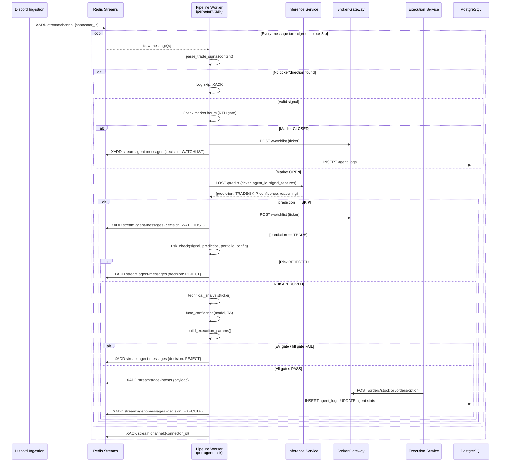
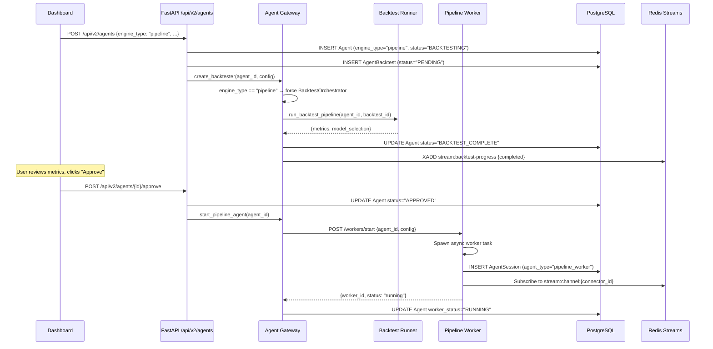
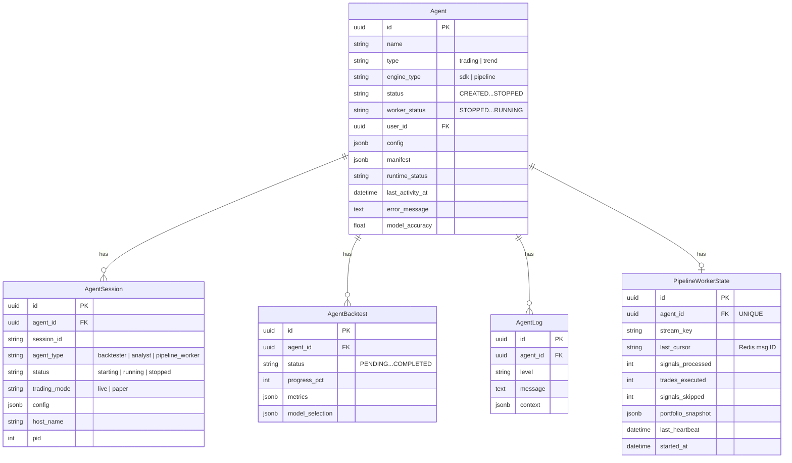
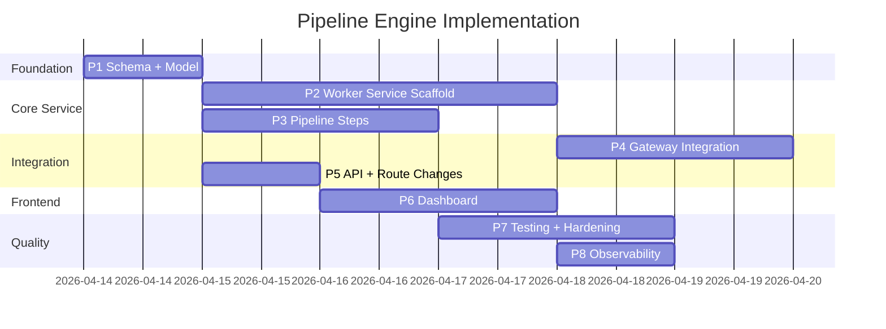

# Architecture: Pipeline Engine

ADR-004 | Date: 2026-04-12 | Status: Proposed

---

## Context

Phoenix Trade Bot currently operates a single "SDK Engine" where every trading agent is a Claude Code session. While powerful (agents reason, self-correct, and adapt), the SDK engine is:

- **Expensive**: every signal processed costs LLM tokens
- **Slow**: LLM round-trips add 2–5 seconds per decision step
- **Fragile to API outages**: Anthropic rate limits or credit exhaustion pause all trading

The Pipeline Engine provides a pure-Python, zero-AI alternative that reuses the **exact same microservice infrastructure** (discord-ingestion, inference-service, execution-service, broker-gateway, feature-pipeline) but replaces the Claude agent's reasoning loop with a deterministic decision pipeline driven by ML models.

**Reference:** This design was informed by the existing `decision_engine.py` tool in `agents/templates/live-trader-v1/tools/`, which already implements the full parse→enrich→infer→risk→TA→decide pipeline as a Python function. The pipeline worker formalizes this into a production microservice.

---

## Current System Overview

**Relevant components (from audit):**

1. **Agent DB model** (`shared/db/models/agent.py`): 30+ columns, status as plain strings (CREATED→BACKTESTING→BACKTEST_COMPLETE→APPROVED/PAPER→RUNNING→PAUSED/STOPPED). **No `engine_type` column exists.**
2. **AgentGateway** (`apps/api/src/services/agent_gateway.py`): Singleton managing agent lifecycle via `asyncio.Task` pool. `create_backtester()` already supports `BACKTEST_TIER=orchestrator` (Python BacktestOrchestrator) vs `sdk` (Claude). `create_analyst()` spawns Claude sessions.
3. **Existing microservices**: discord-ingestion (xadd to `stream:channel:{connector_id}`), inference-service (`POST /predict`), execution-service (consumes `stream:trade-intents`), broker-gateway (REST), feature-pipeline (TA indicators to Feature Store).
4. **Agent tools**: `decision_engine.py` contains the exact pipeline logic we will port — parse→market-gate→enrich→infer→risk→TA→decide.
5. **Redis Streams**: Per-connector streams for messages, fixed streams for trade-intents, agent-messages, backtest-progress. Consumer groups with XREADGROUP.

---

## Proposed Design

### Component Diagram

```mermaid
graph TD
    subgraph "Existing Infrastructure (unchanged)"
        DI[Discord Ingestion<br/>:8060]
        IS[Inference Service<br/>:8045]
        ES[Execution Service<br/>:8020]
        BG[Broker Gateway<br/>:8030]
        FP[Feature Pipeline<br/>:8050]
        RD[(Redis Streams)]
        PG[(PostgreSQL)]
    end

    subgraph "New: Pipeline Worker Service (:8055)"
        WM[Worker Manager<br/>asyncio task pool]
        subgraph "Per-Agent Worker (async)"
            SL[Stream Listener<br/>xreadgroup]
            SP[Signal Parser<br/>shared.utils.signal_parser]
            MG[Market Session Gate<br/>RTH check]
            INF[Inference Client<br/>HTTP → :8045]
            RC[Risk Checker<br/>ported from risk_check.py]
            TA[TA Analyzer<br/>ported from technical_analysis.py]
            DE[Decision Fuser<br/>ported from decision_engine.py]
            TP[Trade Publisher<br/>xadd trade-intents]
            WL[Watchlist Publisher<br/>HTTP → :8030]
            SR[Status Reporter<br/>xadd agent-messages]
        end
        HC[Health / Metrics<br/>GET /health, /workers]
        API_INT[Internal API<br/>POST /workers/start\|stop]
    end

    subgraph "Modified: API + Gateway"
        FAPI[FastAPI :8011]
        GW[Agent Gateway<br/>+ pipeline dispatch]
    end

    subgraph "Modified: Dashboard"
        DASH[React Dashboard<br/>engine selector UI]
    end

    DI -->|xadd stream:channel:X| RD
    RD -->|xreadgroup| SL
    SL --> SP --> MG
    MG -->|market open| INF
    MG -->|market closed| WL
    INF -->|POST /predict| IS
    INF --> RC --> TA --> DE
    DE -->|EXECUTE| TP
    DE -->|WATCHLIST| WL
    DE -->|REJECT/SKIP| SR
    TP -->|xadd stream:trade-intents| RD
    RD -->|xreadgroup| ES
    ES -->|POST /orders/*| BG
    WL -->|POST /watchlist| BG
    SR -->|xadd stream:agent-messages| RD

    FAPI -->|POST /workers/start| API_INT
    GW -->|manage lifecycle| WM
    DASH --> FAPI
    WM --> PG
```

### Sequence Diagram: Pipeline Signal Processing



### Sequence Diagram: Agent Creation (Pipeline Engine)



---

## Data Model Changes

### ER Diagram



### Schema Changes

**1. `agents` table — add `engine_type` column:**

```sql
-- Alembic migration: 039_add_engine_type.py
ALTER TABLE agents
ADD COLUMN engine_type VARCHAR(20) NOT NULL DEFAULT 'sdk';
```

**2. New `pipeline_worker_state` table:**

```sql
CREATE TABLE pipeline_worker_state (
    id UUID PRIMARY KEY DEFAULT gen_random_uuid(),
    agent_id UUID NOT NULL UNIQUE REFERENCES agents(id) ON DELETE CASCADE,
    stream_key VARCHAR(200) NOT NULL,
    last_cursor VARCHAR(50) DEFAULT '0-0',
    signals_processed INTEGER DEFAULT 0,
    trades_executed INTEGER DEFAULT 0,
    signals_skipped INTEGER DEFAULT 0,
    portfolio_snapshot JSONB DEFAULT '{}',
    last_heartbeat TIMESTAMPTZ,
    started_at TIMESTAMPTZ DEFAULT NOW(),
    created_at TIMESTAMPTZ DEFAULT NOW(),
    updated_at TIMESTAMPTZ DEFAULT NOW()
);
CREATE INDEX ix_pws_agent_id ON pipeline_worker_state(agent_id);
```

**3. `agent_sessions.agent_type` — extend allowed values:**

No schema change needed (it's a VARCHAR, not an enum), but code should recognize `"pipeline_worker"` as a valid type alongside `"backtester"` and `"analyst"`.

---

## API Contract Changes

### Modified Endpoints

**`POST /api/v2/agents` — Agent Creation**

Request body gains `engine_type`:

```json
{
  "name": "AAPL Pipeline Bot",
  "type": "trading",
  "engine_type": "pipeline",       // NEW — "sdk" (default) | "pipeline"
  "channel_name": "vinod-picks",
  "connector_ids": ["uuid-of-discord-connector"],
  "config": {
    "risk_params": { "confidence_threshold": 0.65, "max_concurrent_positions": 3 },
    "watchlist_outside_regular_session": true
  }
}
```

Response adds `engine_type`:

```json
{
  "id": "uuid",
  "name": "AAPL Pipeline Bot",
  "engine_type": "pipeline",       // NEW
  "status": "BACKTESTING",
  ...
}
```

**`POST /api/v2/agents/{id}/approve` — Approve & Start**

No request change. Behavior changes: if `agent.engine_type == "pipeline"`, gateway calls pipeline-worker instead of spawning Claude session.

**`POST /api/v2/agents/{id}/pause` / `POST /api/v2/agents/{id}/resume`**

No request change. For pipeline agents, gateway sends `POST /workers/stop` and `POST /workers/start` to pipeline-worker service.

**`GET /api/v2/agents/{id}` — Agent Detail**

Response includes `engine_type` field. Pipeline agents include `pipeline_stats` in runtime-info:

```json
{
  "id": "uuid",
  "engine_type": "pipeline",
  "runtime_info": {
    "pipeline_stats": {
      "signals_processed": 42,
      "trades_executed": 7,
      "signals_skipped": 35,
      "last_heartbeat": "2026-04-12T15:30:00Z",
      "uptime_seconds": 28800
    }
  }
}
```

**`GET /api/v2/agents` — List Agents**

Response includes `engine_type` on each agent. Optional query param `?engine_type=pipeline` for filtering.

### New Endpoints (Pipeline Worker Internal API)

These are on the pipeline-worker service (:8055), NOT the main API:

| Method | Path | Purpose |
|--------|------|---------|
| `GET` | `/health` | Liveness + worker count |
| `GET` | `/workers` | List all running worker tasks |
| `GET` | `/workers/{agent_id}` | Single worker status + stats |
| `POST` | `/workers/start` | Start a worker for an agent |
| `POST` | `/workers/{agent_id}/stop` | Stop a worker gracefully |
| `GET` | `/metrics` | Prometheus-style metrics |

**`POST /workers/start` request:**

```json
{
  "agent_id": "uuid",
  "connector_ids": ["uuid"],
  "config": {
    "risk_params": {},
    "inference_service_url": "http://inference-service:8045",
    "broker_gateway_url": "http://broker-gateway:8030",
    "feature_pipeline_url": "http://feature-pipeline:8050",
    "trading_mode": "live",
    "current_mode": "conservative"
  }
}
```

**`POST /workers/start` response:**

```json
{
  "agent_id": "uuid",
  "worker_id": "uuid",
  "status": "starting",
  "stream_keys": ["stream:channel:connector-uuid"]
}
```

---

## New Service Specification: `services/pipeline-worker/`

### Directory Structure

```
services/pipeline-worker/
├── src/
│   ├── __init__.py
│   ├── main.py              # FastAPI app, lifespan, routes
│   ├── worker_manager.py    # Manages N concurrent agent workers
│   ├── agent_worker.py      # Single agent's processing loop
│   ├── pipeline/
│   │   ├── __init__.py
│   │   ├── signal_parser.py     # Wraps shared.utils.signal_parser
│   │   ├── market_gate.py       # RTH check (from market_session_gate.py)
│   │   ├── enricher.py          # HTTP call to feature-pipeline or inline
│   │   ├── inference_client.py  # HTTP POST to inference-service
│   │   ├── risk_checker.py      # Ported from risk_check.py
│   │   ├── ta_analyzer.py       # Ported from technical_analysis.py
│   │   ├── decision_fuser.py    # Confidence fusion + execution params
│   │   └── publisher.py         # XADD to trade-intents / agent-messages
│   ├── models/
│   │   ├── __init__.py
│   │   └── schemas.py           # Pydantic request/response models
│   └── config.py                # Service configuration
├── tests/
│   └── unit/
│       ├── test_agent_worker.py
│       ├── test_risk_checker.py
│       └── test_decision_fuser.py
├── Dockerfile
└── README.md
```

### Key Design Decisions

**Worker Manager** (`worker_manager.py`):

- Maintains `dict[UUID, asyncio.Task]` of running agent workers
- Each agent gets its own `asyncio.Task` with independent error handling
- If a worker task raises, the manager catches it, logs the error, updates DB status, and does NOT restart (requires explicit re-start from gateway to prevent crash loops)
- Exposes `start_worker(agent_id, config)`, `stop_worker(agent_id)`, `get_status(agent_id)`, `list_workers()`
- On service startup: queries DB for agents with `engine_type="pipeline"` and `worker_status="RUNNING"` → auto-restarts their workers (crash recovery)

**Agent Worker** (`agent_worker.py`):

- Uses `XREADGROUP` with consumer group `pipeline-{agent_id}` to get exactly-once delivery
- Processes messages sequentially per agent (preserves signal ordering)
- Heartbeat: writes `last_activity_at` to Agent table and `last_heartbeat` to `pipeline_worker_state` every 30 seconds
- Cursor persistence: `last_cursor` in `pipeline_worker_state` for resume after restart
- Circuit breaker on inference-service HTTP calls (3 failures → open → 30s cooldown)
- Kill switch: subscribes to `stream:kill-switch`; on receive, immediately stops processing and sets `worker_status=STOPPED`

**Pipeline Steps** (in `pipeline/`):

Each step is a pure function (or thin async wrapper) that:
- Takes well-typed input, returns well-typed output
- Has no global state
- Is independently testable

The flow within `agent_worker.py` calls them in sequence:

```
message → signal_parser.parse() 
        → market_gate.check()
        → enricher.enrich() [optional, feature-pipeline HTTP]
        → inference_client.predict()
        → risk_checker.check()
        → ta_analyzer.analyze()
        → decision_fuser.fuse()
        → publisher.publish_intent() or publisher.publish_watchlist()
```

### Concurrency Model

```
pipeline-worker process (1 per deployment)
└── FastAPI (uvicorn, 1 worker)
    └── WorkerManager
        ├── Agent-Worker-Task (agent_id=AAA) ← asyncio.Task
        │   └── while True: xreadgroup → process → xack
        ├── Agent-Worker-Task (agent_id=BBB) ← asyncio.Task
        │   └── while True: xreadgroup → process → xack
        └── Agent-Worker-Task (agent_id=CCC) ← asyncio.Task
            └── while True: xreadgroup → process → xack
```

- All workers run in a **single event loop** (asyncio, no threads, no multiprocessing)
- Redis xreadgroup is non-blocking (`block=5000` ms) and yields to the event loop
- HTTP calls to inference-service/broker-gateway use `httpx.AsyncClient` (connection pooling)
- Each worker processes its messages serially; concurrency comes from N workers interleaving on the event loop
- For 10–20 simultaneous agents, a single process is sufficient (each worker is I/O-bound, not CPU-bound)
- If scale exceeds ~50 agents: horizontal scale by running multiple pipeline-worker instances, each handling a subset (partition by agent_id modulo)

### Resilience

| Failure Mode | Mitigation |
|---|---|
| Inference-service down | Circuit breaker → after 3 failures, route to WATCHLIST for 30s, then retry |
| Broker-gateway down | Watchlist calls fail gracefully (logged, skipped); trade-intent still published to Redis (execution-service retries) |
| Redis connection lost | Exponential backoff reconnect (1s → 2s → 4s → max 30s) |
| Worker task crash | Manager catches, logs, updates `worker_status=ERROR`, `error_message` on Agent; NO auto-restart |
| Service restart | On startup, resume workers from DB (`engine_type=pipeline` + `worker_status=RUNNING`); resume from `last_cursor` |
| Kill switch | Subscribe to `stream:kill-switch`; on event, stop all workers immediately |
| Memory leak | Prometheus metrics for RSS; rely on container orchestrator for OOM restart |

### Observability

- **Structured logging**: JSON logs with `agent_id`, `signal_id`, `step`, `latency_ms` fields
- **Prometheus metrics** (via `prometheus-client`):
  - `pipeline_signals_total{agent_id, decision}` — counter
  - `pipeline_signal_latency_seconds{agent_id, step}` — histogram
  - `pipeline_workers_active` — gauge
  - `pipeline_inference_circuit_state{agent_id}` — gauge (0=closed, 1=half-open, 2=open)
- **Redis stream `stream:agent-messages`**: Every decision (EXECUTE, REJECT, WATCHLIST) published so dashboard/WebSocket gateway can display real-time activity
- **Agent heartbeat**: `last_activity_at` updated every 30s; dashboard derives `alive`/`stale`/`stopped` from this timestamp (existing logic)
- **DB agent_logs**: Every decision logged with full context (signal, prediction, risk result, TA, execution params)

---

## Implementation Phases

| Phase | Scope | Depends On | Estimated Effort |
|-------|-------|------------|-----------------|
| **P1: Schema + Model** | Add `engine_type` to Agent model, Alembic migration, `PipelineWorkerState` model + migration | None | 1 day |
| **P2: Pipeline Worker Service** | `services/pipeline-worker/` scaffold, `WorkerManager`, `AgentWorker` with stream listener, signal parser, and stub pipeline steps | P1 | 3 days |
| **P3: Pipeline Steps** | Port `risk_checker`, `ta_analyzer`, `inference_client`, `market_gate`, `decision_fuser`, `publisher` from agent tools | P2 | 2 days |
| **P4: Gateway Integration** | Modify `AgentGateway` to dispatch pipeline agents: `create_backtester` (force orchestrator), new `start_pipeline_agent`/`stop_pipeline_agent` methods that call pipeline-worker HTTP API | P2 | 2 days |
| **P5: API + Route Changes** | Modify `POST /api/v2/agents` to accept `engine_type`, modify approve/pause/resume/stop to respect engine_type, add `engine_type` to responses | P1, P4 | 1 day |
| **P6: Dashboard** | Engine type selector in agent creation wizard, display engine type badge on agent cards, pipeline stats in agent detail | P5 | 2 days |
| **P7: Testing + Hardening** | Unit tests for pipeline steps, integration test (mock Redis + HTTP), crash recovery test, kill-switch test | P3, P4 | 2 days |
| **P8: Observability** | Prometheus metrics, structured logging, Grafana dashboard template | P2 | 1 day |

**Parallelism:** P1 is the foundation. After P1: P2+P3 can run in parallel with P5 (API schema changes). P4 bridges them. P6 (dashboard) can start after P5. P7 and P8 are tail-end.



---

## Non-Functional Requirements

### Performance

- **Signal-to-decision latency**: < 500ms p95 (vs 3–8s for SDK engine)
- **Throughput**: Handle 100+ signals/minute across all agents combined
- **Startup time**: Worker task start < 2s
- **Memory**: < 50MB per agent worker (no LLM context to hold)

### Security

- Pipeline-worker service is **internal only** (no public exposure); API gateway proxies all external requests
- Agent configs stored in DB with JSONB — no secrets in plaintext (broker credentials managed by broker-gateway, not pipeline-worker)
- Pipeline-worker authenticates to inference-service and broker-gateway via internal service mesh (no auth tokens needed in dev; bearer token support for prod)

### Scalability

- Single-instance: 10–50 concurrent agents (I/O-bound async)
- Multi-instance: Partition agents by `agent_id % N` across N pipeline-worker instances
- Redis Streams consumer groups provide exactly-once delivery across instances

### Rollback

- `engine_type` column default is `"sdk"` — existing agents unaffected
- Pipeline-worker service is independently deployable; stopping it doesn't affect SDK agents
- Each phase is independently reversible:
  - P1: `ALTER TABLE agents DROP COLUMN engine_type`
  - P2-P3: Delete `services/pipeline-worker/`
  - P4: Revert gateway changes (SDK path untouched)
  - P5: Revert route changes
  - P6: Revert dashboard changes

---

## ADR-004: Pipeline Engine as Sidecar Worker Service

### Context

We need a second execution engine for trading agents that operates without AI/LLM calls. Three main architectural approaches were evaluated.

### Options Considered

**Option A: In-process workers inside the API (asyncio tasks in AgentGateway)**

- Pros: No new service to deploy; reuses existing gateway task pool pattern; simpler networking
- Cons: Tight coupling (pipeline worker crash could affect API); harder to scale independently; gateway already complex (~4500 lines); resource contention between HTTP handlers and signal processing

**Option B: Standalone microservice (`services/pipeline-worker/`)**

- Pros: Clean separation of concerns; independently scalable/deployable; failure isolation (pipeline crash doesn't take down API); follows existing Phoenix service pattern; can horizontally scale
- Cons: One more service to operate; HTTP hop for lifecycle management; need crash-recovery logic on startup

**Option C: One process per agent (subprocess or container per agent)**

- Pros: Perfect isolation; one crash affects only one agent; simple mental model
- Cons: Resource waste (one Python process per agent = ~100MB idle each); process management complexity; slow startup; doesn't match existing Phoenix patterns

### Decision

**Option B: Standalone microservice.**

### Rationale

- Phoenix already runs 18 services — operational overhead of one more is marginal
- The gateway (`agent_gateway.py`) is already ~4500 lines; adding pipeline worker logic would make it unmanageable
- Independent scaling: pipeline-worker can run on a different machine/container than the API
- Failure isolation: inference-service outage with circuit breaker affects only pipeline agents, not API
- Follows the exact pattern of `services/execution/` (FastAPI + background consumer loop)
- The async task-per-agent model within a single process gives us the concurrency we need (10–50 agents) without the overhead of one-process-per-agent

### Consequences

- Gateway needs HTTP client to manage pipeline worker lifecycle (small integration surface)
- Need crash-recovery logic: on pipeline-worker restart, resume workers from DB state
- Must add `pipeline-worker` to `services/__init__.py` aliases and to the Makefile
- Must add health check monitoring for the new service


---

## ADR-005: `engine_type` as Column vs JSONB Config Key

### Context

We need to distinguish SDK agents from pipeline agents. Two approaches: a dedicated column or a key inside the existing `config` JSONB.

### Options Considered

**Option A: Dedicated `engine_type` VARCHAR column with default `"sdk"`**

- Pros: Queryable, indexable, explicit, enforces NOT NULL, visible in all agent list queries
- Cons: Requires Alembic migration; one more column on an already-wide table

**Option B: `config.engine_type` key in existing JSONB**

- Pros: No migration; flexible
- Cons: Not queryable without `->` operator; easy to forget; no NOT NULL enforcement; invisible in standard SELECT; requires updating every query that filters by engine type

### Decision

**Option A: Dedicated column.**

### Rationale

Engine type is a fundamental, immutable property of an agent (set at creation, never changes). It determines which code paths execute throughout the entire lifecycle. Burying it in JSONB would make the codebase fragile and queries slow.

### Consequences

- Requires Alembic migration (trivial: `ADD COLUMN ... DEFAULT 'sdk'`)
- All existing agents automatically get `engine_type='sdk'` — zero disruption
- Agent listing queries can efficiently filter by engine type
- Dashboard can display engine type badge without parsing JSONB


---

## ADR-006: Sequential Per-Agent Processing vs Parallel Signal Processing

### Context

Within a single agent worker, should we process signals sequentially (one at a time) or in parallel (multiple signals concurrently)?

### Options Considered

**Option A: Sequential processing per agent**

- Pros: Simpler reasoning about state (portfolio, position count); no race conditions on risk checks; preserves signal ordering; deterministic behavior
- Cons: If inference-service is slow (500ms), back-to-back signals queue up

**Option B: Parallel processing per agent (semaphore-bounded)**

- Pros: Higher throughput per agent; doesn't block on slow inference calls
- Cons: Race conditions on portfolio state (two signals pass risk check simultaneously, both execute, exceeding position limits); complex error handling; non-deterministic

### Decision

**Option A: Sequential processing.**

### Rationale

Trading systems must have deterministic risk enforcement. If two signals arrive 100ms apart and both pass risk check in parallel, we could exceed `max_concurrent_positions`. The latency cost of sequential processing is negligible: inference-service p99 is ~200ms, so even 5 queued signals resolve in ~1 second. Signal arrival rate per agent is low (a few per hour from Discord channels).

Concurrency happens at the **inter-agent** level (N agents run in parallel), not the intra-agent level.

### Consequences

- Simple, testable worker loop
- Risk check always sees current portfolio state
- If an agent's Discord channel sends 100 messages in 1 second (unlikely), they queue — acceptable


---

## Risk Areas for Implementation

1. **`decision_engine.py` imports**: The existing tool does `from technical_analysis import analyze_ticker` but the file defines `run_analysis`, not `analyze_ticker`. Pipeline must use the correct function name.
2. **Watchlist API mismatch**: `market_session_gate.py` posts `{"ticker", "name"}` to `/watchlist` but `add_to_watchlist.py` posts `{"symbols", "watchlist_name"}`. Pipeline should use the broker-gateway's actual contract.
3. **Signal parser LLM fallback**: `shared/utils/signal_parser.py` has an async `parse_trade_signal_async` with LLM fallback via `ModelRouter`. Pipeline must use only the sync `parse_trade_signal` (regex-only, no LLM).
4. **Consumer group naming**: Pipeline workers use per-agent consumer groups (`pipeline-{agent_id}`). Must not collide with existing consumer groups.
5. **Agent Gateway size**: `agent_gateway.py` is already ~4500 lines. Pipeline integration should be minimal (thin dispatch layer). Consider extracting pipeline lifecycle into a separate module (`pipeline_lifecycle.py`).

---

## Constraints for Code Review (`cortex-reviewer`)

- [ ] `engine_type` column has `DEFAULT 'sdk'` — existing agents must not break
- [ ] Pipeline-worker never imports from `anthropic` or any LLM SDK
- [ ] All pipeline steps are pure functions with no global mutable state
- [ ] Risk checker enforces `max_concurrent_positions` with current DB state, not stale cache
- [ ] Kill-switch subscription is tested
- [ ] Heartbeat writes are at least every 60s (30s target)
- [ ] Circuit breaker on inference-service HTTP has tests for open/half-open/closed states
- [ ] No shared mutable state between agent worker tasks (each has own `httpx.AsyncClient`, own portfolio snapshot)
- [ ] Alembic migration is backward-compatible (no column drops, no NOT NULL without default)
