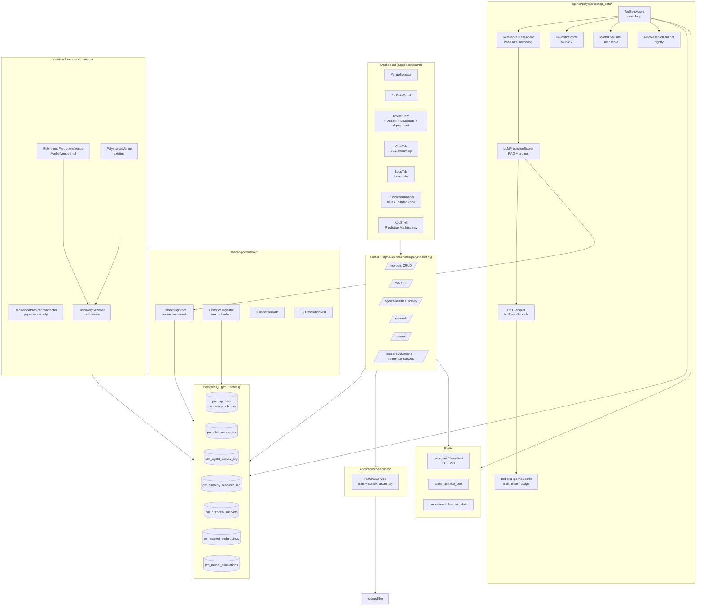

# Architecture: Prediction Markets Phase 15

**Owner:** Atlas (Architect)  
**Status:** v1.0  
**Date:** 2026-04-07  
**PRDs:** `docs/prd/polymarket-phase15.md`, `docs/prd/pm-accuracy-debate-pipeline.md`, `docs/prd/pm-accuracy-cot-sampling.md`, `docs/prd/pm-accuracy-reference-class.md`

---

## 1. Overview

Phase 15 transforms the existing 7-tab "Polymarket" dashboard page into a full **Prediction Markets** platform with Robinhood Prediction Markets as the primary (US-legal, CFTC-regulated) venue and Polymarket as secondary. It adds a 24/7 TopBets agent that surfaces 5–10 high-confidence bets daily using a three-layer LLM accuracy stack: Reference Class Forecasting (base rate anchoring), LLM RAG scoring (similar historical markets as few-shot context), CoT Self-Consistency Sampling (N=5 parallel calls, trimmed mean), and a Bull/Bear/Judge Debate Pipeline (adversarial scoring for top-20 candidates). Two new tabs—Chat and Logs—give the user a natural-language interface to the agent and real-time visibility into its activity. A nightly Auto-Research loop continuously improves strategy config.

Phase 15 reuses without modification: existing `pm_*` ORM models (8 tables), all 18 existing API endpoints, all 7 existing dashboard tabs, the F9 resolution-risk scorer (`shared/polymarket/resolution_risk.py`), the promotion gate (`shared/polymarket/promotion_gate.py`), the global kill switch, the `MarketVenue` ABC and `DiscoveryScanner` (multi-venue was designed from day 1), the existing backtester walk-forward engine, and the existing OpenClaw orchestrator agent runtime.

---

## 2. Component Diagram



---

## 3. New DB Tables

### 3.1 `pm_top_bets`
Daily bet recommendations from TopBetsAgent. Includes all accuracy feature columns.

| Column | Type | Notes |
|---|---|---|
| id | UUID PK | default uuid4 |
| market_id | UUID FK→pm_markets | NOT NULL |
| recommendation_date | DATE | NOT NULL |
| side | VARCHAR(4) | YES or NO |
| confidence_score | SMALLINT | 0–100 |
| edge_bps | SMALLINT | basis points edge |
| reasoning | TEXT | LLM or heuristic reasoning |
| status | VARCHAR(16) | pending/accepted/rejected/expired |
| rejected_reason | TEXT | nullable |
| accepted_order_id | UUID FK→pm_orders | nullable |
| bull_argument | TEXT | F-ACC-1: Bull agent output |
| bear_argument | TEXT | F-ACC-1: Bear agent output |
| debate_summary | TEXT | F-ACC-1: Judge summary |
| bull_score | SMALLINT | F-ACC-1: 0–10 |
| bear_score | SMALLINT | F-ACC-1: 0–10 |
| sample_probabilities | JSONB | F-ACC-2: list of N raw samples |
| consensus_spread | FLOAT | F-ACC-2: max - min of retained |
| reference_class | VARCHAR(64) | F-ACC-3: classified category |
| base_rate_yes | FLOAT | F-ACC-3: historical base rate |
| base_rate_sample_size | INT | F-ACC-3: number of historical markets used |
| base_rate_confidence | FLOAT | F-ACC-3: statistical confidence |
| created_at | TIMESTAMPTZ | server default now() |
| updated_at | TIMESTAMPTZ | server default now() |

**Indexes:** `(recommendation_date, status)`, `(market_id, recommendation_date)`  
**Unique:** `(market_id, recommendation_date)`

### 3.2 `pm_chat_messages`
Per-session chat history. Retained indefinitely; UI shows last 50.

| Column | Type | Notes |
|---|---|---|
| id | UUID PK | |
| session_id | UUID | NOT NULL, no FK (ephemeral) |
| role | VARCHAR(16) | user or assistant |
| content | TEXT | full message text |
| bet_recommendation | JSONB | nullable; structured bet from agent |
| accepted_order_id | UUID FK→pm_orders | nullable |
| created_at | TIMESTAMPTZ | |

**Index:** `(session_id, created_at DESC)`

### 3.3 `pm_agent_activity_log`
Agent scan events, heartbeats, errors. 30-day application-level retention.

| Column | Type | Notes |
|---|---|---|
| id | UUID PK | |
| agent_type | VARCHAR(32) | top_bets / sum_to_one_arb / cross_venue_arb |
| severity | VARCHAR(8) | info / warn / error |
| action | VARCHAR(64) | scan_cycle / bet_generated / error / research_run |
| detail | JSONB | nullable; structured event data |
| markets_scanned_today | INT | nullable |
| bets_generated_today | INT | nullable |
| created_at | TIMESTAMPTZ | |

**Indexes:** `(agent_type, created_at DESC)`, `(severity, created_at DESC)`

### 3.4 `pm_strategy_research_log`
Nightly auto-research findings and apply status.

| Column | Type | Notes |
|---|---|---|
| id | UUID PK | |
| run_at | TIMESTAMPTZ | NOT NULL |
| sources_queried | JSONB | nullable |
| raw_findings | TEXT | NOT NULL |
| proposed_config_delta | JSONB | nullable |
| applied | BOOLEAN | default false |
| applied_at | TIMESTAMPTZ | nullable |
| applied_by_user_id | UUID | nullable |
| notes | TEXT | nullable |
| created_at | TIMESTAMPTZ | |

**Indexes:** `(run_at DESC)`, `(applied, run_at DESC)`

### 3.5 `pm_historical_markets`
Resolved historical markets from all venues. RAG training data for LLM scorer.

| Column | Type | Notes |
|---|---|---|
| id | UUID PK | |
| venue | VARCHAR(32) | robinhood_predictions / polymarket / kalshi |
| venue_market_id | VARCHAR(255) | NOT NULL |
| question | TEXT | NOT NULL |
| category | VARCHAR(64) | nullable |
| description | TEXT | nullable |
| outcomes_json | JSONB | [{label, winning: bool}] |
| winning_outcome | VARCHAR(255) | nullable |
| resolution_date | DATE | nullable |
| price_history_json | JSONB | [{ts, yes_price, no_price}] |
| community_discussion_summary | TEXT | LLM-generated summary |
| volume_usd | FLOAT | nullable |
| liquidity_peak_usd | FLOAT | nullable |
| reference_class | VARCHAR(64) | F-ACC-3: auto-classified |
| created_at | TIMESTAMPTZ | |
| updated_at | TIMESTAMPTZ | |

**Unique:** `(venue, venue_market_id)`

### 3.6 `pm_market_embeddings`
JSONB embedding vectors (1536-dim) for EmbeddingStore cosine similarity.

| Column | Type | Notes |
|---|---|---|
| id | UUID PK | |
| historical_market_id | UUID FK→pm_historical_markets | NOT NULL |
| embedding | JSONB | NOT NULL; list[float] 1536-dim |
| model_used | VARCHAR(64) | NOT NULL |
| created_at | TIMESTAMPTZ | |

### 3.7 `pm_model_evaluations`
Brier score tracking per scorer type.

| Column | Type | Notes |
|---|---|---|
| id | UUID PK | |
| model_type | VARCHAR(32) | llm_rag / heuristic / debate_pipeline / cot_5sample |
| brier_score | FLOAT | lower is better |
| accuracy | FLOAT | |
| sharpe_proxy | FLOAT | nullable |
| num_markets_tested | INT | |
| is_active | BOOLEAN | default false |
| evaluated_at | TIMESTAMPTZ | |
| created_at | TIMESTAMPTZ | |

*Constraint:* At most one row with `is_active = true` per `model_type` (enforced in application layer).

---

## 4. ORM Model Definitions

Append to `shared/db/models/polymarket.py`. All use the `Mapped` annotation style from existing models.

```python
import datetime
import uuid
from typing import Optional

from sqlalchemy import (
    Boolean, Date, Float, ForeignKey, Index, Integer, SmallInteger,
    String, Text, TIMESTAMP, UniqueConstraint,
)
from sqlalchemy.dialects.postgresql import JSONB, UUID
from sqlalchemy.orm import Mapped, mapped_column
from sqlalchemy.sql import func

from shared.db.models.base import Base


class PMTopBet(Base):
    __tablename__ = "pm_top_bets"

    id: Mapped[uuid.UUID] = mapped_column(UUID(as_uuid=True), primary_key=True, default=uuid.uuid4)
    market_id: Mapped[uuid.UUID] = mapped_column(UUID(as_uuid=True), ForeignKey("pm_markets.id"), nullable=False)
    recommendation_date: Mapped[datetime.date] = mapped_column(Date, nullable=False)
    side: Mapped[str] = mapped_column(String(4), nullable=False)
    confidence_score: Mapped[int] = mapped_column(SmallInteger, nullable=False)
    edge_bps: Mapped[int] = mapped_column(SmallInteger, nullable=False)
    reasoning: Mapped[str] = mapped_column(Text, nullable=False)
    status: Mapped[str] = mapped_column(String(16), nullable=False, server_default="pending")
    rejected_reason: Mapped[Optional[str]] = mapped_column(Text, nullable=True)
    accepted_order_id: Mapped[Optional[uuid.UUID]] = mapped_column(
        UUID(as_uuid=True), ForeignKey("pm_orders.id"), nullable=True
    )
    # F-ACC-1: Debate Pipeline
    bull_argument: Mapped[Optional[str]] = mapped_column(Text, nullable=True)
    bear_argument: Mapped[Optional[str]] = mapped_column(Text, nullable=True)
    debate_summary: Mapped[Optional[str]] = mapped_column(Text, nullable=True)
    bull_score: Mapped[Optional[int]] = mapped_column(SmallInteger, nullable=True)
    bear_score: Mapped[Optional[int]] = mapped_column(SmallInteger, nullable=True)
    # F-ACC-2: CoT Sampling
    sample_probabilities: Mapped[Optional[dict]] = mapped_column(JSONB, nullable=True)
    consensus_spread: Mapped[Optional[float]] = mapped_column(Float, nullable=True)
    # F-ACC-3: Reference Class
    reference_class: Mapped[Optional[str]] = mapped_column(String(64), nullable=True)
    base_rate_yes: Mapped[Optional[float]] = mapped_column(Float, nullable=True)
    base_rate_sample_size: Mapped[Optional[int]] = mapped_column(Integer, nullable=True)
    base_rate_confidence: Mapped[Optional[float]] = mapped_column(Float, nullable=True)
    created_at: Mapped[datetime.datetime] = mapped_column(
        TIMESTAMP(timezone=True), server_default=func.now()
    )
    updated_at: Mapped[datetime.datetime] = mapped_column(
        TIMESTAMP(timezone=True), server_default=func.now(), onupdate=func.now()
    )

    __table_args__ = (
        UniqueConstraint("market_id", "recommendation_date", name="uq_pm_top_bets_market_date"),
        Index("ix_pm_top_bets_date_status", "recommendation_date", "status"),
        Index("ix_pm_top_bets_market_date", "market_id", "recommendation_date"),
    )


class PMChatMessage(Base):
    __tablename__ = "pm_chat_messages"

    id: Mapped[uuid.UUID] = mapped_column(UUID(as_uuid=True), primary_key=True, default=uuid.uuid4)
    session_id: Mapped[uuid.UUID] = mapped_column(UUID(as_uuid=True), nullable=False)
    role: Mapped[str] = mapped_column(String(16), nullable=False)
    content: Mapped[str] = mapped_column(Text, nullable=False)
    bet_recommendation: Mapped[Optional[dict]] = mapped_column(JSONB, nullable=True)
    accepted_order_id: Mapped[Optional[uuid.UUID]] = mapped_column(
        UUID(as_uuid=True), ForeignKey("pm_orders.id"), nullable=True
    )
    created_at: Mapped[datetime.datetime] = mapped_column(
        TIMESTAMP(timezone=True), server_default=func.now()
    )

    __table_args__ = (
        Index("ix_pm_chat_messages_session_created", "session_id", "created_at"),
    )


class PMAgentActivityLog(Base):
    __tablename__ = "pm_agent_activity_log"

    id: Mapped[uuid.UUID] = mapped_column(UUID(as_uuid=True), primary_key=True, default=uuid.uuid4)
    agent_type: Mapped[str] = mapped_column(String(32), nullable=False)
    severity: Mapped[str] = mapped_column(String(8), nullable=False)
    action: Mapped[str] = mapped_column(String(64), nullable=False)
    detail: Mapped[Optional[dict]] = mapped_column(JSONB, nullable=True)
    markets_scanned_today: Mapped[Optional[int]] = mapped_column(Integer, nullable=True)
    bets_generated_today: Mapped[Optional[int]] = mapped_column(Integer, nullable=True)
    created_at: Mapped[datetime.datetime] = mapped_column(
        TIMESTAMP(timezone=True), server_default=func.now()
    )

    __table_args__ = (
        Index("ix_pm_activity_log_agent_created", "agent_type", "created_at"),
        Index("ix_pm_activity_log_severity_created", "severity", "created_at"),
    )


class PMStrategyResearchLog(Base):
    __tablename__ = "pm_strategy_research_log"

    id: Mapped[uuid.UUID] = mapped_column(UUID(as_uuid=True), primary_key=True, default=uuid.uuid4)
    run_at: Mapped[datetime.datetime] = mapped_column(
        TIMESTAMP(timezone=True), nullable=False, server_default=func.now()
    )
    sources_queried: Mapped[Optional[dict]] = mapped_column(JSONB, nullable=True)
    raw_findings: Mapped[str] = mapped_column(Text, nullable=False)
    proposed_config_delta: Mapped[Optional[dict]] = mapped_column(JSONB, nullable=True)
    applied: Mapped[bool] = mapped_column(Boolean, nullable=False, server_default="false")
    applied_at: Mapped[Optional[datetime.datetime]] = mapped_column(
        TIMESTAMP(timezone=True), nullable=True
    )
    applied_by_user_id: Mapped[Optional[uuid.UUID]] = mapped_column(
        UUID(as_uuid=True), nullable=True
    )
    notes: Mapped[Optional[str]] = mapped_column(Text, nullable=True)
    created_at: Mapped[datetime.datetime] = mapped_column(
        TIMESTAMP(timezone=True), server_default=func.now()
    )

    __table_args__ = (
        Index("ix_pm_research_log_run_at", "run_at"),
        Index("ix_pm_research_log_applied_run_at", "applied", "run_at"),
    )


class PMHistoricalMarket(Base):
    __tablename__ = "pm_historical_markets"

    id: Mapped[uuid.UUID] = mapped_column(UUID(as_uuid=True), primary_key=True, default=uuid.uuid4)
    venue: Mapped[str] = mapped_column(String(32), nullable=False)
    venue_market_id: Mapped[str] = mapped_column(String(255), nullable=False)
    question: Mapped[str] = mapped_column(Text, nullable=False)
    category: Mapped[Optional[str]] = mapped_column(String(64), nullable=True)
    description: Mapped[Optional[str]] = mapped_column(Text, nullable=True)
    outcomes_json: Mapped[Optional[dict]] = mapped_column(JSONB, nullable=True)
    winning_outcome: Mapped[Optional[str]] = mapped_column(String(255), nullable=True)
    resolution_date: Mapped[Optional[datetime.date]] = mapped_column(Date, nullable=True)
    price_history_json: Mapped[Optional[dict]] = mapped_column(JSONB, nullable=True)
    community_discussion_summary: Mapped[Optional[str]] = mapped_column(Text, nullable=True)
    volume_usd: Mapped[Optional[float]] = mapped_column(Float, nullable=True)
    liquidity_peak_usd: Mapped[Optional[float]] = mapped_column(Float, nullable=True)
    reference_class: Mapped[Optional[str]] = mapped_column(String(64), nullable=True)
    created_at: Mapped[datetime.datetime] = mapped_column(
        TIMESTAMP(timezone=True), server_default=func.now()
    )
    updated_at: Mapped[datetime.datetime] = mapped_column(
        TIMESTAMP(timezone=True), server_default=func.now(), onupdate=func.now()
    )

    __table_args__ = (
        UniqueConstraint("venue", "venue_market_id", name="uq_pm_historical_markets_venue_id"),
    )


class PMMarketEmbedding(Base):
    __tablename__ = "pm_market_embeddings"

    id: Mapped[uuid.UUID] = mapped_column(UUID(as_uuid=True), primary_key=True, default=uuid.uuid4)
    historical_market_id: Mapped[uuid.UUID] = mapped_column(
        UUID(as_uuid=True), ForeignKey("pm_historical_markets.id"), nullable=False
    )
    embedding: Mapped[dict] = mapped_column(JSONB, nullable=False)
    model_used: Mapped[str] = mapped_column(String(64), nullable=False)
    created_at: Mapped[datetime.datetime] = mapped_column(
        TIMESTAMP(timezone=True), server_default=func.now()
    )


class PMModelEvaluation(Base):
    __tablename__ = "pm_model_evaluations"

    id: Mapped[uuid.UUID] = mapped_column(UUID(as_uuid=True), primary_key=True, default=uuid.uuid4)
    model_type: Mapped[str] = mapped_column(String(32), nullable=False)
    brier_score: Mapped[Optional[float]] = mapped_column(Float, nullable=True)
    accuracy: Mapped[Optional[float]] = mapped_column(Float, nullable=True)
    sharpe_proxy: Mapped[Optional[float]] = mapped_column(Float, nullable=True)
    num_markets_tested: Mapped[Optional[int]] = mapped_column(Integer, nullable=True)
    is_active: Mapped[bool] = mapped_column(Boolean, nullable=False, server_default="false")
    evaluated_at: Mapped[Optional[datetime.datetime]] = mapped_column(
        TIMESTAMP(timezone=True), nullable=True
    )
    created_at: Mapped[datetime.datetime] = mapped_column(
        TIMESTAMP(timezone=True), server_default=func.now()
    )
```

---

## 5. Alembic Migration

**File:** `shared/db/migrations/versions/033_pm_phase15.py`

> **Note:** The last applied migration is `032_agents_tab_fix`. This migration sets `down_revision = "032_agents_tab_fix"`.

```python
"""pm phase15 prediction markets expansion

Revision ID: 033_pm_phase15
Revises: 032_agents_tab_fix
Create Date: 2026-04-07
"""
from alembic import op
import sqlalchemy as sa
from sqlalchemy.dialects import postgresql

revision = "033_pm_phase15"
down_revision = "032_agents_tab_fix"
branch_labels = None
depends_on = None


def upgrade() -> None:
    op.create_table(
        "pm_top_bets",
        sa.Column("id", postgresql.UUID(as_uuid=True), primary_key=True),
        sa.Column("market_id", postgresql.UUID(as_uuid=True), sa.ForeignKey("pm_markets.id"), nullable=False),
        sa.Column("recommendation_date", sa.Date, nullable=False),
        sa.Column("side", sa.String(4), nullable=False),
        sa.Column("confidence_score", sa.SmallInteger, nullable=False),
        sa.Column("edge_bps", sa.SmallInteger, nullable=False),
        sa.Column("reasoning", sa.Text, nullable=False),
        sa.Column("status", sa.String(16), nullable=False, server_default="pending"),
        sa.Column("rejected_reason", sa.Text, nullable=True),
        sa.Column("accepted_order_id", postgresql.UUID(as_uuid=True), sa.ForeignKey("pm_orders.id"), nullable=True),
        sa.Column("bull_argument", sa.Text, nullable=True),
        sa.Column("bear_argument", sa.Text, nullable=True),
        sa.Column("debate_summary", sa.Text, nullable=True),
        sa.Column("bull_score", sa.SmallInteger, nullable=True),
        sa.Column("bear_score", sa.SmallInteger, nullable=True),
        sa.Column("sample_probabilities", postgresql.JSONB, nullable=True),
        sa.Column("consensus_spread", sa.Float, nullable=True),
        sa.Column("reference_class", sa.String(64), nullable=True),
        sa.Column("base_rate_yes", sa.Float, nullable=True),
        sa.Column("base_rate_sample_size", sa.Integer, nullable=True),
        sa.Column("base_rate_confidence", sa.Float, nullable=True),
        sa.Column("created_at", sa.TIMESTAMP(timezone=True), server_default=sa.func.now()),
        sa.Column("updated_at", sa.TIMESTAMP(timezone=True), server_default=sa.func.now()),
        sa.UniqueConstraint("market_id", "recommendation_date", name="uq_pm_top_bets_market_date"),
    )
    op.create_index("ix_pm_top_bets_date_status", "pm_top_bets", ["recommendation_date", "status"])
    op.create_index("ix_pm_top_bets_market_date", "pm_top_bets", ["market_id", "recommendation_date"])

    op.create_table(
        "pm_chat_messages",
        sa.Column("id", postgresql.UUID(as_uuid=True), primary_key=True),
        sa.Column("session_id", postgresql.UUID(as_uuid=True), nullable=False),
        sa.Column("role", sa.String(16), nullable=False),
        sa.Column("content", sa.Text, nullable=False),
        sa.Column("bet_recommendation", postgresql.JSONB, nullable=True),
        sa.Column("accepted_order_id", postgresql.UUID(as_uuid=True), sa.ForeignKey("pm_orders.id"), nullable=True),
        sa.Column("created_at", sa.TIMESTAMP(timezone=True), server_default=sa.func.now()),
    )
    op.create_index("ix_pm_chat_messages_session_created", "pm_chat_messages", ["session_id", "created_at"])

    op.create_table(
        "pm_agent_activity_log",
        sa.Column("id", postgresql.UUID(as_uuid=True), primary_key=True),
        sa.Column("agent_type", sa.String(32), nullable=False),
        sa.Column("severity", sa.String(8), nullable=False),
        sa.Column("action", sa.String(64), nullable=False),
        sa.Column("detail", postgresql.JSONB, nullable=True),
        sa.Column("markets_scanned_today", sa.Integer, nullable=True),
        sa.Column("bets_generated_today", sa.Integer, nullable=True),
        sa.Column("created_at", sa.TIMESTAMP(timezone=True), server_default=sa.func.now()),
    )
    op.create_index("ix_pm_activity_log_agent_created", "pm_agent_activity_log", ["agent_type", "created_at"])
    op.create_index("ix_pm_activity_log_severity_created", "pm_agent_activity_log", ["severity", "created_at"])

    op.create_table(
        "pm_strategy_research_log",
        sa.Column("id", postgresql.UUID(as_uuid=True), primary_key=True),
        sa.Column("run_at", sa.TIMESTAMP(timezone=True), nullable=False, server_default=sa.func.now()),
        sa.Column("sources_queried", postgresql.JSONB, nullable=True),
        sa.Column("raw_findings", sa.Text, nullable=False),
        sa.Column("proposed_config_delta", postgresql.JSONB, nullable=True),
        sa.Column("applied", sa.Boolean, nullable=False, server_default="false"),
        sa.Column("applied_at", sa.TIMESTAMP(timezone=True), nullable=True),
        sa.Column("applied_by_user_id", postgresql.UUID(as_uuid=True), nullable=True),
        sa.Column("notes", sa.Text, nullable=True),
        sa.Column("created_at", sa.TIMESTAMP(timezone=True), server_default=sa.func.now()),
    )
    op.create_index("ix_pm_research_log_run_at", "pm_strategy_research_log", ["run_at"])
    op.create_index("ix_pm_research_log_applied", "pm_strategy_research_log", ["applied", "run_at"])

    op.create_table(
        "pm_historical_markets",
        sa.Column("id", postgresql.UUID(as_uuid=True), primary_key=True),
        sa.Column("venue", sa.String(32), nullable=False),
        sa.Column("venue_market_id", sa.String(255), nullable=False),
        sa.Column("question", sa.Text, nullable=False),
        sa.Column("category", sa.String(64), nullable=True),
        sa.Column("description", sa.Text, nullable=True),
        sa.Column("outcomes_json", postgresql.JSONB, nullable=True),
        sa.Column("winning_outcome", sa.String(255), nullable=True),
        sa.Column("resolution_date", sa.Date, nullable=True),
        sa.Column("price_history_json", postgresql.JSONB, nullable=True),
        sa.Column("community_discussion_summary", sa.Text, nullable=True),
        sa.Column("volume_usd", sa.Float, nullable=True),
        sa.Column("liquidity_peak_usd", sa.Float, nullable=True),
        sa.Column("reference_class", sa.String(64), nullable=True),
        sa.Column("created_at", sa.TIMESTAMP(timezone=True), server_default=sa.func.now()),
        sa.Column("updated_at", sa.TIMESTAMP(timezone=True), server_default=sa.func.now()),
        sa.UniqueConstraint("venue", "venue_market_id", name="uq_pm_historical_markets_venue_id"),
    )

    op.create_table(
        "pm_market_embeddings",
        sa.Column("id", postgresql.UUID(as_uuid=True), primary_key=True),
        sa.Column("historical_market_id", postgresql.UUID(as_uuid=True), sa.ForeignKey("pm_historical_markets.id"), nullable=False),
        sa.Column("embedding", postgresql.JSONB, nullable=False),
        sa.Column("model_used", sa.String(64), nullable=False),
        sa.Column("created_at", sa.TIMESTAMP(timezone=True), server_default=sa.func.now()),
    )

    op.create_table(
        "pm_model_evaluations",
        sa.Column("id", postgresql.UUID(as_uuid=True), primary_key=True),
        sa.Column("model_type", sa.String(32), nullable=False),
        sa.Column("brier_score", sa.Float, nullable=True),
        sa.Column("accuracy", sa.Float, nullable=True),
        sa.Column("sharpe_proxy", sa.Float, nullable=True),
        sa.Column("num_markets_tested", sa.Integer, nullable=True),
        sa.Column("is_active", sa.Boolean, nullable=False, server_default="false"),
        sa.Column("evaluated_at", sa.TIMESTAMP(timezone=True), nullable=True),
        sa.Column("created_at", sa.TIMESTAMP(timezone=True), server_default=sa.func.now()),
    )


def downgrade() -> None:
    op.drop_table("pm_model_evaluations")
    op.drop_table("pm_market_embeddings")
    op.drop_table("pm_historical_markets")
    op.drop_table("pm_strategy_research_log")
    op.drop_table("pm_agent_activity_log")
    op.drop_table("pm_chat_messages")
    op.drop_table("pm_top_bets")
```

---

## 6. Scorer Chain Architecture (F-ACC-1/2/3 + Phase 15 core)

The three accuracy features compose in this order on every scan cycle:

```
market
  │
  ▼ Step 1 (F-ACC-3)
ReferenceClassAgent.get_base_rate(market)
  → classify market → query pm_historical_markets base rate
  → returns BaseRateResult(reference_class, base_rate_yes, sample_size, anchor_text)
  │
  ▼ Step 2 (Phase 15 core + F-ACC-2)
LLMPredictionScorer.score(market, base_rate_context=base_rate)
  → builds prompt with base rate anchor + similar historical markets (from EmbeddingStore)
  → CoTSampler.sample(prompt, n=5, temperature=0.7)  [F-ACC-2 wraps internally]
      → asyncio.gather(5 parallel LLM calls)
      → trim outliers → trimmed_mean, consensus_spread
  → returns LLMScore(yes_probability, confidence_score, reasoning, similar_markets,
                     sample_probabilities, consensus_spread)
  │
  ▼ Step 3 (F-ACC-1) — top-20 candidates only
DebatePipelineScorer.debate(market, initial_score, similar_markets)
  → Bull LLM call  → argue YES (3-5 bullets)
  → Bear LLM call  → rebut Bull, argue NO
  → Judge LLM call → evaluate both, produce final probability
  → returns DebateResult(bull_argument, bear_argument, debate_summary,
                          final_yes_probability, bull_score, bear_score)
  │
  ▼ final LLMScore (all fields populated)
→ upsert to pm_top_bets
```

**Cost optimization:** Debate runs only on top-20 confidence candidates per scan cycle, not all markets. CoT sampling uses `asyncio.gather` for 5 parallel calls — latency ≈ 1 LLM call, not 5×.

**Fallback:** If `LLMPredictionScorer` raises (LLM unreachable, timeout, token limit), `HeuristicScorer` is invoked and its result stored. The `reasoning` field records `"[heuristic fallback]"` prefix. All accuracy columns remain `NULL` for heuristic-scored rows.

---

## 7. New API Endpoints

All 20 new endpoints are appended to the existing `/api/polymarket` router in `apps/api/src/routes/polymarket.py`.

### F15-A: Top Bets
| Method | Path | Response |
|---|---|---|
| GET | `/api/polymarket/top-bets` | `list[PMTopBetOut]` — filtered by `date`, `min_confidence`, `category`, `venue`, `limit` |
| POST | `/api/polymarket/top-bets/{bet_id}/accept` | `{ order_id: UUID, status: "accepted" }` |
| POST | `/api/polymarket/top-bets/{bet_id}/reject` | `{ status: "rejected" }` — body: `{ rejected_reason?: str }` |
| GET | `/api/polymarket/top-bets/{bet_id}/reasoning` | `{ reasoning, scorer_type, similar_markets }` |

### F15-B: Chat (SSE streaming)
| Method | Path | Response |
|---|---|---|
| POST | `/api/polymarket/chat` | SSE stream → `{ session_id, message_id, response, bet_recommendation? }` |
| GET | `/api/polymarket/chat/history` | `list[PMChatMessageOut]` — `?session_id=<UUID>&limit=50` |
| DELETE | `/api/polymarket/chat/history` | `{ deleted: int }` — body: `{ session_id: UUID }` |

### F15-C: Agent Logs
| Method | Path | Response |
|---|---|---|
| GET | `/api/polymarket/agents/activity` | `list[PMAgentActivityOut]` |
| GET | `/api/polymarket/agents/health` | `list[PMAgentHealthOut]` — heartbeat + scan counters per agent |

### F15-D: Auto-Research
| Method | Path | Response |
|---|---|---|
| GET | `/api/polymarket/research` | `list[PMStrategyResearchLogOut]` |
| POST | `/api/polymarket/research/{log_id}/apply` | `{ applied: true, strategies_updated: int }` |

### F15-E: Venue Management
| Method | Path | Response |
|---|---|---|
| GET | `/api/polymarket/venues` | `list[VenueStatusOut]` |
| POST | `/api/polymarket/venues/{venue}/enable` | `{ venue, is_enabled: true }` |
| POST | `/api/polymarket/venues/{venue}/disable` | `{ venue, is_enabled: false }` |

### F15-F: LLM Inference Pipeline
| Method | Path | Response |
|---|---|---|
| GET | `/api/polymarket/historical-markets` | `list[PMHistoricalMarketOut]` |
| POST | `/api/polymarket/historical-markets/ingest` | `{ job_id: UUID, status: "started" }` |
| GET | `/api/polymarket/model-evaluations` | `list[PMModelEvaluationOut]` |
| POST | `/api/polymarket/model-evaluations/activate` | `{ model_type, is_active: true }` |

---

## 8. New File Map

```
agents/polymarket/top_bets/
  __init__.py                    NEW
  agent.py                       NEW  TopBetsAgent main loop
  scorer.py                      NEW  HeuristicScorer (fallback)
  llm_scorer.py                  NEW  LLMPredictionScorer
  cot_sampler.py                 NEW  CoTSampler (F-ACC-2)
  debate_scorer.py               NEW  DebatePipelineScorer (F-ACC-1)
  reference_class.py             NEW  ReferenceClassAgent (F-ACC-3)
  model_evaluator.py             NEW  ModelEvaluator (Brier score)
  auto_research.py               NEW  AutoResearchRunner (nightly)
  config.yaml                    NEW

services/connector-manager/src/
  venues/robinhood_predictions_venue.py   NEW  RobinhoodPredictionsVenue
  brokers/robinhood_predictions/
    __init__.py                           NEW
    adapter.py                            NEW  paper-mode-only broker adapter

services/backtest-runner/src/loaders/
  robinhood_predictions_loader.py         NEW  historical market loader

shared/polymarket/
  embedding_store.py             NEW  EmbeddingStore (JSONB cosine sim)
  historical_ingest.py           NEW  HistoricalIngestor (multi-venue)

shared/db/models/polymarket.py             EDIT  append 7 ORM classes
shared/db/models/__init__.py               EDIT  export new classes
shared/db/migrations/versions/
  033_pm_phase15.py                        NEW   Alembic migration

apps/api/src/routes/polymarket.py          EDIT  append 20 new endpoints
apps/api/src/services/pm_chat_service.py   NEW   PMChatService (SSE)

apps/dashboard/src/pages/polymarket/index.tsx                 EDIT  new tabs
apps/dashboard/src/pages/polymarket/components/
  VenueSelectorPills.tsx                                       NEW
  TopBetsPanel.tsx                                             NEW
  TopBetCard.tsx                                               NEW
  VenueBadge.tsx                                               NEW
  AIReasoningSection.tsx                                       NEW
  SimilarMarketsAccordion.tsx                                  NEW
  ChatTab.tsx                                                  NEW
  ChatBubble.tsx                                               NEW
  AcceptBetButton.tsx                                          NEW
  LogsTab.tsx                                                  NEW
  AgentHealthCard.tsx                                          NEW
  ActivityFeedRow.tsx                                          NEW
  ResearchSubPanel.tsx                                         NEW
  ModelPerformanceCard.tsx                                     NEW
apps/dashboard/src/components/layout/AppShell.tsx             EDIT  nav rename
```

---

## 9. Phased Implementation Plan

### Phase 15.1 — DB Models + Migration
**Scope:** 7 new ORM classes + Alembic migration  
**Create:** `shared/db/migrations/versions/033_pm_phase15.py`  
**Edit:** `shared/db/models/polymarket.py`, `shared/db/models/__init__.py`  
**DoD:** `make db-upgrade` clean; all 7 tables exist with all columns; `make test` still green  
**Do not touch:** any other file

### Phase 15.2 — Robinhood Venue + Adapter
**Scope:** `RobinhoodPredictionsVenue` + paper broker adapter  
**Create:** `services/connector-manager/src/venues/robinhood_predictions_venue.py`, `services/connector-manager/src/brokers/robinhood_predictions/__init__.py`, `services/connector-manager/src/brokers/robinhood_predictions/adapter.py`, unit tests  
**Edit:** `services/connector-manager/src/venues/__init__.py`  
**DoD:** `RobinhoodPredictionsVenue.scan()` yields `MarketRow` with `venue="robinhood_predictions"`; paper adapter fills orders; `make lint` clean; unit tests pass  
**Do not touch:** Phase 15.1 files

### Phase 15.3 — Historical Ingest + Embedding Store
**Scope:** Robinhood historical loader + EmbeddingStore + HistoricalIngestor  
**Create:** `services/backtest-runner/src/loaders/robinhood_predictions_loader.py`, `shared/polymarket/embedding_store.py`, `shared/polymarket/historical_ingest.py`, unit tests  
**DoD:** `HistoricalIngestor.run()` upserts to `pm_historical_markets` + `pm_market_embeddings`; `EmbeddingStore.search()` returns ranked `SimilarMarket` list; mock LLM in tests; `make lint` clean  
**Do not touch:** Phase 15.1–15.2 files

### Phase 15.4 — Scorer Chain (all 5 components)
**Scope:** heuristic scorer + LLM scorer + CoT sampler + debate scorer + reference class agent  
**Create:** `agents/polymarket/top_bets/__init__.py`, `scorer.py`, `llm_scorer.py`, `cot_sampler.py`, `debate_scorer.py`, `reference_class.py`, `model_evaluator.py`, `config.yaml`, unit tests for each  
**DoD:** Full chain runs end-to-end in test (mock DB/LLM/Redis); CoT runs 5 parallel calls via `asyncio.gather`; Debate produces bull/bear/judge output; Reference class queries `pm_historical_markets`; heuristic fallback fires on LLM error; `make lint` clean  
**Do not touch:** Phase 15.1–15.3 files

### Phase 15.5 — TopBetsAgent + AutoResearch
**Scope:** Agent main loop + auto-research nightly runner  
**Create:** `agents/polymarket/top_bets/agent.py`, `agents/polymarket/top_bets/auto_research.py`, unit tests  
**DoD:** Scan cycle runs e2e with mock chain; heartbeat written to Redis (`pm:agent:top_bets:heartbeat`, TTL 120 s); `pm_top_bets` upserted; auto-research nonce (`pm:research:last_run_date` Redis key) prevents same-day re-run; `make lint` clean  
**Do not touch:** Phase 15.1–15.4 files

### Phase 15.6 — API Endpoints
**Scope:** 20 new endpoints + PMChatService  
**Edit:** `apps/api/src/routes/polymarket.py`  
**Create:** `apps/api/src/services/pm_chat_service.py`, `apps/api/tests/test_polymarket_phase15.py`  
**DoD:** All endpoints return correct HTTP codes; SSE endpoint yields ≥ 2 frames in test; `make test-api` green; `make lint` clean  
**Do not touch:** Phase 15.1–15.5 files

### Phase 15.7 — Dashboard
**Scope:** All UI — VenueSelector, TopBetsPanel/Card, ChatTab, LogsTab (4 sub-tabs), JurisdictionBanner fix, nav rename  
**Edit:** `apps/dashboard/src/pages/polymarket/index.tsx`, `apps/dashboard/src/components/layout/AppShell.tsx`  
**Create:** all 14 new component files listed in §8  
**DoD:** TypeScript compiles; VenueSelector renders; TopBetCard shows debate + base rate + agreement indicator; Chat tab (8th) SSE streams; Logs tab (9th) 4 sub-tabs render; sidebar nav = "Prediction Markets"; `make lint` clean  
**Do not touch:** all backend files

### Phase 15.8 — Integration Wire-up
**Scope:** Register TopBetsAgent in orchestrator; register Robinhood venue in scanner; update schema safety  
**Edit:** `services/orchestrator/src/pm_agent_runtime.py`, `apps/api/src/main.py` (`_ensure_prod_schema`), connector-manager discovery scanner factory  
**DoD:** `make test` fully green; `make lint` clean; `make typecheck` clean; agent starts when orchestrator starts; Robinhood venue appears in `GET /api/polymarket/venues`

---

## 10. Redis Key Design

| Key | Type | TTL | Owner | Purpose |
|---|---|---|---|---|
| `pm:agent:top_bets:heartbeat` | STRING | 120 s | TopBetsAgent | Liveness check; missing = agent dead |
| `pm:agent:sum_to_one_arb:heartbeat` | STRING | 120 s | SumToOneArbAgent | Same pattern (existing) |
| `pm:agent:cross_venue_arb:heartbeat` | STRING | 120 s | CrossVenueArbAgent | Same pattern (existing) |
| `pm:research:last_run_date` | STRING | None | AutoResearchRunner | ISO date; prevents same-day re-run |
| `stream:pm:top_bets` | STREAM | None | TopBetsAgent | New bet events for dashboard push |

---

## 11. Dashboard Tab Layout (after Phase 15)

| # | Tab | Status |
|---|---|---|
| 1 | Markets | Existing (+ Venue badge column added) |
| 2 | Strategies | Existing |
| 3 | Orders | Existing |
| 4 | Positions | Existing |
| 5 | Promotion | Existing |
| 6 | Briefing | Existing |
| 7 | Risk | Existing |
| 8 | **Chat** | **NEW (F15-B)** |
| 9 | **Logs** | **NEW (F15-C)** |

`TopBetsPanel` renders **above the `TabsList`**, visible on all tabs.  
`VenueSelectorPills` renders **between the H1 and `JurisdictionBanner`**, above `TopBetsPanel`.

---

## 12. Out of Scope (deferred to Phase 16+)

- Live Robinhood order execution (Phase 16)
- pgvector extension — JSONB + Python cosine similarity for v1.0; pgvector upgrade documented for v1.2
- Fine-tuning any base LLM model
- WebSocket upgrade for Chat (SSE is sufficient for Phase 15)
- Plugging TopBets output into walk-forward backtester
- Multi-user / multi-tenant chat
- Kalshi venue (stub only; "coming soon" badge)
- Automation / autonomous live execution — manual-accept only in Phase 15
