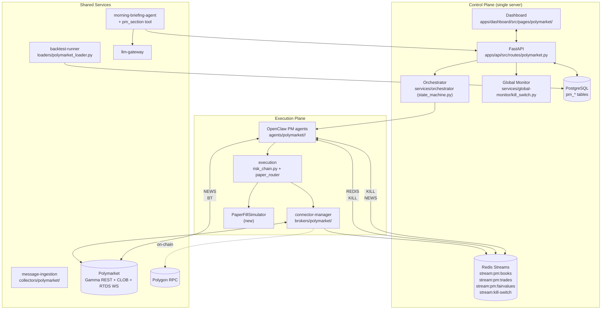
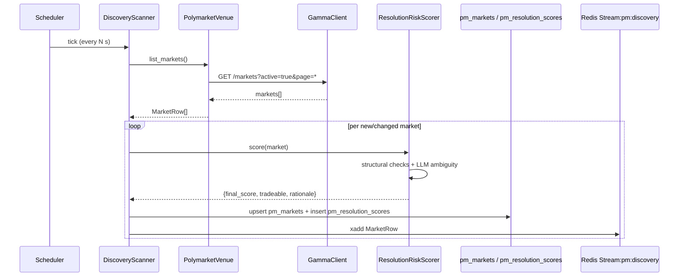
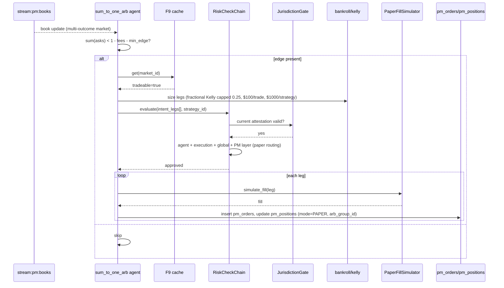
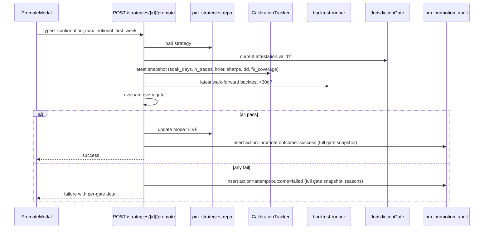
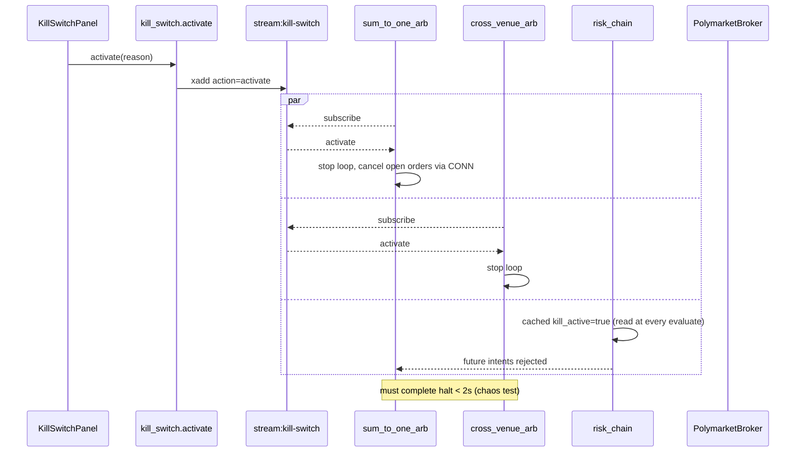

# Architecture: Polymarket Tab

Owner: Atlas (Architect)
Status: v0.1 (handoff to Devin)
Date: 2026-04-07
PRD: `docs/prd/polymarket-tab.md`
Scope: v1.0 (F1, F2, F3, F9, F10, F12, F13) detailed; v1.1–v1.3 outlined.

---

## 0. Top-level Risk Restated (US Jurisdiction)

**Polymarket geo-blocks US users.** The user has confirmed they are operating from a US jurisdiction. This is the single largest non-engineering risk in the entire feature. The architecture treats it as a first-class concern:

1. A **`JurisdictionAttestationGate`** lives in `shared/polymarket/jurisdiction.py` and is invoked by the connector at `connect()` time and by every promotion-gate evaluation. It reads a typed user attestation row from `pm_jurisdiction_attestations` (new table) that records: timestamp, attestation text hash, IP at attestation, user-agent, and an explicit `acknowledged_geoblock: true`. Without an unexpired attestation (TTL configurable, default 30 days) the connector refuses to start.
2. The Polymarket tab in the dashboard renders a non-dismissable **red banner** at the top of every PM page until the attestation is current, plus a modal at first load that requires typed confirmation. Source: `apps/dashboard/src/pages/polymarket/components/JurisdictionBanner.tsx`.
3. All trade audit rows include the attestation id at the time of order — so post-hoc audit can prove each order flowed under a known attestation.
4. Documentation in `docs/architecture/polymarket-tab.md` (this file) and a `LEGAL.md` co-located in the PM module **explicitly states the user is solely responsible** for venue-access compliance. Phoenix does not VPN, does not spoof, does not advise.
5. The promotion gate (paper -> live) **cannot be cleared** without a current attestation, no matter how good the metrics are.

This is documented but not solved. It is the user's call. Engineering's job is to make it impossible to forget.

---

## 1. Context (from PRD)

Phoenix Trade Bot already runs equities/options/derivatives on a Control / Execution / Shared-Services three-plane design. The user wants a **Polymarket tab** that ships seven prediction-market strategies, end-to-end paper-by-default, behind the existing risk chain, OpenClaw orchestrator, ML pipeline, and morning briefing infrastructure. v1.0 ships F1 (PM connector) + F2 (discovery) + F3 (sum-to-one + cross-venue arb) + F9 (resolution-risk scorer) + F10 (PM walk-forward backtester) + F12 (PM morning briefing) + F13 (per-strategy OpenClaw agent + global kill switch wiring). Kalshi is **not** in v1.0 (user has no account); F2 must be venue-pluggable so Kalshi/Opinion drop in later.

---

## 2. Constraints & Quality Attributes

| Attribute | Target | Source |
|---|---|---|
| Book-update normalize latency (RTDS WS -> event bus) | p95 < 50 ms | PRD S1.2 |
| Stale-WS reconnect MTTR | < 5 s | PRD §2 |
| Discovery throughput | >= 500 markets/min | PRD S2.1 |
| Kill-switch propagation to PM strategies | < 2 s | PRD S13.2 |
| Paper soak before live promotion | 7 days, >=50 trades (config) | User decision #4 |
| Brier promotion threshold | <= 0.20 (config) | User decision #4 |
| Sharpe promotion threshold | >= 1.0 (config) | User decision #4 |
| Max drawdown promotion threshold | <= 5% (config) | User decision #4 |
| Initial bankroll | $5,000 | User decision #5 |
| Per-strategy notional cap | $1,000 | User decision #5 |
| Per-trade notional cap | $100 | User decision #5 |
| Kelly fraction cap | 0.25 | User decision #5 |
| Key custody | Fernet via existing `CREDENTIAL_ENCRYPTION_KEY`; OS keychain upgrade in v1.2 | User decision #3 |
| Single-tenant | One power user; no multi-tenant in v1 | PRD §2 |

Quality attributes that drive the design:

- **Default-paper-everywhere**: live mode must be physically routed differently. The risk chain reads `Strategy.mode` and selects between `PaperFillSimulator` and the `PolymarketBroker`.
- **Venue-pluggable**: F2 scanner depends on a `MarketVenue` interface, not on Polymarket directly.
- **Auditability**: every promotion, demotion, attempted promotion, and every blocked-order writes to the existing `audit_log` table with PM-specific subtype rows in `pm_promotion_audit`.
- **Reuse, not parallel**: no new risk system, no new orchestrator, no new backtester. Extension only.

---

## 3. High-Level Design

### 3.1 How PM plugs into the three planes



### 3.2 Component summary

- **`PolymarketBroker`** (new) — implements `BaseBroker`. Wraps three sub-clients: Gamma REST (metadata, fee schedule), CLOB REST (signed orders), RTDS WS (book stream). Lives in `services/connector-manager/src/brokers/polymarket/`.
- **`MarketVenue` interface** (new) — abstracts discovery. Polymarket implementation in v1.0; Kalshi placeholder file present but unimplemented; Opinion deferred.
- **`DiscoveryScanner`** — single async loop iterating registered venues; emits `MarketRow` to `stream:pm:discovery`; persists snapshots to `pm_markets`.
- **`ResolutionRiskScorer` (F9)** — pure shared library in `shared/polymarket/resolution_risk.py`. Combines structural checks (oracle type, dispute history from Gamma) with an LLM ambiguity score via `shared/llm/client.py`. Emits a `tradeable: bool` and a 0–1 score, persisted to `pm_resolution_scores`.
- **`CalibrationTracker`** — ingests resolved markets and per-strategy trade history; computes rolling Brier, log-loss, reliability bins per strategy/category; writes daily snapshot to `pm_calibration_snapshots`. Used by F11 (v1.1) but the table and writer ship in v1.0 so v1.0 strategies start accruing data.
- **PM strategy agents** — one OpenClaw agent per strategy, lives in `agents/polymarket/<strategy>/`. v1.0 ships `sum_to_one_arb/` and `cross_venue_arb/` (the latter scaffolded but disabled until Kalshi credentials exist).
- **`PaperFillSimulator`** — invoked by the execution risk chain when `Strategy.mode == PAPER`. Uses the latest book snapshot from `pm_markets` and a configurable slippage/fill model. Lives in `services/execution/src/paper/polymarket_simulator.py`.
- **PM news collectors** — new collectors targeting election/sports/crypto-news/macro-news Twitter accounts and subreddits relevant to PM markets. **Distinct from existing Twitter/Reddit/Discord feeds** (per user decision #7). Live in `services/message-ingestion/src/collectors/polymarket/`.
- **PM morning briefing tool** — extends `agents/templates/morning-briefing-agent/tools/` with `compile_pm_section.py`, fed by API endpoints.

### 3.3 Component diagram (PM subsystem internals)

```mermaid
flowchart LR
  subgraph PMConn["PolymarketBroker"]
    GR[GammaClient]
    CB[CLOBClient<br/>+ Fernet key]
    WS[RTDSWebSocket<br/>+ seq-gap detector]
    CIRC[CircuitBreaker<br/>shared/broker/circuit_breaker.py]
  end

  subgraph Disc["Discovery (F2)"]
    SCAN[DiscoveryScanner]
    PMV[PolymarketVenue]
    KAV[KalshiVenue<br/>(stub)]
  end

  subgraph Risk["Risk & Gating"]
    F9[ResolutionRiskScorer]
    PG[PromotionGate]
    RC[risk_chain.py<br/>extended]
    JUR[JurisdictionAttestationGate]
  end

  subgraph Strats["PM Strategy Agents"]
    S1[sum_to_one_arb]
    S2[cross_venue_arb]
  end

  subgraph BT["Backtest"]
    LD[polymarket_loader.py]
    WF[walk_forward.py]
  end

  PMV --> GR
  KAV -.-> KAV
  SCAN --> PMV
  SCAN --> KAV
  SCAN --> F9
  S1 --> RC
  S2 --> RC
  RC --> F9
  RC --> JUR
  RC --> CB
  RC --> Paper[PaperFillSimulator]
  PG --> F9
  PG --> JUR
  LD --> GR
  WF --> LD
```

### 3.4 Module layout (new code, exact paths)

```
services/connector-manager/src/brokers/polymarket/
  __init__.py
  adapter.py                # PolymarketBroker(BaseBroker)
  gamma_client.py           # REST: markets, fee schedule, dispute history
  clob_client.py            # REST: signed order placement, cancel, balances
  rtds_ws.py                # WebSocket: book + trade stream, heartbeat, seq-gap detection
  sequence_gap.py           # gap detector + REST resync coordinator
  signing.py                # EIP-712 / CLOB signing (uses Fernet-decrypted key)
  models.py                 # pydantic: PMOrder, PMBook, PMTrade, PMMarketMeta
  errors.py
  config.py                 # endpoints, timeouts, retry/backoff knobs

services/connector-manager/src/venues/
  __init__.py
  base.py                   # MarketVenue ABC (used by F2)
  polymarket_venue.py       # uses brokers/polymarket/gamma_client
  kalshi_venue.py           # stub raising NotImplementedError; documented seam

services/connector-manager/src/discovery/
  __init__.py
  scanner.py                # DiscoveryScanner — iterates venues, emits MarketRow
  market_row.py             # unified MarketRow dataclass

agents/polymarket/
  README.md
  sum_to_one_arb/
    config.json             # OpenClaw agent config (mode, caps, kill-switch hook)
    CLAUDE.md
    tools/
      detect_violation.py
      size_legs.py
      submit_atomic.py
      rollback.py
  cross_venue_arb/          # scaffolded, disabled in v1.0
    config.json
    CLAUDE.md
    tools/...
  market_making/            # v1.2
  ml_fairvalue/             # v1.1
  news_reactor/             # v1.2
  combinatorial_arb/        # v1.3
  whale_copy/               # v1.2

services/backtest-runner/src/loaders/
  __init__.py
  polymarket_loader.py      # historical book/trade fetch from Gamma + on-disk cache

services/execution/src/paper/
  __init__.py
  polymarket_simulator.py   # PaperFillSimulator for PM markets

shared/polymarket/
  __init__.py
  resolution_risk.py        # F9 scorer (structural + LLM)
  calibration.py            # CalibrationTracker
  jurisdiction.py           # JurisdictionAttestationGate
  fees.py                   # fee schedule cache + worst-case helpers
  bankroll.py               # fractional Kelly, per-strategy/per-trade caps
  events.py                 # event-bus topic constants for PM streams

services/message-ingestion/src/collectors/polymarket/
  __init__.py
  base.py                   # PMNewsCollector ABC
  election_twitter.py
  sports_twitter.py
  crypto_news_twitter.py
  macro_news_twitter.py
  pm_subreddits.py          # /r/PoliticalBetting, /r/sportsbook, etc.
  pm_discord.py             # election/sports rooms
  config.yaml               # source list (editable)

apps/api/src/routes/
  polymarket.py             # all /api/polymarket/* endpoints (see §5)

apps/dashboard/src/pages/polymarket/
  PolymarketPage.tsx        # tab root
  components/
    JurisdictionBanner.tsx
    MarketScannerTable.tsx
    StrategyCard.tsx
    PromoteModal.tsx
    CalibrationPanel.tsx
    KillSwitchPanel.tsx
    F9Badge.tsx
  hooks/
    usePMMarkets.ts
    usePMStrategies.ts
    usePMPromotion.ts

shared/db/models/
  polymarket.py             # all pm_* SQLAlchemy models (see §4)

agents/templates/morning-briefing-agent/tools/
  compile_pm_section.py     # new tool; called from compile_briefing.py
```

### 3.5 Existing files extended (not replaced)

| File | Change |
|---|---|
| `services/execution/src/risk_chain.py` | Add `PolymarketLayerRisk` (paper-mode routing, bankroll/Kelly caps, F9 gate, jurisdiction gate). Wire into `RiskCheckChain` only when `intent.venue == "polymarket"`. |
| `services/orchestrator/src/state_machine.py` | No code change; PM strategies reuse the existing state machine. The PM agent loader maps each strategy folder to one `AgentStateMachine` instance. |
| `services/global-monitor/src/kill_switch.py` | No code change. PM agents subscribe to `stream:kill-switch` and halt on `activate`. |
| `shared/db/models/strategy.py` | Add `mode` column (`String(10)`, NOT NULL, default `'PAPER'`, CHECK in `('PAPER','LIVE')`) and `venue` column. |
| `shared/db/models/__init__.py` | Register new `pm_*` models. |
| `apps/api/src/main.py` (or wherever routes register) | Mount `polymarket.router`. |
| `apps/dashboard/src/components/layout/AppShell.tsx` | Add `Polymarket` nav item. |
| `apps/dashboard/src/App.tsx` | Add route. |
| `agents/templates/morning-briefing-agent/tools/compile_briefing.py` | Call `compile_pm_section.py`. |
| `agents/templates/morning-briefing-agent/config.json` | Register the new tool. |

---

## 4. Data Model

All new tables live in `shared/db/models/polymarket.py`. Single Alembic migration `pm_v1_0_initial.py` creates them. UUID primary keys for consistency with existing models. Timestamps `timezone=True`.

### 4.1 `pm_markets` — discovery snapshot + metadata

| Column | Type | Notes |
|---|---|---|
| `id` (PK) | UUID | |
| `venue` | String(20) | `'polymarket'` for v1.0; future `'kalshi'`, `'opinion'` |
| `venue_market_id` | String(128) | Polymarket condition_id |
| `slug` | String(255) | |
| `question` | Text | |
| `category` | String(50) | election/sports/crypto/macro/other |
| `outcomes` | JSONB | `[{name, token_id, yes_bid, yes_ask, last, volume_24h}]` |
| `total_volume` | Float | |
| `liquidity_usd` | Float | |
| `expiry` | DateTime | |
| `resolution_source` | String(255) | |
| `oracle_type` | String(30) | `uma_oo`, `centralized`, `multi_sig`, `unknown` |
| `is_active` | Boolean | |
| `last_scanned_at` | DateTime | |
| `created_at` / `updated_at` | DateTime | |

Indexes: `(venue, venue_market_id)` UNIQUE, `(category, expiry)`, `(is_active, last_scanned_at)`, `(total_volume DESC)`.

### 4.2 `pm_strategies` — PM-specific strategy config & runtime

(Distinct from `strategies`; FK back to `strategies.id`. Keeps PM concerns out of the generic table.)

| Column | Type | Notes |
|---|---|---|
| `id` (PK) | UUID | |
| `strategy_id` | UUID FK -> `strategies.id` ON DELETE CASCADE | one-to-one |
| `archetype` | String(40) | `sum_to_one_arb`, `cross_venue_arb`, `mm`, `ml_fv`, `news_reactor`, `combinatorial_arb`, `whale_copy` |
| `mode` | String(10) NOT NULL DEFAULT 'PAPER' CHECK IN ('PAPER','LIVE') | |
| `bankroll_usd` | Float NOT NULL DEFAULT 5000 | |
| `max_strategy_notional_usd` | Float NOT NULL DEFAULT 1000 | |
| `max_trade_notional_usd` | Float NOT NULL DEFAULT 100 | |
| `kelly_cap` | Float NOT NULL DEFAULT 0.25 | |
| `min_edge_bps` | Integer | per-strategy min edge to fire |
| `paused` | Boolean DEFAULT false | per-strategy pause (S13.3) |
| `last_promotion_attempt_id` | UUID FK -> `pm_promotion_audit.id` nullable | |
| `created_at` / `updated_at` | DateTime | |

Index: `(mode, paused)`, `(archetype)`.

### 4.3 `pm_orders`

| Column | Type | Notes |
|---|---|---|
| `id` (PK) | UUID | |
| `pm_strategy_id` | UUID FK -> `pm_strategies.id` | |
| `pm_market_id` | UUID FK -> `pm_markets.id` | |
| `outcome_token_id` | String(128) | |
| `side` | String(4) | `BUY`/`SELL` |
| `qty_shares` | Float | |
| `limit_price` | Float | |
| `mode` | String(10) | snapshot of strategy mode at submit time |
| `status` | String(20) | `PENDING`,`OPEN`,`PARTIAL`,`FILLED`,`CANCELLED`,`REJECTED` |
| `venue_order_id` | String(128) nullable | null in paper |
| `fees_paid_usd` | Float | |
| `slippage_bps` | Float | |
| `f9_score` | Float | denormalized snapshot |
| `jurisdiction_attestation_id` | UUID FK | snapshot |
| `arb_group_id` | UUID nullable | links legs of an arb |
| `submitted_at` / `filled_at` / `cancelled_at` | DateTime | |

Indexes: `(pm_strategy_id, submitted_at)`, `(pm_market_id, status)`, `(arb_group_id)`.

### 4.4 `pm_positions`

| Column | Type | Notes |
|---|---|---|
| `id` (PK) | UUID | |
| `pm_strategy_id` | UUID FK | |
| `pm_market_id` | UUID FK | |
| `outcome_token_id` | String(128) | |
| `qty_shares` | Float | signed |
| `avg_entry_price` | Float | |
| `mode` | String(10) | |
| `unrealized_pnl_usd` | Float | |
| `realized_pnl_usd` | Float | |
| `opened_at` | DateTime | |
| `closed_at` | DateTime nullable | |

Index: UNIQUE `(pm_strategy_id, pm_market_id, outcome_token_id, mode)` partial WHERE `closed_at IS NULL`.

### 4.5 `pm_calibration_snapshots`

| Column | Type | Notes |
|---|---|---|
| `id` (PK) | UUID | |
| `pm_strategy_id` | UUID FK | |
| `category` | String(50) nullable | per-category bucket |
| `window_days` | Integer | 7/30/90 |
| `n_trades` | Integer | |
| `n_resolved` | Integer | |
| `brier` | Float | |
| `log_loss` | Float | |
| `reliability_bins` | JSONB | array of `{p_bin, observed_freq, n}` |
| `sharpe` | Float | |
| `max_drawdown_pct` | Float | |
| `computed_at` | DateTime | |

Index: `(pm_strategy_id, computed_at DESC)`.

### 4.6 `pm_resolution_scores`

| Column | Type | Notes |
|---|---|---|
| `id` (PK) | UUID | |
| `pm_market_id` | UUID FK | |
| `oracle_type` | String(30) | |
| `prior_disputes` | Integer | |
| `llm_ambiguity_score` | Float | 0–1 |
| `llm_rationale` | Text | |
| `final_score` | Float | combined |
| `tradeable` | Boolean | hard gate |
| `scored_at` | DateTime | |
| `model_version` | String(30) | |

Index: `(pm_market_id, scored_at DESC)`, `(tradeable)`.

### 4.7 `pm_promotion_audit`

| Column | Type | Notes |
|---|---|---|
| `id` (PK) | UUID | |
| `pm_strategy_id` | UUID FK | |
| `actor_user_id` | UUID FK -> users.id | |
| `action` | String(20) | `attempt`,`promote`,`demote`,`block` |
| `outcome` | String(20) | `success`,`failed` |
| `gate_evaluations` | JSONB | full snapshot of every gate (soak, n_trades, brier, sharpe, dd, F9 coverage, jurisdiction) |
| `attached_backtest_id` | UUID FK -> backtests.id nullable | |
| `jurisdiction_attestation_id` | UUID FK | |
| `previous_mode` / `new_mode` | String(10) | |
| `notes` | Text | typed user confirmation |
| `created_at` | DateTime | |

Index: `(pm_strategy_id, created_at DESC)`. Rows are immutable (enforced at the repository layer; no UPDATE/DELETE methods exposed).

### 4.8 `pm_jurisdiction_attestations`

| Column | Type | Notes |
|---|---|---|
| `id` (PK) | UUID | |
| `user_id` | UUID FK | |
| `attestation_text_hash` | String(64) | sha256 of the legalese shown |
| `acknowledged_geoblock` | Boolean | |
| `ip_at_attestation` | String(64) | |
| `user_agent` | Text | |
| `valid_until` | DateTime | |
| `created_at` | DateTime | |

Index: `(user_id, valid_until DESC)`.

### 4.9 Alembic plan

Single migration `alembic/versions/<rev>_pm_v1_0_initial.py`:
1. Add `mode` and `venue` columns to existing `strategies` (default `'PAPER'`/`'equities'` for back-compat).
2. Create all `pm_*` tables in dependency order.
3. Create indexes.
4. No data backfill required (no existing PM rows).

Downgrade drops in reverse order. Idempotent against the schema-self-heal in lifespan.

---

## 5. API Contracts (`apps/api/src/routes/polymarket.py`)

All endpoints require JWT auth (existing middleware). Base path `/api/polymarket`. All responses include `request_id` for trace.

| Method | Path | Purpose | Request | Response |
|---|---|---|---|---|
| GET | `/markets` | List discovered markets, filterable | query: `category`, `min_volume`, `max_spread_bps`, `expiry_before`, `tradeable_only`, `limit`, `offset` | `{markets: MarketRow[], total: int}` |
| GET | `/markets/{id}` | Single market detail with F9 score | — | `MarketDetail` (includes outcomes, latest book, F9 score, oracle info) |
| POST | `/markets/scan` | Force a discovery scan run (debug) | `{venue?: string}` | `{started: bool, scan_id: uuid}` |
| GET | `/strategies` | List PM strategies | — | `PMStrategy[]` |
| GET | `/strategies/{id}` | One strategy with runtime metrics | — | `PMStrategyDetail` |
| POST | `/strategies/{id}/pause` | Pause one strategy | — | `{paused: true}` |
| POST | `/strategies/{id}/resume` | Resume | — | `{paused: false}` |
| POST | `/strategies/{id}/promote` | Promotion attempt | `{typed_confirmation: string, max_notional_first_week: float, ack_resolution_risk: bool}` | `{success: bool, audit_id: uuid, gate_evaluations: {...}}` |
| POST | `/strategies/{id}/demote` | One-click demote | `{reason?: string}` | `{success: bool, audit_id: uuid}` |
| GET | `/strategies/{id}/promotion_audit` | Full audit history | — | `PromotionAuditRow[]` |
| GET | `/strategies/{id}/calibration` | Latest calibration snapshot | query: `window_days`, `category?` | `CalibrationSnapshot` |
| GET | `/positions` | All PM positions, filter by `mode`, `strategy_id` | — | `PMPosition[]` |
| GET | `/orders` | Order history | query: `strategy_id`, `status`, `limit` | `PMOrder[]` |
| POST | `/jurisdiction/attest` | Submit attestation | `{ack_geoblock: true, attestation_text_hash: string}` | `{id: uuid, valid_until: datetime}` |
| GET | `/jurisdiction/current` | Current attestation status | — | `{valid: bool, valid_until?: datetime}` |
| POST | `/kill-switch/activate` | PM-scoped kill switch (publishes `pm:halt` to global `stream:kill-switch` with `scope=polymarket`) | `{reason: string}` | `{active: true}` |
| POST | `/kill-switch/deactivate` | Re-arm | `{typed_confirmation: string}` | `{active: false}` |
| GET | `/kill-switch/status` | — | — | `{active: bool, reason?: string, activated_at?: datetime}` |
| GET | `/briefing/section` | PM section for morning briefing | query: `date?` | `{movers, new_high_volume, resolutions_24h, f9_risks, paper_pnl, live_pnl, kill_switch}` |

Promotion gate response shape:

```
{
  "success": false,
  "audit_id": "...",
  "gate_evaluations": {
    "jurisdiction":      {"passed": true},
    "soak_days":         {"passed": true,  "value": 8,    "threshold": 7},
    "n_trades":          {"passed": false, "value": 41,   "threshold": 50},
    "brier":             {"passed": true,  "value": 0.18, "threshold": 0.20},
    "sharpe":            {"passed": true,  "value": 1.12, "threshold": 1.0},
    "max_drawdown_pct":  {"passed": true,  "value": 3.4,  "threshold": 5.0},
    "f9_coverage":       {"passed": true,  "value": 1.0,  "threshold": 1.0},
    "backtest_attached": {"passed": true,  "value": "<id>"}
  }
}
```

---

## 6. Key Flows

### 6.1 Market discovery scan



### 6.2 Sum-to-one arb detection -> paper execution



### 6.3 Paper -> Live promotion gate (with audit)



### 6.4 Global kill-switch propagation



---

## 7. Cross-cutting Concerns

### 7.1 Authentication / Authorization
Reuse existing JWT middleware. Single power user; no per-endpoint role gating beyond existing admin checks. CLOB signing key encrypted at rest with `shared/crypto/credentials.py` (Fernet via `CREDENTIAL_ENCRYPTION_KEY`). Decrypted only inside `PolymarketBroker.signing.py` and never logged. Document upgrade path to OS keychain / hardware key (YubiKey/Ledger) in v1.2 — gated behind a new `KeyCustodyProvider` interface in `shared/crypto/` with the Fernet impl as one provider.

### 7.2 Observability
- Prometheus metrics namespace `phoenix_pm_*`: scan throughput, F9 latency, ws gap count, paper-vs-live order counts, per-strategy Brier, kill-switch propagation latency.
- Structured logs with `strategy_id`, `pm_market_id`, `mode`, `arb_group_id`.
- Grafana panel set added under `infrastructure/grafana/dashboards/polymarket.json`.

### 7.3 Errors
- Connector errors return typed `PolymarketError` subclasses (Auth, RateLimit, SequenceGap, Sign, Network).
- Sequence-gap detector triggers a REST resync; if resync fails twice, the connector publishes a `ws_stale` event and the risk chain pauses all PM strategies until book freshness recovers.

### 7.4 Security
- No plaintext keys in logs (lint rule + redaction in connector).
- Jurisdiction attestation immutable, hash-bound to displayed text.
- Promotion-audit rows immutable.
- LLM prompts/responses for F9 logged with rotation.

### 7.5 Risk-chain extension (PolymarketLayerRisk)

Pseudocode (illustrative only, not code):

```
class PolymarketLayerRisk:
    def check(self, intent, strategy_row, attestation_state):
        if intent.venue != "polymarket": return pass
        if not attestation_state.valid: return fail("jurisdiction attestation expired")
        if not f9_cache.get(intent.pm_market_id).tradeable: return fail("F9 blocked")
        if intent.notional_usd > strategy_row.max_trade_notional_usd: return fail("per-trade cap")
        if strategy_row.live_notional_today + intent.notional_usd > strategy_row.max_strategy_notional_usd: return fail("per-strategy cap")
        kelly = compute_kelly(intent.edge, intent.p_win)
        if kelly > strategy_row.kelly_cap: kelly = strategy_row.kelly_cap
        if kelly <= 0: return fail("non-positive kelly")
        if strategy_row.mode == "PAPER" and intent.target == "live":
            return fail("paper strategy attempted live order")  # hard fail + audit
        return pass
```

This layer is appended to `RiskCheckChain.evaluate()` and only fires when `intent.venue == "polymarket"`. Existing behavior for equities/options is unchanged.

---

## 8. Agent Topology

- Each PM strategy folder under `agents/polymarket/<strategy>/` is loaded by the orchestrator at startup as **one OpenClaw agent**, one row in `agents`, one row in `strategies`, one row in `pm_strategies`.
- Each agent uses the existing `AgentStateMachine` (`services/orchestrator/src/state_machine.py`) unchanged. v1.0 PM agents start in `PAPER` and never auto-transition to `LIVE`; the promotion API performs the `PAPER -> LIVE` transition only after all gates pass and writes the audit row.
- The `mode` column on `pm_strategies` is the **authoritative paper/live flag** read by `risk_chain`. The state-machine `PAPER`/`LIVE` is the **lifecycle** marker. They are kept in sync by the promotion endpoint; on mismatch the risk chain treats the more restrictive value as truth.
- Each agent subscribes to `stream:kill-switch` and reacts within 2s. Per-strategy pause uses `pm_strategies.paused` (no Redis needed; checked in the agent's main loop on every iteration).
- Agents publish to `stream:pm:trades` for the position monitor and ws-gateway to fan out to UI.

---

## 9. Phased Technical Implementation Plan (v1.0)

Each phase is sized for ~1–3 days of Devin work, dependency-ordered, with explicit DoD and Quill test hooks. Phases inside the same numeric block can be parallelized only if noted.

### Phase 1 — Schema + jurisdiction primitive (1d)
**Goal:** Land all DB models and the jurisdiction gate so every later phase can reference them.
**Files:** `shared/db/models/polymarket.py`, `shared/db/models/__init__.py`, `shared/db/models/strategy.py` (add `mode`, `venue`), `alembic/versions/<rev>_pm_v1_0_initial.py`, `shared/polymarket/jurisdiction.py`, `shared/polymarket/__init__.py`.
**Interfaces:** repository functions for each table (CRUD, no business logic).
**Deps:** none.
**DoD:** `make db-upgrade` succeeds; `make db-downgrade` reverses cleanly; unit tests for each repo; jurisdiction gate unit-tested with valid/expired/missing rows.
**Test hooks:** `tests/unit/polymarket/test_models.py`, `test_jurisdiction.py`.

### Phase 2 — PolymarketBroker connector skeleton (2d)
**Goal:** Auth round-trip + Gamma metadata fetch working end-to-end against the live Polymarket public endpoints (no orders yet).
**Files:** all of `services/connector-manager/src/brokers/polymarket/` except `clob_client.py` order paths, plus `signing.py` stub.
**Interfaces:** `PolymarketBroker(BaseBroker)` with `connect/disconnect/get_account/health_check` working; `gamma_client.list_markets()`, `gamma_client.get_market(id)`, `gamma_client.get_fee_schedule()`.
**Deps:** Phase 1 (jurisdiction gate enforced in `connect()`).
**DoD:** `health_check` returns `ok` against staging credentials; markets list non-empty; no plaintext keys in logs; circuit breaker reuses `shared/broker/circuit_breaker.py`.
**Test hooks:** `tests/unit/polymarket/test_gamma_client.py` with recorded fixtures; `tests/integration/polymarket/test_connect.py` (skipped without env keys).

### Phase 3 — RTDS WebSocket + sequence-gap handling (2d)
**Goal:** Live book stream normalized to internal schema and published to `stream:pm:books`.
**Files:** `rtds_ws.py`, `sequence_gap.py`, `shared/polymarket/events.py` (topic constants).
**Deps:** Phase 2.
**DoD:** integration test simulates a missing sequence and verifies REST resync; p95 normalize latency benchmark < 50ms; reconnect MTTR < 5s in chaos test.
**Test hooks:** `tests/unit/polymarket/test_sequence_gap.py`, `tests/benchmark/test_pm_book_latency.py`.

### Phase 4 — MarketVenue interface + DiscoveryScanner (F2) (2d)
**Goal:** F2 scanner producing unified `MarketRow` with PM venue impl and Kalshi stub.
**Files:** `services/connector-manager/src/venues/`, `services/connector-manager/src/discovery/`.
**Deps:** Phase 2.
**DoD:** scanner emits >=500 markets/min in benchmark; per-venue failure isolation tested by killing PMV mid-scan; Kalshi stub raises clear NotImplementedError without breaking the scanner.
**Test hooks:** `tests/unit/polymarket/test_scanner.py`, `tests/benchmark/test_pm_scan_throughput.py`.

### Phase 5 — F9 Resolution-risk scorer (2d)
**Goal:** Score every market discovered by Phase 4 and gate trades.
**Files:** `shared/polymarket/resolution_risk.py`, plus persistence into `pm_resolution_scores`. LLM call via `shared/llm/client.py`.
**Deps:** Phases 1, 4.
**DoD:** every market in `pm_markets` has a current `pm_resolution_scores` row; `tradeable=false` blocks orders at the risk chain; rationale logged.
**Test hooks:** `tests/unit/polymarket/test_resolution_risk.py` with golden cases (clean UMA market, disputed market, ambiguous wording).

### Phase 6 — Risk-chain extension + PaperFillSimulator (2d)
**Goal:** PM intents flow through extended `risk_chain.py` and route to paper sim by default.
**Files:** `services/execution/src/risk_chain.py` (extend), `services/execution/src/paper/polymarket_simulator.py`, `shared/polymarket/bankroll.py`, `shared/polymarket/fees.py`.
**Deps:** Phases 1, 2, 5.
**DoD:** unit tests cover paper-routing, per-trade cap, per-strategy cap, kelly cap, jurisdiction gate, F9 gate, mode-mismatch hard fail; integration test simulates a full order through the chain in PAPER mode.
**Test hooks:** `tests/unit/execution/test_pm_risk.py`, `tests/integration/polymarket/test_paper_fill.py`.

### Phase 7 — Backtest loader (F10) (2d)
**Goal:** Historical PM data feeds existing walk-forward.
**Files:** `services/backtest-runner/src/loaders/polymarket_loader.py` (with on-disk parquet cache).
**Deps:** Phase 2.
**DoD:** loader returns OHLC-equivalent book snapshots compatible with `walk_forward.py`; a sample backtest of `sum_to_one_arb` archetype (synthetic strategy) runs end-to-end and writes a `backtests` row.
**Test hooks:** `tests/unit/backtest/test_pm_loader.py`, `tests/integration/backtest/test_pm_walk_forward.py`.

### Phase 8 — sum_to_one_arb agent (F3.1) (3d)
**Goal:** First real PM strategy, paper mode only.
**Files:** `agents/polymarket/sum_to_one_arb/` (config + tools), agent loader registration in orchestrator.
**Deps:** Phases 3, 5, 6.
**DoD:** agent detects synthetic sum<1 violation in fixture book, sizes legs, submits to risk chain, gets paper fills, writes `pm_orders` rows with shared `arb_group_id`; rollback on simulated leg failure tested; per-strategy pause works; kill switch halts < 2s.
**Test hooks:** `tests/unit/polymarket/test_sum_to_one_detector.py`, `tests/integration/polymarket/test_sum_to_one_e2e.py`, `tests/chaos/test_pm_kill_switch.py`.

### Phase 9 — cross_venue_arb scaffold (F3.2) (1d)
**Goal:** Folder + interface only; disabled in v1.0 because no Kalshi account.
**Files:** `agents/polymarket/cross_venue_arb/` with `enabled: false` in config.
**Deps:** Phase 8.
**DoD:** loader sees the agent and starts it in `STOPPED` state; documented seam for v1.x activation.

### Phase 10 — API routes (2d)
**Goal:** All `/api/polymarket/*` endpoints from §5.
**Files:** `apps/api/src/routes/polymarket.py`, repository wiring, response schemas.
**Deps:** Phases 1, 4, 6, 8.
**DoD:** OpenAPI doc generated; pytest covers each endpoint happy + auth-fail + validation-fail; promotion endpoint re-validates every gate server-side regardless of client payload.
**Test hooks:** `apps/api/tests/test_polymarket_routes.py`.

### Phase 11 — Promotion gate engine (1d)
**Goal:** Single source of truth for gate evaluation, callable from API and from CI/chaos tests.
**Files:** `shared/polymarket/promotion_gate.py` (consolidates rules referenced in §5/§6.3); `pm_promotion_audit` writes wrapped in repo.
**Deps:** Phase 10.
**DoD:** every promote/demote/attempt writes immutable audit row; bypass attempts (e.g., DB direct UPDATE of `mode`) are caught by a startup-time consistency check that reconciles `strategies.status`/`pm_strategies.mode` and writes a `block` audit row on drift.

### Phase 12 — Dashboard tab (3d)
**Goal:** Polymarket page with scanner table, strategy cards, kill switch, jurisdiction banner, promote modal.
**Files:** `apps/dashboard/src/pages/polymarket/` (page + components + hooks), `App.tsx`, `AppShell.tsx`.
**Deps:** Phase 10.
**DoD:** Playwright e2e test opens tab, attests jurisdiction, sees markets, paused/resumed a strategy, attempts and fails a promotion (insufficient soak), sees audit row.
**Test hooks:** `tests/e2e/polymarket.spec.ts`.

### Phase 13 — Morning briefing PM section (F12) (1d)
**Goal:** PM block in the daily briefing.
**Files:** `agents/templates/morning-briefing-agent/tools/compile_pm_section.py`, briefing config + compile_briefing.py extension.
**Deps:** Phase 10.
**DoD:** running the morning routine renders the PM section in `MorningBriefing.tsx`.

### Phase 14 — PM news collectors (1d, parallelizable with Phase 12)
**Goal:** Brand-new collectors per user decision #7. Pure ingestion in v1.0; consumed by F6 in v1.2.
**Files:** `services/message-ingestion/src/collectors/polymarket/` + `config.yaml`.
**DoD:** each collector writes to its dedicated topic, isolated from existing twitter/reddit/discord adapters; volumes show in metrics.

### Phase 15 — Chaos + benchmark + docs hardening (2d)
**Goal:** v1.0 exit criteria from PRD §3.
**Files:** `tests/chaos/test_pm_kill_switch.py` (extended), `tests/benchmark/test_pm_*`, `docs/architecture/polymarket-tab.md` updates, `LEGAL.md`.
**DoD:** kill-switch propagation < 2s asserted; scanner throughput >= 500 markets/min asserted; promotion-bypass test asserts zero bypass paths.

**Total v1.0 estimate:** ~26 days of Devin work.

### v1.1 outline (F5 + F11)
- ML fair-value training pipeline reuses `agents/backtesting/` 9-step; outputs published to `stream:pm:fairvalues`.
- `CalibrationTracker` already shipping data from v1.0 — v1.1 wires it into adaptive Kelly in `shared/polymarket/bankroll.py` and surfaces the calibration dashboard via new components in the PM tab.
- New strategy folder `agents/polymarket/ml_fairvalue/`.

### v1.2 outline (F4 + F6 + F8)
- F4 market-making agent depends on F5 fair value and on `shared/polymarket/fees.py` extended with rebate tiers.
- F6 news reactor consumes the v1.0 PM news collectors via LLM scoring; F9 mandatory.
- F8 whale copy adds a Polygon on-chain watcher under `services/connector-manager/src/brokers/polymarket/onchain_watcher.py`.
- Key custody upgrade path: introduce `KeyCustodyProvider` interface; ship OS-keychain provider behind a feature flag.

### v1.3 outline (F7)
- Combinatorial arb solver as a new microservice `services/pm-combinatorial-solver/` (constraint-graph engine; technology TBD — likely OR-tools or a hand-rolled SAT-style solver scoped to PM market graph size).
- Manual one-click execution in v1.2/v1.3 transition; auto execution gated behind a separate per-strategy promotion in late v1.3 per user decision #6.

---

## 10. Risks (engineering, restating top user concerns)

| # | Risk | Mitigation |
|---|---|---|
| R-A | **US jurisdiction (Polymarket geo-block)** | `JurisdictionAttestationGate` + UI banner + audit linkage + LEGAL.md. The user is solely responsible. Live mode physically blocked without current attestation. |
| R-B | UMA OO disputes / wrong resolution | F9 ships with v1.0 and gates every order. Per-market notional caps when ambiguity > 0.3. |
| R-C | CLOB key custody | Fernet via `CREDENTIAL_ENCRYPTION_KEY`; signing isolated in `signing.py`; never logged. v1.2 introduces `KeyCustodyProvider` so OS keychain / hardware can be added without refactor. |
| R-D | Fee-model drift | `shared/polymarket/fees.py` re-fetches fee schedule from Gamma each scan cycle; min-edge calculations always use the worst-case fee in cache. |
| R-E | RTDS sequence gaps | `sequence_gap.py` detects, triggers REST resync, double failure pauses PM strategies via the risk chain. |
| R-F | Model miscalibration drift | `CalibrationTracker` writes daily snapshots from v1.0; v1.1 adaptive Kelly auto-demotes to paper on Brier breach. |
| R-G | Adverse selection on MM (v1.2) | F4 includes N-consecutive-loss kill, inventory caps, F5 confidence gate. |
| R-H | Promotion-gate bypass | Single `promotion_gate.py` source of truth; server re-validates every gate; immutable audit; startup consistency check writes `block` rows on direct-DB drift. |
| R-I | Cross-venue event-matching false positive | F3.2 defers cross-venue until Kalshi exists; F9 must pass on both legs; manual override list. |
| R-J | Single power-user assumption leaks into multi-tenant code | All PM repos take `user_id`; no global singletons; future multi-tenant requires only adding row-level filters. |

---

## 11. Open Architectural Decisions

1. **F7 solver technology** — OR-tools vs hand-rolled. Defer to v1.3 design pass; not blocking v1.0.
2. **Whether `PolymarketBroker` lives in `services/connector-manager/src/brokers/` or in `shared/broker/` alongside `alpaca_adapter.py`.** Chose connector-manager per existing pattern (`alpaca.py`, `ibkr.py`, `tradier.py` all live there). `shared/broker/` is for the abstraction; concrete adapters live in connector-manager.
3. **Order-cancellation atomicity for sum-to-one arb.** Polymarket CLOB does not provide atomic multi-leg orders. Phase 8 uses an optimistic sequential submit + rollback-on-failure pattern. If real-world fill races prove costly, v1.1 can add an order-pacing layer; flagged as a known imperfection.
4. **Where the F9 LLM lives** — reuses existing `llm-gateway`. No new service.
5. **Whether `pm_strategies.mode` should be merged into the shared `strategies.mode` column.** Decision: keep both. `strategies.mode` is the cross-venue field; `pm_strategies.mode` is the PM-authoritative mirror used by PM-specific code. Reconciled at startup.

---

## 12. Handoff Summary (for Build / Devin)

- Read this doc, then re-read PRD §4 (acceptance criteria) and §5 (promotion gate).
- Phase 1 is unblocked and should start first.
- Phases 2 and 3 need real Polymarket public endpoint reachability; staging keys not required for read-only Gamma.
- The single biggest non-engineering risk is the **US jurisdiction issue**; the architecture surfaces it but does not solve it. The user has accepted responsibility.
- Quill should add tests at every phase's listed test hook before merging.
