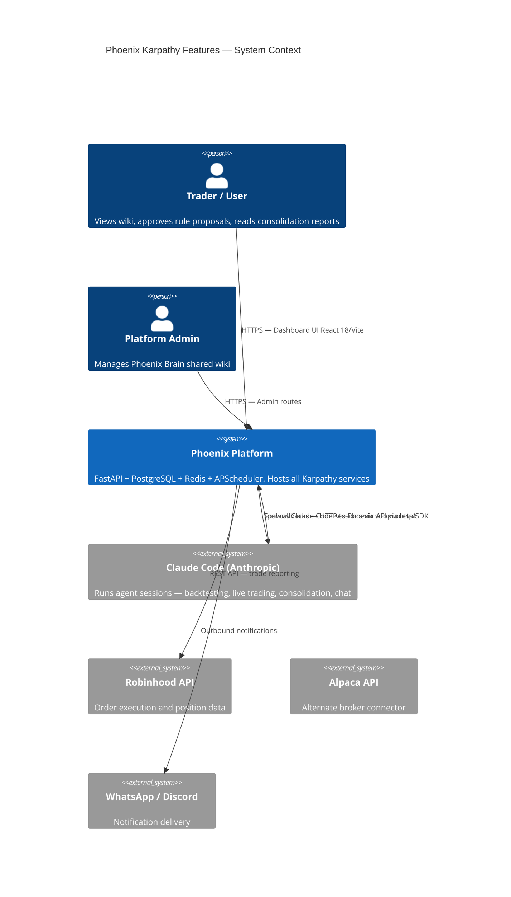
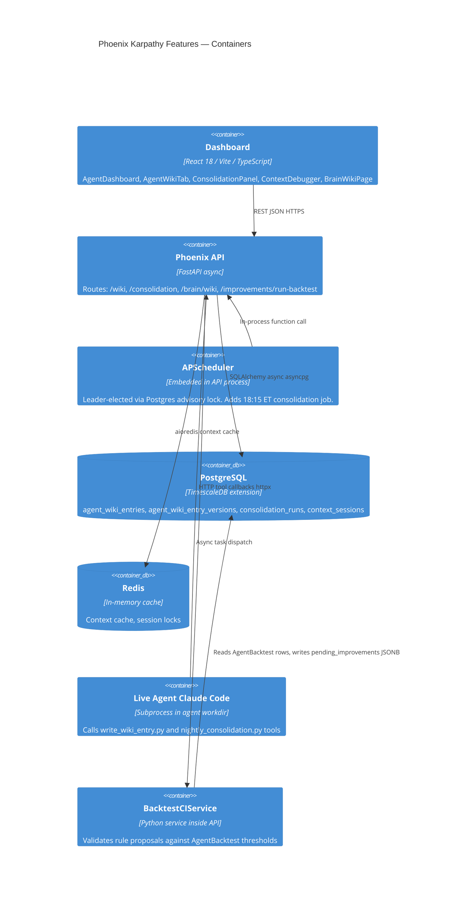
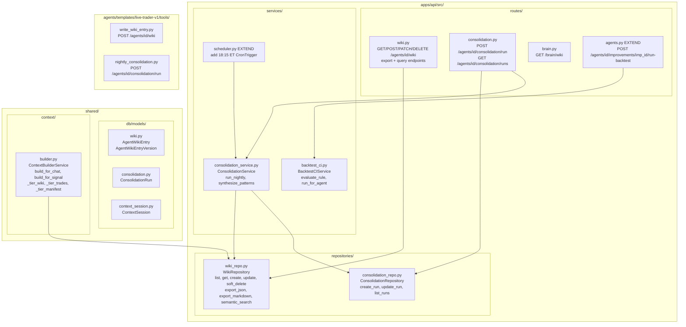
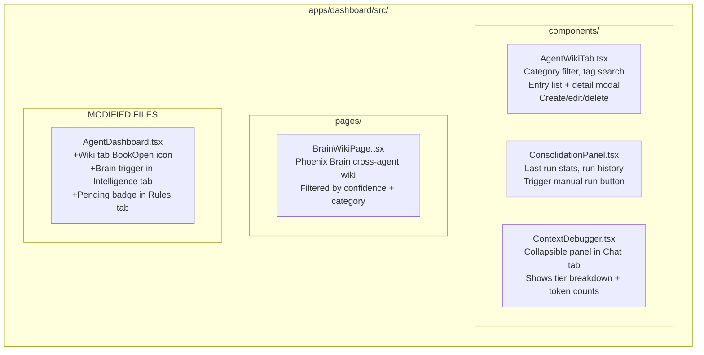
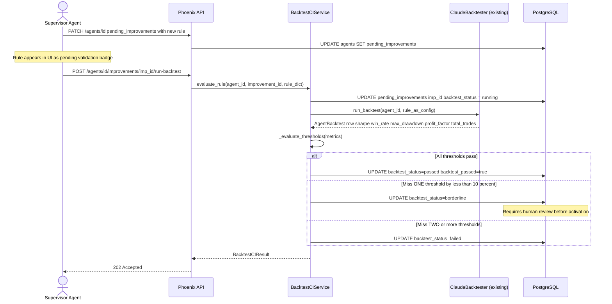
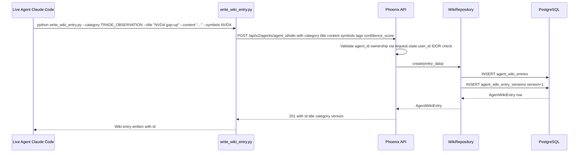
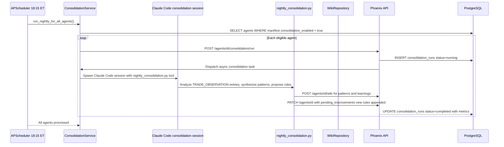
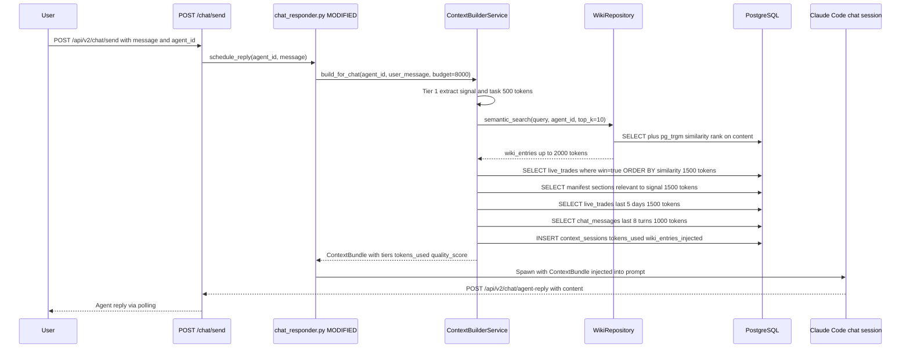
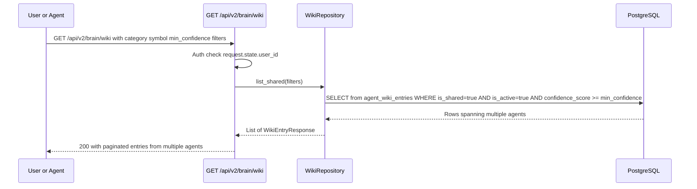

# Architecture: Phoenix Trade Bot — Karpathy Features
### Verifiable Alpha CI · Agent Knowledge Wiki · Nightly Consolidation · Smart Context Builder · Phoenix Brain

**Status:** Draft v1.0  
**Date:** 2025-01-28  
**Author:** Atlas (Architect)  
**Phases:** 0 – 5  
**Implements PRDs:** #0 Verifiable Alpha CI, #1 Agent Knowledge Wiki, #2 Nightly Consolidation, #3 Smart Context Builder, #4 Phoenix Brain  

---

## 1. Context (from PRDs)

Phoenix is a multi-agent AI trading platform. Each agent runs a Claude Code session with a tool harness, reports trades to the Phoenix API, and is supervised by nightly scheduled jobs. The Karpathy feature set adds four vertically integrated capabilities:

| Layer | Capability | What it replaces / augments |
|---|---|---|
| Safety gate | Verifiable Alpha CI (PRD #0) | `pending_improvements` is promoted from a suggestion pile to a CI-gated proposal queue |
| Memory | Agent Knowledge Wiki (PRD #1) | Replaces ephemeral `manifest.knowledge` sections with a versioned, queryable, per-agent knowledge base |
| Learning | Nightly Consolidation (PRD #2) | Replaces ad-hoc EOD scripts with a structured, auditable nightly synthesis pipeline |
| Context | Smart Context Builder (PRD #3) | Replaces static context assembly in `chat_responder.py` with priority-tiered, token-budgeted injection |
| Network | Phoenix Brain (Phase 5) | Surfaces cross-agent learning by federating high-confidence shared wiki entries |

These features compose into a self-reinforcing learning loop:

```
Trade closes → TRADE_OBSERVATION wiki entry → Nightly Consolidation
→ pattern + rule proposal → Backtest CI → pending_improvements
→ Smart Context Builder injects verified knowledge → better next trade
```

---

## 2. Constraints & Quality Attributes

| Attribute | Target | Notes |
|---|---|---|
| Latency — wiki query | < 200 ms p99 | Full-text search via `pg_trgm` + GIN index on `content` |
| Latency — context build | < 500 ms p99 | Budget-capped, no LLM calls on critical path |
| Latency — backtest CI | < 5 min per rule | Runs the existing `ClaudeBacktester`; async, non-blocking |
| Throughput — consolidation | All live agents, nightly | APScheduler leader-elected job at 18:15 ET; sequential per agent |
| DB isolation | Row-level by `agent_id` + `user_id` | IDOR enforced at route layer via `request.state.user_id` |
| Token safety | `WIKI_CONTEXT_TOKEN_BUDGET` env var | Default 8000; overridable per-agent in `manifest.wiki_token_budget` |
| Feature flag | `ENABLE_SMART_CONTEXT=false` | Opt-in per env; backfilled in context builder |
| Migration safety | Idempotent `_has_column()` guards | Pattern from migration 034; no destructive `ALTER TABLE` |
| Backward compat | Zero breaking changes to existing routes | All new routes are additive; no existing endpoint signatures changed |

---

## 3. High-Level Design

### 3.1 System Context Diagram (C4 Level 1)



### 3.2 Container Diagram (C4 Level 2)



---

## 4. Components

### 4.1 New Backend Components



### 4.2 New Frontend Components



---

## 5. Key Flows

### 5.1 Flow: Rule Proposal → Backtest CI → Activation



### 5.2 Flow: Agent Writes Wiki Entry



### 5.3 Flow: Nightly Consolidation Pipeline



### 5.4 Flow: Smart Context Builder (Chat Path)



### 5.5 Flow: Phoenix Brain Cross-Agent Wiki Query



---

## 6. Data Model

### 6.1 New Tables

#### `agent_wiki_entries`
| Column | Type | Constraints | Notes |
|---|---|---|---|
| `id` | UUID | PK, default uuid4 | |
| `agent_id` | UUID | FK → agents.id ON DELETE CASCADE, NOT NULL, INDEX | |
| `user_id` | UUID | FK → users.id, nullable | For audit / IDOR |
| `category` | VARCHAR(50) | NOT NULL, CHECK in enum | See enum below |
| `subcategory` | VARCHAR(100) | nullable | Free-form sub-grouping |
| `title` | VARCHAR(255) | NOT NULL | |
| `content` | TEXT | NOT NULL | |
| `tags` | VARCHAR[] | DEFAULT '{}' | GIN index |
| `symbols` | VARCHAR[] | DEFAULT '{}' | GIN index |
| `confidence_score` | FLOAT | DEFAULT 0.5, CHECK 0.0–1.0 | |
| `trade_ref_ids` | UUID[] | DEFAULT '{}' | References live_trades.id |
| `created_by` | VARCHAR(10) | DEFAULT 'agent', CHECK IN ('agent','user') | |
| `is_active` | BOOLEAN | DEFAULT true | Soft-delete flag |
| `is_shared` | BOOLEAN | DEFAULT false | Phoenix Brain visibility |
| `version` | INT | DEFAULT 1 | Incremented on PATCH |
| `created_at` | TIMESTAMPTZ | DEFAULT now() | |
| `updated_at` | TIMESTAMPTZ | DEFAULT now() | |

**Category enum:** `MARKET_PATTERNS`, `SYMBOL_PROFILES`, `STRATEGY_LEARNINGS`, `MISTAKES`, `WINNING_CONDITIONS`, `SECTOR_NOTES`, `MACRO_CONTEXT`, `TRADE_OBSERVATION`

**Indexes:**
- `ix_wiki_agent_id` on `(agent_id)`
- `ix_wiki_category` on `(agent_id, category)`
- `ix_wiki_symbols_gin` on `USING gin(symbols)`
- `ix_wiki_tags_gin` on `USING gin(tags)`
- `ix_wiki_content_trgm` on `USING gin(content gin_trgm_ops)` — requires `CREATE EXTENSION IF NOT EXISTS pg_trgm`
- `ix_wiki_shared` on `(is_shared, is_active, confidence_score)`

#### `agent_wiki_entry_versions`
| Column | Type | Constraints | Notes |
|---|---|---|---|
| `id` | UUID | PK, default uuid4 | |
| `entry_id` | UUID | FK → agent_wiki_entries.id ON DELETE CASCADE, INDEX | |
| `version` | INT | NOT NULL | |
| `content` | TEXT | NOT NULL | Full content snapshot |
| `updated_by` | VARCHAR(10) | nullable | 'agent' or 'user' |
| `updated_at` | TIMESTAMPTZ | DEFAULT now() | |
| `change_reason` | VARCHAR(500) | nullable | |

**Unique constraint:** `(entry_id, version)`

#### `consolidation_runs`
| Column | Type | Constraints | Notes |
|---|---|---|---|
| `id` | UUID | PK, default uuid4 | |
| `agent_id` | UUID | FK → agents.id, NOT NULL, INDEX | |
| `run_type` | VARCHAR(20) | DEFAULT 'nightly' | 'nightly' or 'manual' |
| `status` | VARCHAR(20) | DEFAULT 'pending' | 'pending', 'running', 'completed', 'failed', 'skipped' |
| `scheduled_for` | TIMESTAMPTZ | nullable | For nightly: 18:15 ET date |
| `started_at` | TIMESTAMPTZ | nullable | |
| `completed_at` | TIMESTAMPTZ | nullable | |
| `trades_analyzed` | INT | DEFAULT 0 | |
| `wiki_entries_written` | INT | DEFAULT 0 | |
| `wiki_entries_updated` | INT | DEFAULT 0 | |
| `wiki_entries_pruned` | INT | DEFAULT 0 | |
| `patterns_found` | INT | DEFAULT 0 | |
| `rules_proposed` | INT | DEFAULT 0 | |
| `consolidation_report` | TEXT | nullable | Full markdown summary |
| `error_message` | TEXT | nullable | |
| `created_at` | TIMESTAMPTZ | DEFAULT now() | |

**Indexes:** `ix_consolidation_agent_id` on `(agent_id)`, `ix_consolidation_status` on `(status)`

#### `context_sessions`
| Column | Type | Constraints | Notes |
|---|---|---|---|
| `id` | UUID | PK, default uuid4 | |
| `agent_id` | UUID | FK → agents.id, NOT NULL, INDEX | |
| `session_id` | UUID | nullable | Links to Claude session |
| `session_type` | VARCHAR(20) | DEFAULT 'chat' | 'chat', 'signal', 'consolidation' |
| `signal_symbol` | VARCHAR(20) | nullable | |
| `token_budget` | INT | NOT NULL | From env var or manifest |
| `tokens_used` | INT | DEFAULT 0 | |
| `wiki_entries_injected` | INT | DEFAULT 0 | |
| `trades_injected` | INT | DEFAULT 0 | |
| `manifest_sections_injected` | TEXT[] | DEFAULT '{}' | |
| `quality_score` | FLOAT | nullable | Computed signal relevance |
| `built_at` | TIMESTAMPTZ | DEFAULT now() | |

### 6.2 Modified JSONB Structures

#### `agents.pending_improvements` — Extended Entry Schema
Each entry in the `pending_improvements` JSONB dict is extended with additive fields (no breaking change — no column migration needed):

```jsonc
// Illustrative pseudocode schema — NOT a SQLAlchemy model change
{
  "<improvement_id>": {
    // Existing fields preserved unchanged:
    "title": "string",
    "description": "string",
    "rule": { /* rule dict */ },
    "proposed_at": "ISO timestamp",
    "proposed_by": "supervisor | user",

    // NEW fields added by BacktestCIService (null until backtest runs):
    "backtest_status": "pending | running | passed | failed | borderline",
    "backtest_passed": false,          // true only when status = passed
    "backtest_run_id": "UUID | null",  // FK to agent_backtests.id
    "backtest_metrics": {
      "sharpe_ratio": null,
      "win_rate": null,
      "max_drawdown": null,
      "profit_factor": null,
      "trade_count": null
    },
    "backtest_ran_at": "ISO timestamp | null",
    "borderline_reason": "string | null"  // which threshold was borderline
  }
}
```

#### `agents.manifest` — New Fields (additive, no migration needed)

```jsonc
// Illustrative pseudocode — additive fields written by services at runtime
{
  // All existing manifest fields unchanged ...

  // NEW fields:
  "consolidation_enabled": false,    // set true after 20th closed trade
  "wiki_token_budget": 8000          // overrides WIKI_CONTEXT_TOKEN_BUDGET env var
}
```

---

## 7. Interfaces / APIs

### 7.1 Backtest CI Endpoint

#### `POST /api/v2/agents/{agent_id}/improvements/{improvement_id}/run-backtest`

**Auth:** JWT bearer — `request.state.user_id` must match `agent.user_id`  
**Path params:** `agent_id: UUID`, `improvement_id: str`  
**Request body:** `{}` — rule is read from `agents.pending_improvements[improvement_id]`

**Response 202:**
```json
{
  "improvement_id": "string",
  "backtest_status": "running",
  "message": "Backtest CI queued"
}
```

**Response 404:** Agent not found or improvement_id not in pending_improvements  
**Response 409:** Backtest already running for this improvement  
**Response 403:** Agent does not belong to requesting user

---

### 7.2 Wiki Endpoints

**Router file:** `apps/api/src/routes/wiki.py`  
**Router prefix:** `/api/v2/agents/{agent_id}/wiki`  
**Tags:** `["wiki"]`  
**Auth:** JWT — agent must belong to `request.state.user_id`

#### `GET /api/v2/agents/{agent_id}/wiki`
**Query params:** `category`, `tag`, `symbol`, `search`, `is_shared`, `page` (default 1), `per_page` (default 20, max 100)

**Response 200:**
```json
{
  "entries": [
    {
      "id": "uuid",
      "agent_id": "uuid",
      "category": "TRADE_OBSERVATION",
      "subcategory": "gap-up",
      "title": "NVDA morning gap-up pattern",
      "content": "string",
      "tags": ["gap-up", "momentum"],
      "symbols": ["NVDA"],
      "confidence_score": 0.82,
      "trade_ref_ids": ["uuid"],
      "created_by": "agent",
      "is_active": true,
      "is_shared": false,
      "version": 3,
      "created_at": "ISO",
      "updated_at": "ISO"
    }
  ],
  "total": 47,
  "page": 1,
  "per_page": 20
}
```

#### `GET /api/v2/agents/{agent_id}/wiki/{entry_id}`
**Response 200:** Single WikiEntryResponse (same shape as list item)  
**Response 404:** Entry not found or does not belong to agent

#### `GET /api/v2/agents/{agent_id}/wiki/{entry_id}/versions`
**Response 200:**
```json
{
  "versions": [
    {
      "id": "uuid",
      "entry_id": "uuid",
      "version": 3,
      "content": "string",
      "updated_by": "user",
      "updated_at": "ISO",
      "change_reason": "Updated win rate data"
    }
  ]
}
```

#### `POST /api/v2/agents/{agent_id}/wiki`
**Request body:**
```json
{
  "category": "TRADE_OBSERVATION",
  "title": "string",
  "content": "string",
  "subcategory": "string",
  "tags": ["string"],
  "symbols": ["NVDA", "AAPL"],
  "confidence_score": 0.75,
  "trade_ref_ids": ["uuid"],
  "is_shared": false
}
```
**Response 201:** WikiEntryResponse

#### `PATCH /api/v2/agents/{agent_id}/wiki/{entry_id}`
**Request body:** Partial — any subset of POST fields  
**Behavior:** Increments `version`, inserts version snapshot into `agent_wiki_entry_versions`  
**Response 200:** Updated WikiEntryResponse

#### `DELETE /api/v2/agents/{agent_id}/wiki/{entry_id}`
**Behavior:** Soft-delete — sets `is_active=false`  
**Response 204:** No content

#### `GET /api/v2/agents/{agent_id}/wiki/export`
**Query params:** `format: "json" | "markdown"` (default `json`)  
**Response 200:** File download with appropriate Content-Type  
- JSON: full list of active entries  
- Markdown: category-grouped document

#### `POST /api/v2/agents/{agent_id}/wiki/query`
**Request body:**
```json
{
  "query_text": "string",
  "category": "string",
  "top_k": 10,
  "include_shared": true
}
```
**Response 200:**
```json
{
  "results": [
    {
      "entry": { },
      "similarity_score": 0.87
    }
  ]
}
```

---

### 7.3 Phoenix Brain Endpoint

**Router file:** `apps/api/src/routes/brain.py`  
**Router prefix:** `/api/v2/brain`  
**Tags:** `["brain"]`

#### `GET /api/v2/brain/wiki`
**Auth:** Any authenticated user  
**Query params:** `category`, `symbol`, `search`, `min_confidence` (default 0.5), `page`, `per_page`  
**Response 200:** Same paginated shape as agent wiki list. `agent_id` and agent `name` included per entry. Only `is_shared=true` and `is_active=true` entries returned.

---

### 7.4 Consolidation Endpoints

**Router file:** `apps/api/src/routes/consolidation.py`  
**Router prefix:** `/api/v2/agents/{agent_id}/consolidation`  
**Tags:** `["consolidation"]`

#### `POST /api/v2/agents/{agent_id}/consolidation/run`
**Auth:** JWT — agent must belong to caller  
**Request body:** `{}` or `{"run_type": "manual"}`  
**Response 202:**
```json
{
  "run_id": "uuid",
  "status": "pending",
  "message": "Consolidation queued"
}
```
**Response 409:** Consolidation already running for this agent  
**Response 403:** `manifest.consolidation_enabled` is false and run_type is not "manual" from admin

#### `GET /api/v2/agents/{agent_id}/consolidation/runs`
**Query params:** `page` (default 1), `per_page` (default 10)  
**Response 200:**
```json
{
  "runs": [
    {
      "id": "uuid",
      "agent_id": "uuid",
      "run_type": "nightly",
      "status": "completed",
      "scheduled_for": "ISO",
      "started_at": "ISO",
      "completed_at": "ISO",
      "trades_analyzed": 14,
      "wiki_entries_written": 3,
      "wiki_entries_updated": 2,
      "wiki_entries_pruned": 0,
      "patterns_found": 5,
      "rules_proposed": 2,
      "consolidation_report": "markdown string",
      "error_message": null,
      "created_at": "ISO"
    }
  ],
  "total": 12
}
```

---

### 7.5 Agent Tool Contracts

#### `write_wiki_entry.py`
**Location:** `agents/templates/live-trader-v1/tools/write_wiki_entry.py`  
**Pattern:** Follows `report_to_phoenix.py` — uses `httpx` with env vars  
**CLI invocation (pseudocode):**
```
python write_wiki_entry.py \
  --category TRADE_OBSERVATION \
  --title "NVDA gap-up pattern" \
  --content "..." \
  --symbols NVDA,AAPL \
  --tags gap-up,momentum \
  --confidence 0.75 \
  --trade_ref_ids uuid1,uuid2
```
**Env vars:** `PHOENIX_API_URL`, `PHOENIX_API_KEY`, `PHOENIX_TARGET_AGENT_ID`  
**HTTP call:** `POST /api/v2/agents/{PHOENIX_TARGET_AGENT_ID}/wiki`  
**Stdout:** `{"success": true, "entry_id": "uuid"}`

#### `nightly_consolidation.py`
**Location:** `agents/templates/live-trader-v1/tools/nightly_consolidation.py`  
**CLI invocation (pseudocode):**
```
python nightly_consolidation.py \
  --agent_id uuid \
  --consolidation_run_id uuid
```
**Env vars:** `PHOENIX_API_URL`, `PHOENIX_API_KEY`, `PHOENIX_TARGET_AGENT_ID`  
**Outbound HTTP calls:**
- `GET /api/v2/agents/{id}/wiki?category=TRADE_OBSERVATION&per_page=100`
- `GET /api/v2/agents/{id}/live-trades?status=FILLED&limit=200`
- `POST /api/v2/agents/{id}/wiki` (multiple — patterns + learnings)
- `PATCH /api/v2/agents/{id}` (append rules to pending_improvements)
- Status callback: handled by ConsolidationService watching consolidation_runs table

---

## 8. Cross-Cutting Concerns

### 8.1 Security & IDOR

| Check | Location | Mechanism |
|---|---|---|
| Wiki CRUD ownership | `apps/api/src/routes/wiki.py` | `agent.user_id == request.state.user_id` |
| Consolidation trigger | `apps/api/src/routes/consolidation.py` | Same ownership check |
| Backtest CI trigger | `apps/api/src/routes/agents.py` | Same ownership check |
| Brain wiki read | `apps/api/src/routes/brain.py` | Any authenticated user; only `is_shared=true` entries |
| Agent tool auth | `write_wiki_entry.py`, `nightly_consolidation.py` | `X-API-Key: {PHOENIX_API_KEY}` header (existing pattern from `report_to_phoenix.py`) |
| Admin brain management | `request.state.is_admin == True` | For bulk operations on shared entries |

**Future (v2):** Fernet encryption of `content` field for sensitive wiki entries — opt-in per entry via `is_encrypted: bool` column. Not in scope for Phase 0–5.

### 8.2 Observability

| Signal | Mechanism |
|---|---|
| Wiki CRUD events | `AgentLog` entries (existing `agent_logs` table) — `level="INFO"`, `context={"wiki_entry_id": "...", "action": "create"}` |
| Consolidation run lifecycle | `consolidation_runs.status` transitions; AgentLog entry per transition |
| Backtest CI results | AgentLog entry per run with full threshold detail |
| Smart context telemetry | `context_sessions` table write per build (best-effort, non-blocking) |
| Context hit rates | Query `context_sessions` grouped by `wiki_entries_injected > 0` |

### 8.3 Error Handling

| Scenario | Behavior |
|---|---|
| Backtest CI times out | `backtest_status="failed"`, `error_message` set in pending_improvements entry |
| Consolidation agent crashes | `consolidation_runs.status="failed"`, `error_message` populated; scheduler logs and continues to next agent |
| `pg_trgm` extension unavailable | `WikiRepository.semantic_search` falls back to `ILIKE '%query%'` |
| Smart context DB error | `ContextBuilderService` catches exception and falls back to legacy `_load_context()` in `chat_responder.py`; chat never blocked |
| Agent tool HTTP 4xx | Tool exits with non-zero code; Claude session logs the tool failure; agent continues trading |
| `consolidation_enabled=false` | Nightly job silently skips that agent; logs at DEBUG level |

### 8.4 Feature Flag Strategy

| Flag | Type | Default | Scope |
|---|---|---|---|
| `ENABLE_SMART_CONTEXT` | env var (bool) | `false` | Process-wide; read in `chat_responder.py` at call time |
| `WIKI_CONTEXT_TOKEN_BUDGET` | env var (int) | `8000` | Process-wide; overridable per-agent via `manifest.wiki_token_budget` |
| `consolidation_enabled` | per-agent JSONB in `manifest` | `false` | Set `true` when `agents.total_trades >= 20` by ConsolidationService gate check |
| `RUN_SCHEDULER` | env var | `""` (auto advisory lock) | Controls APScheduler leader election (existing) |

**Rollout order:** Phase 0 → Phase 1–2 → Phase 3 → Phase 4 (flag-gated) → Phase 5 (Brain).

### 8.5 Token Budget Logic (Smart Context — illustrative pseudocode)

```python
# Pseudocode — illustrative only, NOT production code
budget = (
    agent.manifest.get("wiki_token_budget")
    or int(os.getenv("WIKI_CONTEXT_TOKEN_BUDGET", 8000))
)

TIERS = [
    ("signal",   500,  _load_signal_and_task),
    ("wiki",     2000, _load_wiki_semantic_search),
    ("wins",     1500, _load_winning_trades),
    ("manifest", 1500, _load_manifest_sections),
    ("recent",   1500, _load_recent_trades_5d),
    ("chat",     1000, _load_chat_history_8turns),
]

context = {}
tokens_used = 0
for tier_name, tier_limit, loader_fn in TIERS:
    if tokens_used >= budget:
        break
    remaining = min(tier_limit, budget - tokens_used)
    data, tokens = loader_fn(agent_id, remaining)
    context[tier_name] = data
    tokens_used += tokens

return ContextBundle(context=context, tokens_used=tokens_used, budget=budget)
```

---

## 9. Risks & Open Questions

| # | Risk | Severity | Mitigation |
|---|---|---|---|
| R1 | `pg_trgm` extension not enabled in prod PostgreSQL | High | Phase 1 migration runs `CREATE EXTENSION IF NOT EXISTS pg_trgm`; fallback to ILIKE on exception |
| R2 | Consolidation Claude session runs over token budget | Medium | `monthly_token_budget_usd` check before spawning in `ConsolidationService`; `consolidation_enabled` gate |
| R3 | `pending_improvements` JSONB grows unbounded | Low | BacktestCIService enforces max 50 entries; rejects new proposals beyond that |
| R4 | Wiki content contains PII (account numbers in trade notes) | Medium | Document agent-internal status; Fernet encryption in v2 |
| R5 | Nightly consolidation at 18:15 conflicts with 17:00 daily summary | Low | Jobs run sequentially in APScheduler queue; 75-min gap is sufficient |
| R6 | Smart context degrades chat latency | Medium | `ENABLE_SMART_CONTEXT=false` default; all DB queries indexed; `context_sessions` write is fire-and-forget |
| R7 | Semantic search quality without vector embeddings | Medium | Phase 1–4 use `pg_trgm` TF-IDF approximation. Upgrade path: add `content_embedding vector(1536)` column in future migration for pgvector |
| R8 | Cross-agent brain wiki surfaces confidential agent strategy | Medium | Sharing opt-in only (`is_shared=false` default); user must explicitly flip flag |

### Open Questions (non-blocking for Phase 0–2)
1. Should `write_wiki_entry` be added to ALL agent templates or only `live-trader-v1`? → Phase 2: `live-trader-v1` only. Phase 5: other templates.
2. What triggers `consolidation_enabled=true` automatically? → `ConsolidationService.run_nightly_for_all_agents()` checks `agent.total_trades >= 20` and sets flag if not yet set.
3. pgvector extension available in prod? → Confirm before Phase 5; fall back to `pg_trgm` if not available.
4. Should backtest CI block the endpoint or return 202? → 202 async (confirmed in ADR-002).

---

## 10. Phased Plan

See [`tech-plan.md`](./tech-plan.md) for the full implementation plan with per-phase DoD and test hooks.

**Summary table:**

| Phase | Name | New Tables | Key New Files | Frontend |
|---|---|---|---|---|
| 0 | Verifiable Alpha CI | none | `backtest_ci.py`, extend `agents.py` route | RulesTab pending badge |
| 1 | Wiki DB + API | `agent_wiki_entries`, `agent_wiki_entry_versions` | `wiki.py` (model + repo + route) | none |
| 2 | Wiki Agent Tool + Frontend | none | `write_wiki_entry.py` | `AgentWikiTab.tsx`, update `AgentDashboard.tsx` |
| 3 | Nightly Consolidation | `consolidation_runs` | `consolidation_service.py`, `consolidation.py` route | `ConsolidationPanel.tsx` |
| 4 | Smart Context Builder | `context_sessions` | `shared/context/builder.py` | `ContextDebugger.tsx` |
| 5 | Phoenix Brain + QA + Release | none | `brain.py` route | `BrainWikiPage.tsx` |

---

## 11. Architecture Decision Records (ADRs)

### ADR-001: pg_trgm for Semantic Search (over pgvector)

**Context:** Wiki query and Smart Context Builder both need relevance-ranked search over `content` TEXT columns.

**Options considered:**
1. `pg_trgm` GIN index — trigram similarity, built into standard PostgreSQL
2. `pgvector` — cosine similarity over embeddings, requires extension + embedding generation at write time
3. ElasticSearch — external system with dedicated indexing

**Decision:** Use `pg_trgm` for Phases 1–4. Wire pgvector in Phase 5 only if extension confirmed available in prod.

**Consequences:** Lower semantic precision than embeddings for long-form content. Zero external dependencies. Upgrade path exists: add `content_embedding vector(1536)` column in a Phase 5+ migration.

---

### ADR-002: Extend pending_improvements JSONB in Place (no new table)

**Context:** Backtest CI needs to track status, metrics, and results per pending improvement.

**Options considered:**
1. New table `improvement_backtest_runs` (fully normalized)
2. Extend existing `pending_improvements` JSONB with additive fields
3. New separate JSONB column `pending_improvement_ci_results`

**Decision:** Extend `pending_improvements` JSONB in-place with additive fields. No migration needed.

**Consequences:** Less queryable for cross-agent analytics. Zero migration risk. Agent model unchanged. Existing supervisor writes are fully backward compatible.

---

### ADR-003: Consolidation as Claude Code Session (not in-process Python)

**Context:** Nightly consolidation needs to analyze patterns and synthesize rule proposals.

**Options considered:**
1. Pure Python heuristics inside ConsolidationService (fast, deterministic, no LLM cost)
2. Claude Code session with `nightly_consolidation.py` tool (LLM-quality synthesis, uses token budget)

**Decision:** Claude Code session — consistent with all other agent operations in Phoenix.

**Consequences:** Requires token budget check before spawning. Billed against agent's monthly budget. Higher quality synthesis. Consistent operational model.

---

### ADR-004: Smart Context as Opt-In Feature Flag

**Context:** Replacing static context assembly in `chat_responder.py` carries latency risk.

**Options considered:**
1. Replace immediately (no fallback)
2. Feature flag `ENABLE_SMART_CONTEXT` defaulting to `false`
3. Per-agent flag in manifest

**Decision:** Process-wide env var `ENABLE_SMART_CONTEXT=false`. Operators enable per environment.

**Consequences:** Slower adoption. Safer rollout. Easy rollback. Existing chat behavior unchanged until flag enabled.

---

### ADR-005: Wiki Versioning via Separate Table (not JSONB history array)

**Context:** Wiki entries need version history for audit trail and rollback.

**Options considered:**
1. `content_history JSONB[]` array column on `agent_wiki_entries`
2. Separate `agent_wiki_entry_versions` table (normalized)

**Decision:** Separate `agent_wiki_entry_versions` table.

**Consequences:** Extra join needed for version reads. Versions are individually addressable. Supports future access-control on versions. Consistent with Phoenix audit trail patterns.
